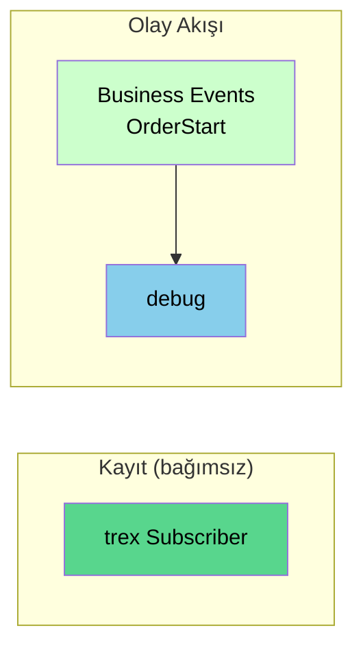

# Hızlı Başlangıç

Bu rehber, ilk trexMes akışınızı **5 dakika içinde** ayağa kaldırmanız için yazılmıştır.

## Hedef

Bir trexMes panelinden gelen **Business Event**'i yakalayıp Node-RED debug penceresinde gösteren bir akış oluşturacağız.

## Akış Şeması

`trex Subscriber` bağımsız durur; olay akışı doğrudan `Business Events`'ten başlar.



## Adım 1 — Yeni Bir Flow Oluşturun

1. Node-RED arayüzünde **+** ile yeni bir tab açın (örn. "MyFirstTrexFlow").

## Adım 2 — `trex Subscriber` Ekleyin

Paletten **trexMes service** kategorisi altındaki `trex Subscriber` node'unu canvas'a sürükleyin.

| Özellik | Değer |
|---|---|
| Name | _(boş bırakabilirsiniz)_ |
| Method | `get` _(otomatik)_ |
| Event | `/GetSubscribed` _(varsayılan)_ |

!!! info "Bu node ne yapar?"
    `trex Subscriber`, projenizdeki **tüm event node'larının isimlerini** trexMes paneline kayıt eder. Panel bu listeye bakarak hangi olayları Node-RED'e göndereceğini bilir.

## Adım 3 — `Business Events` Ekleyin

Paletten `Business Events` node'unu canvas'a sürükleyin ve çift tıklayarak yapılandırın:

| Özellik | Değer | Açıklama |
|---|---|---|
| Name | `OrderStart` _(opsiyonel)_ | Akış üzerinde göstermek için |
| Method | `get` _(varsayılan)_ | HTTP method |
| Event | `/OrderStartEvent` | Panel tarafında tanımlanan olay adı |
| Is Handled | `false` | Bu olayı bizim akışımız mı işleyecek? |

!!! tip "Event ismi nereden geliyor?"
    `Event` alanına yazdığınız değer, trexMes Edge tarafında tanımlı olay isimleriyle **birebir eşleşmelidir** (büyük/küçük harf duyarlı). Panel yapılandırmasından doğru ismi öğrenin.

## Adım 4 — `debug` Node'u Ekleyin

Standart Node-RED `debug` node'unu sürükleyip `Business Events` çıkışına bağlayın. `debug` özelliklerinde:

- **Output**: `complete msg object`

## Adım 5 — Deploy

Sağ üstteki kırmızı **Deploy** butonuna tıklayın. Bağlantı başarılı kurulduysa:

- `trex Subscriber` node'unun altında kısa bir süre yeşil **"Triggered"** durumu görünür.
- Sağ panelde **debug** çıktısı, panelden olay tetiklendiğinde belirir.

## Beklenen Çıktı

Panel tarafında `OrderStartEvent` tetiklendiğinde Node-RED debug panelinde şuna benzer bir mesaj görmelisiniz:

```json
{
  "_msgid": "abc123",
  "payload": {
    "orderNo": "ORD-2026-0001",
    "operatorId": "OP-007",
    "machineId": "M-12"
  },
  "req": { /* HTTP request bilgisi */ },
  "res": { /* HTTP response wrapper */ }
}
```

## Sonraki Adım: Veriyi Form'a Yansıtmak

İlerleyen örneklerde bu yapıyı genişleterek:

1. Gelen olay verisiyle bir **Custom Form** açacağız.
2. Form alanlarını **Form Bind Controls** ile dolduracağız.
3. Form üzerindeki butonları **Button Configurator** ile yapılandıracağız.
4. Akış sonunda **Responser** ile cevap döndüreceğiz.

[Custom Form Akışı örneğine geç →](../ornekler/custom-form-akisi.md)

## Yaygın Hatalar

!!! failure "Olay tetiklenmiyor"
    - `trex Subscriber` node'unun durumu kontrol edin (Triggered çıkıyor mu?)
    - trexMes Edge'de Node-RED Connector eklentisi etkin mi?
    - `Event` alanındaki isim trexMes'teki ile **tam olarak** eşleşiyor mu?
    - Bu projede **birden fazla** `trex Subscriber` mi var? (Olmamalı!)

!!! failure "Aynı olayı birden fazla akış işliyor"
    Aynı `Event` ismine sahip birden fazla `Business Events` node'u kullanırsanız hepsi tetiklenir. Bu davranış bilinçli olmalıdır.

!!! failure "Custom Form çıktısı yok"
    Custom Form kullanıyorsanız Designer çıktısı `C:\temp\<formname>_form_design.xml` konumunda olmalıdır. [Kurulum sayfasındaki Custom Form Designer](kurulum.md) bölümüne bakın.
