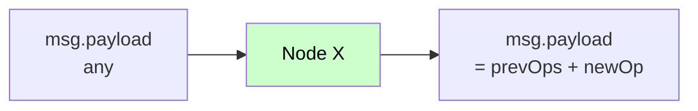

# Mesaj (msg) Yapısı

Bu sayfa, `node-red-trexmes-service` node'ları arasında dolaşan `msg` nesnesinin **anatomisini**, üretilen `operationtype` değerlerini ve `dataType` (msg/flow/global/...) çözümlemesini detaylı açıklar.

## Temel Yaklaşım

Pakette **tüm form/aksiyon node'ları** aynı sözleşmeyi kullanır:

1. **Giriş**: Önceki node'dan gelen `msg.payload` ya bir **array** ya da **scalar** olabilir.
2. **Çıkış**: `msg.payload` her zaman bir **array**'dir; node kendi operasyonunu sona ekler.



## Giriş Çözümleme Sözleşmesi

Her node şu Standart bloğu çalıştırır:

```javascript
let payload = msg.payload;
let receiveddata = null;

if (Array.isArray(payload)) {
    // Önceki bir form/event node'undan zincirleme geliyor
    if (payload.length > 0 && payload[0].receiveddata !== undefined) {
        receiveddata = msg.payload[0].receiveddata;
    }
} else {
    // İlk girişte (Event node'undan gelir)
    receiveddata = msg.payload;
    msg.payload = [];   // <-- yeniden array yapılır
}
```

!!! info "`receiveddata` nedir?"
    Panelden gelen **ham olay verisini** taşıyan değerdir. Zincirin ilk elemanında bir kez set edilir; sonraki tüm operasyonlara aktarılır. Panel tarafı bu veriyi karar mantığında kullanır.

## Operasyon Formatı

Her node `msg.payload` array'ine bir **operation object** ekler. En sık karşılaşacağınız alanlar:

| Alan | Tip | Açıklama |
|---|---|---|
| `operationtype` | string | İşlem türü (zorunlu) |
| `name` | string | Hedef form / kontrol adı |
| `receiveddata` | any | Orijinal olay verisi |
| `value` | any | İşleme özgü değer |
| `customformxml` | string | Form XML'i (Custom Form için) |
| `bindcontrols` | array | Bağlanacak kontroller listesi |
| `continueevent` | string\|bool | Sonraki event akışı kontrolü |
| `message` | string | Method ismi / script kodu |
| `isstyled` | boolean | Form stillendirildi mi? |

## Bütün `operationtype` Değerleri

Pakette **11 farklı operationtype** üretilir:

=== "CustomDialog"

    **Üreten**: `Custom Form` (formainform=`false`)
    **Anlamı**: Panelde yeni bir modal/dialog form aç.

    ```json
    {
      "operationtype": "CustomDialog",
      "receiveddata": { /* event data */ },
      "name": "OrderEntryForm",
      "continueevent": "Continue",
      "customformxml": "<form>...</form>",
      "isstyled": true
    }
    ```

=== "MainForm"

    **Üreten**: `Custom Form` (formainform=`true`)
    **Anlamı**: Panelin ana formunu yeni içerikle güncelle.

    ```json
    {
      "operationtype": "MainForm",
      "receiveddata": { /* event data */ },
      "name": "OrderEntryForm",
      "continueevent": "Break",
      "customformxml": "<form>...</form>",
      "isstyled": true
    }
    ```

=== "BindControl"

    **Üreten**: `Form Bind Controls`
    **Anlamı**: Form üzerindeki kontrollere veri bağla.

    ```json
    {
      "operationtype": "BindControl",
      "receiveddata": { /* event data */ },
      "name": "OrderEntryForm",
      "bindcontrols": [
        { "Name": "txtOrderNo",  "FieldName": "orderNo"  },
        { "Name": "txtCustomer", "FieldName": "customer" }
      ],
      "value": { "orderNo": "ORD-001", "customer": "ACME" }
    }
    ```

=== "ControlProperties"

    **Üreten**: `Control Properties`
    **Anlamı**: Kontrollerin görsel/işlevsel özelliklerini ayarla.

    ```json
    {
      "operationtype": "ControlProperties",
      "receiveddata": { /* event data */ },
      "name": "OrderEntryForm",
      "value": [
        { "ControlName": "btnSubmit", "PropertyName": "Enabled", "Value": true },
        { "ControlName": "lblTitle",  "PropertyName": "Text",    "Value": "Yeni Sipariş" }
      ]
    }
    ```

=== "UIButtonConfig"

    **Üreten**: `Button Configurator`
    **Anlamı**: Form üzerindeki butonların görünüm/davranışını yapılandır.

    ```json
    {
      "operationtype": "UIButtonConfig",
      "receiveddata": { /* event data */ },
      "value": [
        {
          "ButtonIndexType": 0,
          "DefaultCaption": "Kaydet",
          "IsVisible": true,
          "IsToOverrideDefaultHandler": true,
          "ComponentName": "btnSave"
        }
      ]
    }
    ```

=== "TriggerMain"

    **Üreten**: `Main Form Action`
    **Anlamı**: Ana formdaki bir butonu tetikle.

    ```json
    {
      "operationtype": "TriggerMain",
      "receiveddata": { /* event data */ },
      "name": "3"
    }
    ```

=== "MethodInvokerProcess"

    **Üreten**: `Method Invoker`
    **Anlamı**: Panel tarafındaki bir method'u çağır.

    ```json
    {
      "operationtype": "MethodInvokerProcess",
      "receiveddata": { /* event data */ },
      "name": "GetOrderDetails",
      "message": "OrderService.GetOrderDetails",
      "value": [
        { "ParameterName": "orderNo", "Value": "ORD-001" }
      ]
    }
    ```

=== "ExecuteProcess"

    **Üreten**: `Execute Process`
    **Anlamı**: Panel tarafında tanımlı bir process'i tetikle.

    ```json
    {
      "operationtype": "ExecuteProcess",
      "receiveddata": { /* event data */ },
      "message": "ProductionStart"
    }
    ```

=== "ExecuteScript"

    **Üreten**: `Execute Script`
    **Anlamı**: Bir form üzerinde script çalıştır.

    ```json
    {
      "operationtype": "ExecuteScript",
      "receiveddata": { /* event data */ },
      "name": "OrderForm",
      "message": "if(value > 100) { btnAlert.Visible = true; }"
    }
    ```

=== "TrexEventHandler"

    **Üreten**: `Handle Setter`
    **Anlamı**: Olayın handle edilip edilmediğini panele bildir.

    ```json
    {
      "operationtype": "TrexEventHandler",
      "continueevent": false
    }
    ```

## `dataType` Çözümleme

Bir çok node (`Form Bind Controls`, `Control Properties`, `Method Invoker`) parametre değerlerini farklı kaynaklardan okuyabilir. Bu kaynak **`dataType`** ile belirtilir:

| `dataType` | Kaynak | Örnek |
|---|---|---|
| `msg` | Geçerli mesaj nesnesinden | `msg.payload.orderNo` |
| `flow` | Flow context | `flow.get("currentOrder")` |
| `global` | Global context | `global.get("config.companyName")` |
| `num` | Sabit sayı | `42` |
| `json` | Sabit JSON | `{"a":1}` |
| `bool` | Sabit boolean | `true` / `false` |
| `jsonata` | JSONata ifadesi | `$.items[price > 100]` |

### Çözümleme Mantığı

```javascript
switch (item.dt) {  // item.dt = dataType
    case 'msg':
        computedValue = RED.util.getMessageProperty(msg, item.d);
        break;
    case 'flow':
        computedValue = node.context().flow.get(item.d);
        break;
    case 'global':
        computedValue = node.context().global.get(item.d);
        break;
    case 'num':
        computedValue = Number(item.d);
        break;
    case 'json':
        try { computedValue = JSON.parse(item.d); }
        catch (e) { computedValue = null; }
        break;
    case 'bool':
        computedValue = item.d === 'true';
        break;
    case 'jsonata':
        let expr = RED.util.prepareJSONataExpression(item.d, node);
        RED.util.evaluateJSONataExpression(expr, msg, /* callback */);
        break;
}
```

## `continueevent` Davranışı

`continueevent` alanı, panele "bu form/olay sonrasında akış nasıl ilerlesin?" sorusunu cevaplar.

| Değer | Anlamı |
|---|---|
| `"Continue"` | Form kapatıldığında akış devam etsin |
| `"Break"` | Akış burada dursun |
| `true` / `false` | `Handle Setter` üretiminde: olay handle edildi mi? |

## `formainform` (MainForm vs CustomDialog) Davranışı

Birçok form node'unda `formainform` bayrağı vardır:

- `false` → Operasyon **modal dialog** olarak çalışır (`operationtype: CustomDialog`).
- `true` → Operasyon **ana form** üzerinde uygulanır (`operationtype: MainForm`); `formname` otomatik olarak `"AppForm"` olur.

```javascript
var formname = node.formname;
if (n.formainform == true) {
    formname = "AppForm";
}
```

## Tipik Bir Tam Akış `msg.payload`'u

Aşağıda iki node'dan geçmiş tipik bir payload gösterilmiştir:

```json
{
  "_msgid": "abc123",
  "req": { /* HTTP request */ },
  "res": { /* HTTP response wrapper */ },
  "payload": [
    {
      "operationtype": "CustomDialog",
      "receiveddata": { "orderNo": "ORD-001", "qty": 50 },
      "name": "OrderForm",
      "continueevent": "Continue",
      "customformxml": "<form>...</form>",
      "isstyled": true
    },
    {
      "operationtype": "BindControl",
      "receiveddata": { "orderNo": "ORD-001", "qty": 50 },
      "name": "OrderForm",
      "bindcontrols": [
        { "Name": "txtOrderNo", "FieldName": "orderNo" },
        { "Name": "txtQty",     "FieldName": "qty"     }
      ],
      "value": { "orderNo": "ORD-001", "qty": 50 }
    }
  ]
}
```

`Responser` bu `payload` array'ini olduğu gibi HTTP cevabında panele gönderir.

## İpuçları

!!! tip "Debug node'unu sevin"
    Akış geliştirirken her form/aksiyon node'undan sonra bir `debug` node bağlayın. `msg.payload` array'ini görerek operasyonların doğru sırada eklenip eklenmediğini doğrulayın.

!!! tip "JSONata'yı tercih edin"
    Karmaşık dönüştürmeler için `dataType: jsonata` seçeneği `function` node'una alternatif olarak çok güçlüdür. Örnek: `payload.items[status="active"].total`

!!! warning "Sıralama önemli"
    Panel `msg.payload` array'indeki operasyonları **sıralı** uygular. Önce `CustomDialog`, sonra `BindControl`, sonra `ControlProperties` mantıklı bir sıradır. Sırayı bozarsanız henüz açılmamış forma veri bağlamaya çalışırsınız.
