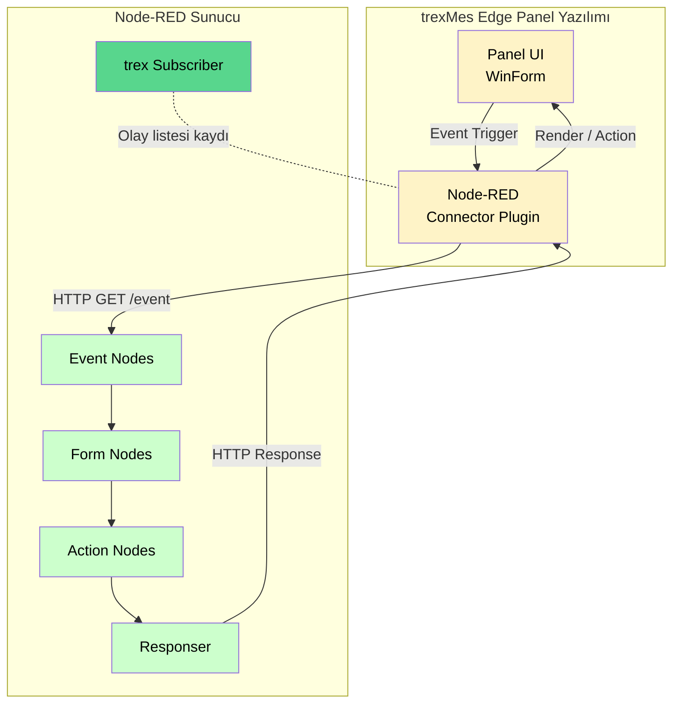
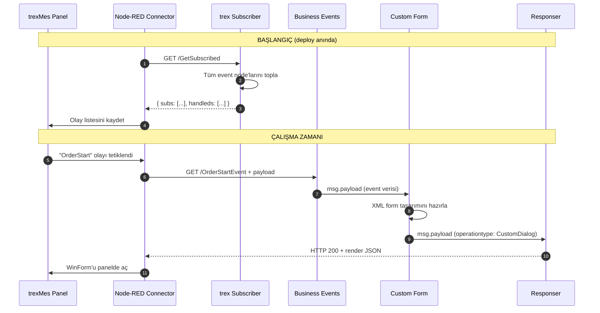

# Mimari Genel Bakış

Bu sayfa, `node-red-trexmes-service` paketinin **iç mimarisini**, trexMes Edge ile haberleşme şeklini ve node'lar arası veri akışını açıklar.

## Yüksek Seviye Mimari



## Bileşenlerin Rolleri

### 1. trexMes Edge Panel + Connector Plugin

Üretim sahasındaki **fiziksel/sanal panel** üzerinde çalışan ana yazılımdır. İçindeki **Node-RED Connector** eklentisi:

- Panel üzerindeki tüm UI olaylarını HTTP isteklerine çevirir.
- Bu istekleri Node-RED sunucusuna gönderir.
- Node-RED'den dönen cevapla panelde **WinForm render eder**, kontrol özelliklerini günceller, method çağrılarına yanıt verir.

### 2. Node-RED Sunucu

trexMes panellerinden gelen istekleri **işleyen ve cevaplayan** sunucudur. Tek bir Node-RED kurulumu **150-200 paneli aynı anda yönetebilir**.

## Node Kategorileri ve Sorumlulukları

| Kategori | Rolü | Örnek Node'lar |
|---|---|---|
| **Çekirdek** | Altyapı / kayıt | `trex Subscriber`, `Responser` |
| **Olay (Event)** | Panelden gelen tetikleyiciler + olay kesme | `Business Events`, `Form Events`, …, `Handle Setter` |
| **Form** | Panel üzerinde UI üretme/güncelleme | `Custom Form`, `Form Bind Controls`, … |
| **İşlem** | Method çağırma, process tetikleme | `Method Invoker`, `Execute Process`, … |
| **Yapay Zekâ** | LLM ile akış üretimi | `LLM Flow Builder` |

## Olay Yaşam Döngüsü (Event Lifecycle)

Bir olayın panelden tetiklenip Node-RED'de işlenmesi şu adımlardan geçer:



### Anahtar Noktalar

1. **Tek bir `trex Subscriber`**: Deploy anında bir kez çalışır, projedeki tüm event node'larının isimlerini panele bildirir.
2. **Her event akışı bir HTTP isteğidir**: Panel HTTP `GET` ile olay tetikler, Node-RED akışı çalışır, sonunda HTTP cevabı döner.
3. **`Responser` kapatıcıdır**: Cevap dönmeden panel beklemede kalır. Bazı node'lar (örn. `trex Subscriber`) bunu kendiliğinden yönetir; diğer olay akışlarında manuel eklenmelidir.

## Mesaj Akışı Anatomisi

Tüm node'lar arasında dolaşan `msg.payload` aslında bir **operation array**'dir. Her node bu array'e kendi "operasyonunu" `push` eder:

```javascript
msg.payload = [
  {
    operationtype: "CustomDialog",
    name: "OrderForm",
    customformxml: "<form>...</form>"
  },
  {
    operationtype: "BindControl",
    name: "OrderForm",
    bindcontrols: [
      { Name: "txtOrderNo", FieldName: "orderNo" }
    ],
    value: { orderNo: "ORD-001" }
  },
  {
    operationtype: "UIButtonConfig",
    value: [ /* button configs */ ]
  }
]
```

`Responser` bu array'i tek HTTP cevabında panele gönderir. Panel sırayla bu operasyonları yorumlar:

| `operationtype` | Anlamı | Hangi node üretir? |
|---|---|---|
| `CustomDialog` | Yeni form aç | `Custom Form` (formainform=false) |
| `MainForm` | Ana formu güncelle | `Custom Form` (formainform=true) |
| `BindControl` | Form alanlarına veri bağla | `Form Bind Controls` |
| `ControlProperties` | Kontrol özelliklerini ayarla | `Control Properties` |
| `UIButtonConfig` | Buton konfigürasyonu | `Button Configurator` |
| `TriggerMain` | Ana form butonu tetikle | `Main Form Action` |
| `MethodInvokerProcess` | Panel method'unu çağır | `Method Invoker` |
| `ExecuteProcess` | Process tetikle | `Execute Process` |
| `ExecuteScript` | Form üzerinde script çalıştır | `Execute Script` |
| `TrexEventHandler` | Olay handle bilgisi | `Handle Setter` |

[Mesaj yapısı detayları →](mesaj-yapisi.md)

## Event Tipleri ve Yetenekleri

Paket **8 farklı event tipi** sağlar. Bu tipler panel tarafındaki **olay sınıflandırmasıyla** birebir eşleşir:

| Event Tipi | Tipik Kullanım |
|---|---|
| **Business Events** | İş akışı olayları (sipariş başlama, üretim bitirme, vs.) |
| **System Events** | Sistem seviyesi olaylar (boot, login, shutdown) |
| **Communication Events** | İletişim katmanı olayları (PLC, OPC, sensör) |
| **Display Events** | UI üzerindeki gösterim olayları |
| **Form Events** | Form üzerindeki etkileşim olayları (button click vs.) |
| **Display Methods** | Ana form metod tetikleyicileri |
| **Method Returns** | Method invocation cevapları |

## "Handle Edildi" Kavramı

Bazı olaylar **panel tarafında varsayılan bir işleyiciye** sahiptir. Node-RED akışınız bu olayı yakaladığında **panelin de kendi işleyicisinin çalışmasını isteyip istemediğinizi** belirtmelisiniz:

- `ishandled = true` → "Bu olayı Node-RED yönetti, panel kendi işleyicisini ÇALIŞTIRMASIN."
- `ishandled = false` → "Panel kendi işleyicisini de çalıştırsın."

Bu davranış olay node'larının **Is Handled** alanı veya akış ortasında **Handle Setter** ile dinamik olarak kontrol edilebilir.

## Çoklu Panel Senaryosu

Aynı Node-RED akışı **150-200 paneli aynı anda** yönetebilir. Her panelin IP'si gelen `req.ip` üzerinden ayrıştırılır:

```javascript
// trex Subscriber çıkışı
{
  payload: {
    client: "192.168.1.42",     // Hangi panel?
    subs: [ /* event listesi */ ],
    handleds: [ /* handle edilenler */ ]
  }
}
```

Akışınızda panel-bazlı ayrım yapmak için `msg.payload.client` veya `msg.req.ip` üzerinden filtre uygulayabilirsiniz.

## Sonraki Adım

[Mesaj Yapısı](mesaj-yapisi.md) sayfasında `operationtype` formatının her alanı detaylı incelenmiştir.
