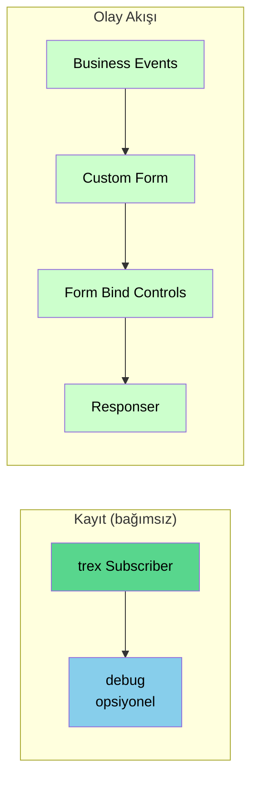

---
hide:
  - navigation
---

# node-red-trexmes-service

  
  

    <h2 style="margin: 0;">trexMes Edge için Node-RED Servis Paketi</h2>
    

      Versiyon <strong>1.6.2</strong> · GPL-3.0-or-later · Asaf Yurdakul
    

  

`node-red-trexmes-service`, **trexMes Edge** panel yazılımında çalışan Node-RED konnektör eklentisi ile haberleşen, gerçek zamanlı **olay (event)** yakalama, **form tasarımı** ve **kontrol yönetimi** sağlayan bir Node-RED paketidir.

!!! info "Bu paket ne işe yarar?"
    Üretim sahasındaki **150-200 trexMes panelinden** gelen olay tetikleyicilerini tek bir Node-RED sunucusunda toplar, gerçek zamanlı **WinForm tasarımları** yapabilmenizi sağlar ve panel üzerindeki kontrolleri Node-RED akışlarınızdan yönetmenize olanak tanır.

## Hızlı Bakış

  <a class="tx-card" href="baslangic/kurulum/">
    <h3>📦 Kurulum</h3>
    
Paketi Node-RED'e nasıl kuracağınızı ve ön gereklilikleri öğrenin.

  </a>
  <a class="tx-card" href="baslangic/hizli-baslangic/">
    <h3>🚀 Hızlı Başlangıç</h3>
    
İlk akışınızı 5 dakikada ayağa kaldırın.

  </a>
  <a class="tx-card" href="baslangic/mimari/">
    <h3>🏗️ Mimari</h3>
    
Paket nasıl çalışır, hangi node hangi rolü üstlenir?

  </a>
  <a class="tx-card" href="nodlar/">
    <h3>📚 Node Referansı</h3>
    
22 node için detaylı özellik ve kullanım dokümanları.

  </a>
  <a class="tx-card" href="ornekler/">
    <h3>💡 Örnekler</h3>
    
Hazır akış örnekleri ve kullanım senaryoları.

  </a>
  <a class="tx-card" href="sss/">
    <h3>❓ SSS</h3>
    
Sıkça sorulan sorular ve sorun giderme.

  </a>

## Nodlara Genel Bakış

Paket toplam **22 Node-RED node tipi** kaydeder ve bunları **5 mantıksal gruba** ayırır:

### 🟢 Çekirdek Nodlar (2)
Her trexMes projesinde mutlaka bulunması gereken altyapı node'ları.

trex Subscriber
Responser

### 🔔 Olay (Event) Nodları (8)
trexMes panelinden gönderilen olay tipine göre **trigger** sağlayan node'lar. `Handle Setter`, `IsHandled` özelliği olan Event node'larını içeren akışlarda zincirin **son trexMes node'u** olarak kullanılır.

Business Events
System Events
Communication Events
Display Events
Form Events
Display Methods
Method Returns
Handle Setter

### 🧩 Form Nodları (5)
Custom form tasarımı, kontrol bağlama ve özellik yönetimi.

Custom Form
Form Bind Controls
Control Properties
Button Configurator
Main Form Action

### ⚙️ İşlem Nodları (3)
Method çağırma, process tetikleme ve script çalıştırma.

Method Invoker
Execute Process
Execute Script

### 🤖 Yapay Zekâ (1)
LLM tabanlı otomatik akış üretici.

LLM Flow Builder

## Tipik Bir Akışın Görünümü

`trex Subscriber` akıştan **bağımsız** durur; diğer node'ları tetiklemez. Olay akışları doğrudan Event node'larından başlar.

!!! tip "Akış kuralı"
    Her trexMes projesinde **bir adet `trex Subscriber`** bulunmak zorundadır. Bu node bağımsız çalışır; çıkışına `debug` bağlanırsa bağlı trexEdge PC'lerin IP'lerini ve panele bildirilen event listesini görüntüleyebilirsiniz. Olay akışları **Event node'larından** başlar; `Responser` ile biter.

## Gereksinimler

| Bileşen | Minimum Sürüm |
|---|---|
| Node.js | 18.16+ |
| Node-RED | 3.0+ |
| trexMes Edge | Node-RED konnektör eklentisi etkin |

## Lisans & Yazar

Bu paket [**GPL-3.0-or-later**](https://www.gnu.org/licenses/gpl-3.0.html) lisansı altında dağıtılmaktadır.

Geliştirici: [Asaf Yurdakul](https://github.com/asafyurdakul) · [trex Digital Manufacturing](https://trex.com.tr)
