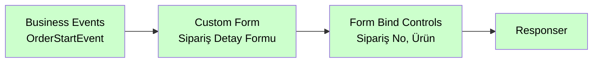

# Business Events

<div class="node-header">
  <span class="node-preview green-light">Business Events</span>
  <div class="meta-item"><strong>Inputs:</strong> <span class="io-badge in">0</span></div>
  <div class="meta-item"><strong>Outputs:</strong> <span class="io-badge out">1</span></div>
  <div class="meta-item"><strong>Kategori:</strong> trexMes service</div>
</div>

trexMes panelindeki **iş akışı olaylarına** abone olur. Üretim, sipariş, vardiya gibi iş süreçlerine bağlı tetiklemeleri yakalar.

## Property Tablosu

| Alan | Tip | Varsayılan | Açıklama |
|---|---|---|---|
| `name` | string | — | Canvas üzerinde gösterilecek ad |
| `method` | string | `get` | HTTP method (otomatik) |
| `event` | string | _(boş)_ | Panel'in tetikleyeceği HTTP path |
| `ishandled` | boolean | `false` | Node-RED handle ediyor mu? |
| `suffix` | string | — | Event ismine eklenecek son ek (özel alan) |

## Olay Listesi

`Event` alanı combobox ile seçilir. Mevcut seçenekler kategorilere göre gruplandırılmıştır:

### Proses / Analiz

| Olay | Açıklama |
|---|---|
| `OnProcessDataAnalysisAlertOccured` | Proses verisi analizinde tolerans dışı değer algılandığında tetiklenir. |
| `OnProcessDataAnalysisProcessing` | Proses verisi analiz edilirken tetiklenir. IsHandled true ise argümanlardan dönen analiz nesnesi işlenir. |
| `OnShiftDefectsQuerying` | trex Edge analiz ekranında ıskarta analizi için sorgulama gerçekleştirilirken fırlatılır. |
| `OnShiftProductivityCalculated` | Vardiya üretkenliği hesaplandığında tetiklenir. |

### Lot / Malzeme

| Olay | Açıklama |
|---|---|
| `OnConsumedLotEntriesDeleting` | Tüketilen lot kayıtları silinirken tetiklenir. |
| `OnLotEntriesDeletingOnProductionCompletion` | Üretim tamamlandığında lot kayıtları silinirken tetiklenir. |
| `OnLotDeleted` | Lot silindiğinde tetiklenir. |
| `OnMaterialCounterIncreased` | Malzeme sayacı artırıldığında tetiklenir. |
| `OnMaterialLotSelectionProcessed` | Malzeme lot seçimi işlendiğinde tetiklenir. |
| `OnPlanLotsFromLotEntriesGenerating` | Lot girişlerinden plan lotları oluşturulurken tetiklenir. |
| `OnPlanMaterialsQuerying` | Plan malzemeleri sorgulanırken tetiklenir. |
| `OnCurrentLotBalancesValidating` | Mevcut lot bakiyeleri doğrulanırken tetiklenir. |

### Iskarta

| Olay | Açıklama |
|---|---|
| `OnDefectAmountQuerying` | Iskarta miktarı sorgulanırken tetiklenir. |
| `OnDefectEntryCreated` | Iskarta girişi oluşturulduğunda tetiklenir. |
| `OnDefectEntryDeleted` | Iskarta girişi silindiğinde tetiklenir. |
| `OnDefectQuantityConverting` | Iskarta miktarı çevrimi sırasında tetiklenir. |
| `OnSerieDefectCreated` | Seri bazlı ıskarta oluşturulduğunda tetiklenir. |

### Belge

| Olay | Açıklama |
|---|---|
| `OnDocumentNotFound` | Belge bulunamadığında tetiklenir. |

### Takım

| Olay | Açıklama |
|---|---|
| `OnTeamChanged` | Takım değiştiğinde tetiklenir. |

### Forklift

| Olay | Açıklama |
|---|---|
| `OnForkliftOrderCreated` | Forklift siparişi oluşturulduğunda tetiklenir. |
| `OnForkliftFetchOrderCreating` | Forklift alma siparişi oluşturulurken tetiklenir. |
| `OnForkliftGetOrderCreating` | Forklift getirme siparişi oluşturulurken tetiklenir. |
| `OnForkliftOrderUpdated` | Forklift siparişi güncellendiğinde tetiklenir. |
| `OnForkliftOrdersQuerying` | Forklift siparişleri sorgulanırken tetiklenir. |

### Plan / İş Emri

| Olay | Açıklama |
|---|---|
| `OnCreatedProductionPlanLoading` | Oluşturulan üretim planı yüklenirken tetiklenir. |
| `OnCurrentPlanInfoSet` | Mevcut plan bilgisi ayarlandığında tetiklenir. |
| `OnJobOrderQueryGenerating` | İş emri sorgusu oluşturulurken tetiklenir. |
| `OnJobOrderSelecting` | İş emri seçilirken tetiklenir. |
| `OnOperatorAddedNextPlan` | Operatör sonraki plana eklendiğinde tetiklenir. |
| `OnOperatorDeletedNextPlan` | Operatör sonraki plandan silindiğinde tetiklenir. |
| `OnPlanChanged` | Plan değiştiğinde tetiklenir. |
| `OnPlanLoaded` | Plan yüklendiğinde tetiklenir. |
| `OnPlanLoadViaOpcStockNoFailed` | OPC stok no ile plan yükleme başarısız olduğunda tetiklenir. |
| `OnPlanSelecting` | Plan seçilirken tetiklenir. |
| `OnPlanSelectionApproved` | Plan seçimi onaylandığında tetiklenir. |
| `OnPlanSelectViabilityChecking` | Plan seçim uygunluğu kontrol edilirken tetiklenir. |
| `OnPlanStartViabilityChecking` | Plan başlatma uygunluğu kontrol edilirken tetiklenir. |
| `OnProductionPlanChanging` | Üretim planı değiştirilirken tetiklenir. |
| `OnProductionPlanCreated` | Üretim planı oluşturulduğunda tetiklenir. |
| `OnProductionPlanJobOrdersAppending` | Üretim planına iş emirleri eklenirken tetiklenir. |
| `OnProductionPlanQueryGenerating` | Üretim planı sorgusu oluşturulurken tetiklenir. |

### Etiket

| Olay | Açıklama |
|---|---|
| `OnLabelPrinting` | Etiket basımı sırasında tetiklenir. |
| `OnLabelReprinting` | Etiket yeniden basımı sırasında tetiklenir. |
| `OnUnapprovedProductionReceiptLabelPrinting` | Onaysız üretim fişi etiketi basılırken tetiklenir. |

### Dil

| Olay | Açıklama |
|---|---|
| `OnLanguageChanged` | Dil değiştiğinde tetiklenir. |
| `OnLanguageSelectionChanged` | Dil seçimi değiştiğinde tetiklenir. |

### Bakım

| Olay | Açıklama |
|---|---|
| `OnMaintenanceOrderCompleted` | Bakım emri tamamlandığında tetiklenir. |
| `OnMaintenanceOrderCreated` | Bakım emri oluşturulduğunda tetiklenir. |
| `OnMaintenancePlanSetting` | Bakım planı ayarlanırken tetiklenir. |
| `OnMaintenanceServiceReceiptCreated` | Bakım servis fişi oluşturulduğunda tetiklenir. |
| `OnMaintenanceServiceRequestCreated` | Bakım servis talebi oluşturulduğunda tetiklenir. |
| `OnOperatorCreatingMaintenanceOrder` | Operatör bakım emri oluştururken tetiklenir. |
| `OnOperatorMaintenaceInterventionEnded` | Operatör bakım müdahalesi bittiğinde tetiklenir. |
| `OnPeriodicalMaintenanceApproved` | Periyodik bakım onaylandığında tetiklenir. |
| `OnPeriodicalMaintenanceConditionChecking` | Periyodik bakım koşulu kontrol edilirken tetiklenir. |

### PokaYoke

| Olay | Açıklama |
|---|---|
| `OnPokaYokeBarcodeValidating` | PokaYoke barkod doğrulaması yapılırken tetiklenir. |
| `OnPokaYokeComponentChanging` | PokaYoke bileşen değiştirilirken tetiklenir. |

### Üretim / Hız / Tamamlanma

| Olay | Açıklama |
|---|---|
| `OnPlanCompletionSummaryCalculated` | Plan tamamlanma özeti hesaplandığında tetiklenir. |
| `OnPlanCompletionSummaryCalculatedSetting` | Plan tamamlanma özeti ayarlanırken tetiklenir. |
| `OnCurrentSpeedCalculated` | Mevcut hız hesaplandığında tetiklenir. |
| `OnCurrentSpeedCalculating` | Mevcut hız hesaplanırken tetiklenir. |
| `OnEstimatedCompletionTimeCalculating` | Tahmini bitiş süresi hesaplanırken tetiklenir. |
| `OnJoblessProductionOccured` | İşsiz üretim gerçekleştiğinde tetiklenir. |
| `OnNoShiftTimeProductionOccuring` | Vardiya dışı üretim gerçekleşirken tetiklenir. |
| `OnProductionSectionEntryCreated` | Üretim kesit girişi oluşturulduğunda tetiklenir. |
| `OnProductionSectionEntryCreating` | Üretim kesit girişi oluşturulurken tetiklenir. |
| `OnProductionSectionEntryUndefinedStockDetected` | Tanımsız stok algılandığında tetiklenir. |
| `OnProductionSectionEntryUpdating` | Üretim kesit girişi güncellenirken tetiklenir. |
| `OnProductionCompleted` | Üretim tamamlandığında tetiklenir. |
| `OnProductionCompleting` | Üretim tamamlanmak üzereyken tetiklenir. |
| `OnProductionContinuing` | Üretime devam edilirken tetiklenir. |
| `OnProductionFinishStatusChecking` | Üretim bitiş durumu kontrol edilirken tetiklenir. |
| `OnProductionInfoResetted` | Üretim bilgileri sıfırlandığında tetiklenir. |
| `OnProductionInfoSet` | Üretim bilgileri ayarlandığında tetiklenir. |
| `OnProductionQuantityConverting` | Üretim miktarı çevrilirken tetiklenir. |
| `OnProductionSummaryUpdated` | Üretim özeti güncellendiğinde tetiklenir. |
| `OnRotationSpeedCalculating` | Dönüş hızı hesaplanırken tetiklenir. |
| `OnPlannedSpeedCalculating` | Planlanan hız hesaplanırken tetiklenir. |
| `OnSignalProductionEnding` | Sinyal ile üretim bitişi tetiklendiğinde tetiklenir. |

### Sayaç

| Olay | Açıklama |
|---|---|
| `OnCounterIncrementViabilityChecked` | Sayaç artırım uygunluğu kontrol edildiğinde tetiklenir. |
| `OnOpcProductionCounterIncreasing` | OPC üzerinden üretim sayacı artırılırken tetiklenir. |
| `OnOperatorCounterIncreasing` | Operatör sayacı artırırken tetiklenir. |
| `OnProductionCounterIncreased` | Üretim sayacı artırıldığında tetiklenir. |
| `OnProductionCounterIncrementCompleted` | Üretim sayacı artırım tamamlandığında tetiklenir. |
| `OnStockProductionCounterIncreased` | Stok üretim sayacı artırıldığında tetiklenir. |

### Çevrim Süresi / Parametre

| Olay | Açıklama |
|---|---|
| `OnCoefficientChangeSaved` | Çarpan değişikliği kaydedildiğinde tetiklenir. |
| `OnCyclePeriodSet` | Çevrim süresi ayarlandığında tetiklenir. |
| `OnCyclePeriodSetting` | Çevrim süresi ayarlanırken tetiklenir. |
| `OnProPlanCycleFromStockCycleSetting` | Stok çevriminden üretim planı çevrimi ayarlanırken tetiklenir. |
| `OnSelectedJobOrderProductionParametersSetting` | Seçili iş emri üretim parametreleri ayarlanırken tetiklenir. |
| `OnSpecPortSelected` | Spec port seçildiğinde tetiklenir. |
| `OnStockCoefficientChangeSaving` | Stok üretim çarpanı değiştirilirken tetiklenir. |
| `OnStockEquipmentMatchViabilityChecking` | Stok ekipman uyumu kontrol edilirken tetiklenir. |

### Fiş

| Olay | Açıklama |
|---|---|
| `OnEditedProductionReceiptSaving` | Düzenlenen üretim fişi kaydedilmeden önce tetiklenir. |
| `OnEditProductionReceiptSaved` | Düzenlenen üretim fişi kaydedildiğinde tetiklenir. |
| `OnPlanReceiptCreated` | Plan fişi oluşturulduğunda tetiklenir. |
| `OnPlanReceiptCreating` | Plan fişi oluşturulurken tetiklenir. |
| `OnPlanReceiptMaterialsCreated` | Plan fişi malzemeleri oluşturulduğunda tetiklenir. |
| `OnPidReceiptCreated` | Ön üretim fişi oluşturulduğunda tetiklenir. |
| `OnPidReceiptCreating` | Ön üretim fişi oluşturulurken tetiklenir. |
| `OnPidSectionReceiptCreated` | Üretim kesit fişi oluşturulduğunda tetiklenir. |
| `OnProductionReceiptCreated` | Üretim fişi oluşturulduğunda tetiklenir. |
| `OnProductionReceiptCreating` | Üretim fişi oluşturulmadan hemen önce tetiklenir. |
| `OnProductionReceiptEditQuantityConverting` | Üretim fişi düzenlenirken miktar çevrimi sırasında tetiklenir. |
| `OnProductionReceiptEditReceiptLoading` | Düzenleme için üretim fişi yüklenirken tetiklenir. |
| `OnProductionReceiptEditSaving` | Düzenlenen üretim fişi kaydedilirken tetiklenir. |
| `OnProductionReceiptIntegrating` | Üretim fişi entegrasyonu sırasında tetiklenir. |
| `OnProductionReceiptIntegrationSaving` | Üretim fişi entegrasyon kaydı yapılırken tetiklenir. |
| `OnSubProductReceiptsCreating` | Yan ürün fişleri oluşturulurken tetiklenir. |
| `OnUnapprovedProductionReceiptIntegrating` | Onaysız üretim fişi entegrasyonu sırasında tetiklenir. |
| `OnUnapprovedProductionReceiptUsedMaterialSelecting` | Onaysız fişlerde sarf malzemesi seçilirken tetiklenir. |
| `OnUserDefinedReceiptDataCreated` | Kullanıcı tanımlı fiş verisi oluşturulduğunda tetiklenir. |
| `OnProductionReceiptUserDefinedFieldsGetting` | Üretim fişi için kullanıcı tanımlı alanlar hazırlanırken tetiklenir. |

### Üretim Onayı

| Olay | Açıklama |
|---|---|
| `OnFractionalAmountProductionConfirmed` | Kısmi miktarlı otomatik üretim onayı gerçekleştiğinde tetiklenir. |
| `OnOperatorApprovedProductionConfirmationAmount` | Operatör üretim miktar onayını verdiğinde tetiklenir. |
| `OnOperatorApprovingProductionConfirmationAmount` | Operatör üretim miktar onayı verirken tetiklenir. |
| `OnOperatorApprovingProductionSaveAmount` | Operatör üretim kaydetme miktarı onaylarken tetiklenir (obsolete). |
| `OnProductionConfirmationAmountValidating` | Üretim onay miktarı doğrulanırken tetiklenir. |
| `OnOperatorProductionConfirming` | Operatör üretim onayını başlatırken tetiklenir. |
| `OnProductionConfirmationCompleted` | Üretim onay işlemi tamamlandığında tetiklenir. |
| `OnProductionConfirmationCompleting` | Üretim onay işlemi tamamlanmak üzereyken tetiklenir. |
| `OnProductionConfirmed` | Üretim onayı gerçekleştiğinde tetiklenir. |
| `OnProductionConfirmationAllowanceChecked` | Üretim onay izni kontrol edildiğinde tetiklenir. |
| `OnProductionConfirmationStarted` | Üretim onay işlemi başladığında tetiklenir. |
| `OnProductionConfirmationViabilityChecking` | Üretim onay uygunluğu kontrol edilirken tetiklenir. |
| `OnProductionConfirming` | Üretim onay işlemi başlatılırken tetiklenir. |
| `OnSignalProductionConfirmed` | Sinyal ile üretim onayı gerçekleştiğinde tetiklenir. |
| `OnSignalProductionConfirming` | Sinyal ile üretim onayı başlamadan önce tetiklenir. |

### Kalite

| Olay | Açıklama |
|---|---|
| `OnQualityReceiptCreated` | Kalite fişi oluşturulduğunda tetiklenir. |

### Vardiya

| Olay | Açıklama |
|---|---|
| `OnShiftChanged` | Vardiya değiştiğinde tetiklenir. |
| `OnShiftChanging` | Vardiya değişimi sırasında tetiklenir. |

### Duruş

| Olay | Açıklama |
|---|---|
| `OnAuthorizationRequiredStoppageEnding` | Yetki gerektiren duruş bitirilirken tetiklenir. |
| `OnStoppageChanging` | Duruş değiştirilirken tetiklenir. |
| `OnStoppageChanged` | Duruş değiştirildiğinde tetiklenir. |
| `OnStoppageEnding` | Duruş bitirilirken tetiklenir. |
| `OnStoppageEnded` | Duruş bittiğinde tetiklenir. |
| `OnStoppageReasonEquipmentSelected` | Duruş sebebi ekipmanı seçildiğinde tetiklenir. |
| `OnStoppageSelected` | Duruş seçildiğinde tetiklenir. |
| `OnStoppageSelecting` | Duruş seçilirken tetiklenir. |
| `OnStoppageStarted` | Duruş başladığında tetiklenir. |
| `OnTestModeChanged` | Test modu değiştiğinde tetiklenir. |
| `OnUndefinedStoppageChanged` | Tanımsız duruş değiştirildiğinde tetiklenir. |
| `OnUndefinedStoppageChanging` | Tanımsız duruş değiştirilirken tetiklenir. |
| `OnUndefinedStoppagesListing` | Tanımsız duruşlar listelenirken tetiklenir. |
| `OnUndefinedStoppagesQuerying` | Tanımsız duruşlar sorgulanırken tetiklenir. |
| `OnPlannedStoppageEstimatedDurationReached` | Planlı duruş tahmini süresine ulaşıldığında tetiklenir. |

### İş İstasyonu

| Olay | Açıklama |
|---|---|
| `OnWorkStationStatusEntryCreating` | İş istasyonu durum kaydı oluşturulurken tetiklenir. |
| `OnWorkStationStatusItemEntryCreating` | İş istasyonu durum kalem kaydı oluşturulurken tetiklenir. |
| `OnWorkStationStatesSet` | İş istasyonu durumları ayarlandığında tetiklenir. |
| `OnWorkStationInfoLoaded` | İş istasyonu bilgileri yüklendiğinde tetiklenir. |

## Örnek Kullanım



## Giriş Mesajı

```json
{
  "_msgid": "abc123",
  "req": { "ip": "192.168.1.42", "query": {...} },
  "res": { /* response wrapper */ },
  "payload": {
    "orderNo": "ORD-2026-0001",
    "operatorId": "OP-007",
    "machineId": "M-12",
    "productCode": "PRD-X100",
    "qty": 100
  }
}
```

## `suffix` Alanı

`suffix`, yalnızca `Business Events` node'una özgü bir alandır. Aynı panel olayını birden fazla `Business Events` node'unun yakalaması gerektiğinde kullanılır.

Node-RED, her `Business Events` node'unu ayrı bir HTTP endpoint olarak kaydeder. Aynı `event` değerine sahip ikinci bir node eklendiğinde endpoint çakışması oluşur. `suffix` alanına herhangi bir değer yazılması bu çakışmayı önler:

| Node | `event` | `suffix` | Kaydedilen Endpoint |
|---|---|---|---|
| 1. node | `OnPlanLoaded` | _(boş)_ | `/OnPlanLoaded` |
| 2. node | `OnPlanLoaded` | `_2` | `/OnPlanLoaded_2` |
| 3. node | `OnPlanLoaded` | `_3` | `/OnPlanLoaded_3` |

Panel `OnPlanLoaded` olayını tetiklediğinde **tüm bu node'lar** birlikte tetiklenir; her biri bağımsız akışını çalıştırır.

!!! warning "Diğer Event node'larında suffix yoktur"
    `suffix` alanı yalnızca `Business Events`'e aittir. Diğer Event node türlerinde (`System Events`, `Form Events` vb.) aynı olay adı birden fazla kullanılamaz.

## İpuçları

!!! tip "İsim standardizasyonu"
    İş olaylarının isminin sonuna her zaman `Event` eklenmesi tavsiye edilir (`OrderStartEvent`, `ProductionEndEvent`). Bu, kayıt listesinde sıralı görünmesini sağlar.

!!! tip "Suffix değeri önemli değil"
    Suffix alanına yazılan değerin anlamı yoktur; çakışmayı önlemek için yeterlidir. `_2`, `_3` gibi sıralı değerler okunabilirlik açısından tavsiye edilir.

## İlgili

- [Olay Nodları Genel Bakış](event-subscribers.md)
- [Custom Form](custom-form.md)
- [Hızlı Başlangıç](../baslangic/hizli-baslangic.md)
