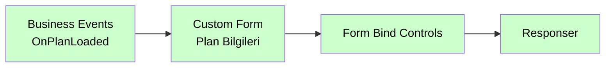

# Business Events

<div class="node-header">
  <span class="node-preview green-light">Business Events</span>
  <div class="meta-item"><strong>Inputs:</strong> <span class="io-badge in">0</span></div>
  <div class="meta-item"><strong>Outputs:</strong> <span class="io-badge out">1</span></div>
  <div class="meta-item"><strong>Kategori:</strong> trexMes service</div>
</div>

trexMes panelindeki **iş akışı olaylarına** abone olur. Üretim, sipariş, vardiya gibi iş süreçlerine bağlı tetiklemeleri yakalar.

## Property Tablosu

| Alan | Tip | Varsayılan | Açıklama |
|---|---|---|---|
| `name` | string | — | Canvas üzerinde gösterilecek ad |
| `event` | string | _(boş)_ | Abone olunacak iş akışı olayı |
| `ishandled` | boolean | `false` | Node-RED bu olayı handle ediyor mu? |
| `suffix` | string | — | Event ismine eklenecek son ek (çakışma önleme) |

## Olay Listesi

`Event` alanı combobox ile seçilir. Mevcut seçenekler kategorilere göre gruplandırılmıştır:

### Proses / Analiz

| Olay | Açıklama |
|---|---|
| `OnProcessDataAnalysisAlertOccured` | Proses verisi analizinde tolerans dışı değer algılandığında tetiklenir. |
| `OnProcessDataAnalysisProcessing` | Proses verisi analiz edilirken tetiklenir. IsHandled true ise argümanlardan dönen analiz nesnesi işlenir. |
| `OnShiftDefectsQuerying` | trex Edge analiz ekranında ıskarta analizi için sorgulama gerçekleştirilirken fırlatılır. |
| `OnShiftProductivityCalculated` | Vardiya üretkenliği hesaplandığında tetiklenir. |

### Lot / Malzeme

| Olay | Açıklama |
|---|---|
| `OnConsumedLotEntriesDeleting` | Tüketilen lot kayıtları silinirken tetiklenir. |
| `OnLotEntriesDeletingOnProductionCompletion` | Üretim tamamlandığında lot kayıtları silinirken tetiklenir. |
| `OnLotDeleted` | Lot silindiğinde tetiklenir. |
| `OnMaterialCounterIncreased` | Malzeme sayacı artırıldığında tetiklenir. |
| `OnMaterialLotSelectionProcessed` | Malzeme lot seçimi işlendiğinde tetiklenir. |
| `OnPlanLotsFromLotEntriesGenerating` | Lot girişlerinden plan lotları oluşturulurken tetiklenir. |
| `OnPlanMaterialsQuerying` | Plan malzemeleri sorgulanırken tetiklenir. |
| `OnCurrentLotBalancesValidating` | Mevcut lot bakiyeleri doğrulanırken tetiklenir. |

### Iskarta

| Olay | Açıklama |
|---|---|
| `OnDefectAmountQuerying` | Iskarta miktarı sorgulanırken tetiklenir. |
| `OnDefectEntryCreated` | Iskarta girişi oluşturulduğunda tetiklenir. |
| `OnDefectEntryDeleted` | Iskarta girişi silindiğinde tetiklenir. |
| `OnDefectQuantityConverting` | Iskarta miktarı çevrimi sırasında tetiklenir. |
| `OnSerieDefectCreated` | Seri bazlı ıskarta oluşturulduğunda tetiklenir. |

### Belge

| Olay | Açıklama |
|---|---|
| `OnDocumentNotFound` | Belge bulunamadığında tetiklenir. |

### Takım

| Olay | Açıklama |
|---|---|
| `OnTeamChanged` | Takım değiştiğinde tetiklenir. |

### Forklift

| Olay | Açıklama |
|---|---|
| `OnForkliftOrderCreated` | Forklift siparişi oluşturulduğunda tetiklenir. |
| `OnForkliftFetchOrderCreating` | Forklift alma siparişi oluşturulurken tetiklenir. |
| `OnForkliftGetOrderCreating` | Forklift getirme siparişi oluşturulurken tetiklenir. |
| `OnForkliftOrderUpdated` | Forklift siparişi güncellendiğinde tetiklenir. |
| `OnForkliftOrdersQuerying` | Forklift siparişleri sorgulanırken tetiklenir. |

### Plan / İş Emri

| Olay | Açıklama |
|---|---|
| `OnCreatedProductionPlanLoading` | Oluşturulan üretim planı yüklenirken tetiklenir. |
| `OnCurrentPlanInfoSet` | Mevcut plan bilgisi ayarlandığında tetiklenir. |
| `OnJobOrderQueryGenerating` | İş emri sorgusu oluşturulurken tetiklenir. |
| `OnJobOrderSelecting` | İş emri seçilirken tetiklenir. |
| `OnOperatorAddedNextPlan` | Operatör sonraki plana eklendiğinde tetiklenir. |
| `OnOperatorDeletedNextPlan` | Operatör sonraki plandan silindiğinde tetiklenir. |
| `OnPlanChanged` | Plan değiştiğinde tetiklenir. |
| `OnPlanLoaded` | Plan yüklendiğinde tetiklenir. |
| `OnPlanLoadViaOpcStockNoFailed` | OPC stok no ile plan yükleme başarısız olduğunda tetiklenir. |
| `OnPlanSelecting` | Plan seçilirken tetiklenir. |
| `OnPlanSelectionApproved` | Plan seçimi onaylandığında tetiklenir. |
| `OnPlanSelectViabilityChecking` | Plan seçim uygunluğu kontrol edilirken tetiklenir. |
| `OnPlanStartViabilityChecking` | Plan başlatma uygunluğu kontrol edilirken tetiklenir. |
| `OnProductionPlanChanging` | Üretim planı değiştirilirken tetiklenir. |
| `OnProductionPlanCreated` | Üretim planı oluşturulduğunda tetiklenir. |
| `OnProductionPlanJobOrdersAppending` | Üretim planına iş emirleri eklenirken tetiklenir. |
| `OnProductionPlanQueryGenerating` | Üretim planı sorgusu oluşturulurken tetiklenir. |

### Etiket

| Olay | Açıklama |
|---|---|
| `OnLabelPrinting` | Etiket basımı sırasında tetiklenir. |
| `OnLabelReprinting` | Etiket yeniden basımı sırasında tetiklenir. |
| `OnUnapprovedProductionReceiptLabelPrinting` | Onaysız üretim fişi etiketi basılırken tetiklenir. |

### Dil

| Olay | Açıklama |
|---|---|
| `OnLanguageChanged` | Dil değiştiğinde tetiklenir. |
| `OnLanguageSelectionChanged` | Dil seçimi değiştiğinde tetiklenir. |

### Bakım

| Olay | Açıklama |
|---|---|
| `OnMaintenanceOrderCompleted` | Bakım emri tamamlandığında tetiklenir. |
| `OnMaintenanceOrderCreated` | Bakım emri oluşturulduğunda tetiklenir. |
| `OnMaintenancePlanSetting` | Bakım planı ayarlanırken tetiklenir. |
| `OnMaintenanceServiceReceiptCreated` | Bakım servis fişi oluşturulduğunda tetiklenir. |
| `OnMaintenanceServiceRequestCreated` | Bakım servis talebi oluşturulduğunda tetiklenir. |
| `OnOperatorCreatingMaintenanceOrder` | Operatör bakım emri oluştururken tetiklenir. |
| `OnOperatorMaintenaceInterventionEnded` | Operatör bakım müdahalesi bittiğinde tetiklenir. |
| `OnPeriodicalMaintenanceApproved` | Periyodik bakım onaylandığında tetiklenir. |
| `OnPeriodicalMaintenanceConditionChecking` | Periyodik bakım koşulu kontrol edilirken tetiklenir. |

### PokaYoke

| Olay | Açıklama |
|---|---|
| `OnPokaYokeBarcodeValidating` | PokaYoke barkod doğrulaması yapılırken tetiklenir. |
| `OnPokaYokeComponentChanging` | PokaYoke bileşen değiştirilirken tetiklenir. |

### Üretim / Hız / Tamamlanma

| Olay | Açıklama |
|---|---|
| `OnPlanCompletionSummaryCalculated` | Plan tamamlanma özeti hesaplandığında tetiklenir. |
| `OnPlanCompletionSummaryCalculatedSetting` | Plan tamamlanma özeti ayarlanırken tetiklenir. |
| `OnCurrentSpeedCalculated` | Mevcut hız hesaplandığında tetiklenir. |
| `OnCurrentSpeedCalculating` | Mevcut hız hesaplanırken tetiklenir. |
| `OnEstimatedCompletionTimeCalculating` | Tahmini bitiş süresi hesaplanırken tetiklenir. |
| `OnJoblessProductionOccured` | İşsiz üretim gerçekleştiğinde tetiklenir. |
| `OnNoShiftTimeProductionOccuring` | Vardiya dışı üretim gerçekleşirken tetiklenir. |
| `OnProductionSectionEntryCreated` | Üretim kesit girişi oluşturulduğunda tetiklenir. |
| `OnProductionSectionEntryCreating` | Üretim kesit girişi oluşturulurken tetiklenir. |
| `OnProductionSectionEntryUndefinedStockDetected` | Tanımsız stok algılandığında tetiklenir. |
| `OnProductionSectionEntryUpdating` | Üretim kesit girişi güncellenirken tetiklenir. |
| `OnProductionCompleted` | Üretim tamamlandığında tetiklenir. |
| `OnProductionCompleting` | Üretim tamamlanmak üzereyken tetiklenir. |
| `OnProductionContinuing` | Üretime devam edilirken tetiklenir. |
| `OnProductionFinishStatusChecking` | Üretim bitiş durumu kontrol edilirken tetiklenir. |
| `OnProductionInfoResetted` | Üretim bilgileri sıfırlandığında tetiklenir. |
| `OnProductionInfoSet` | Üretim bilgileri ayarlandığında tetiklenir. |
| `OnProductionQuantityConverting` | Üretim miktarı çevrilirken tetiklenir. |
| `OnProductionSummaryUpdated` | Üretim özeti güncellendiğinde tetiklenir. |
| `OnRotationSpeedCalculating` | Dönüş hızı hesaplanırken tetiklenir. |
| `OnPlannedSpeedCalculating` | Planlanan hız hesaplanırken tetiklenir. |
| `OnSignalProductionEnding` | Sinyal ile üretim bitişi tetiklendiğinde tetiklenir. |

### Sayaç

| Olay | Açıklama |
|---|---|
| `OnCounterIncrementViabilityChecked` | Sayaç artırım uygunluğu kontrol edildiğinde tetiklenir. |
| `OnOpcProductionCounterIncreasing` | OPC üzerinden üretim sayacı artırılırken tetiklenir. |
| `OnOperatorCounterIncreasing` | Operatör sayacı artırırken tetiklenir. |
| `OnProductionCounterIncreased` | Üretim sayacı artırıldığında tetiklenir. |
| `OnProductionCounterIncrementCompleted` | Üretim sayacı artırım tamamlandığında tetiklenir. |
| `OnStockProductionCounterIncreased` | Stok üretim sayacı artırıldığında tetiklenir. |

### Çevrim Süresi / Parametre

| Olay | Açıklama |
|---|---|
| `OnCoefficientChangeSaved` | Çarpan değişikliği kaydedildiğinde tetiklenir. |
| `OnCyclePeriodSet` | Çevrim süresi ayarlandığında tetiklenir. |
| `OnCyclePeriodSetting` | Çevrim süresi ayarlanırken tetiklenir. |
| `OnProPlanCycleFromStockCycleSetting` | Stok çevriminden üretim planı çevrimi ayarlanırken tetiklenir. |
| `OnSelectedJobOrderProductionParametersSetting` | Seçili iş emri üretim parametreleri ayarlanırken tetiklenir. |
| `OnSpecPortSelected` | Spec port seçildiğinde tetiklenir. |
| `OnStockCoefficientChangeSaving` | Stok üretim çarpanı değiştirilirken tetiklenir. |
| `OnStockEquipmentMatchViabilityChecking` | Stok ekipman uyumu kontrol edilirken tetiklenir. |

### Fiş

| Olay | Açıklama |
|---|---|
| `OnEditedProductionReceiptSaving` | Düzenlenen üretim fişi kaydedilmeden önce tetiklenir. |
| `OnEditProductionReceiptSaved` | Düzenlenen üretim fişi kaydedildiğinde tetiklenir. |
| `OnPlanReceiptCreated` | Plan fişi oluşturulduğunda tetiklenir. |
| `OnPlanReceiptCreating` | Plan fişi oluşturulurken tetiklenir. |
| `OnPlanReceiptMaterialsCreated` | Plan fişi malzemeleri oluşturulduğunda tetiklenir. |
| `OnPidReceiptCreated` | Ön üretim fişi oluşturulduğunda tetiklenir. |
| `OnPidReceiptCreating` | Ön üretim fişi oluşturulurken tetiklenir. |
| `OnPidSectionReceiptCreated` | Üretim kesit fişi oluşturulduğunda tetiklenir. |
| `OnProductionReceiptCreated` | Üretim fişi oluşturulduğunda tetiklenir. |
| `OnProductionReceiptCreating` | Üretim fişi oluşturulmadan hemen önce tetiklenir. |
| `OnProductionReceiptEditQuantityConverting` | Üretim fişi düzenlenirken miktar çevrimi sırasında tetiklenir. |
| `OnProductionReceiptEditReceiptLoading` | Düzenleme için üretim fişi yüklenirken tetiklenir. |
| `OnProductionReceiptEditSaving` | Düzenlenen üretim fişi kaydedilirken tetiklenir. |
| `OnProductionReceiptIntegrating` | Üretim fişi entegrasyonu sırasında tetiklenir. |
| `OnProductionReceiptIntegrationSaving` | Üretim fişi entegrasyon kaydı yapılırken tetiklenir. |
| `OnSubProductReceiptsCreating` | Yan ürün fişleri oluşturulurken tetiklenir. |
| `OnUnapprovedProductionReceiptIntegrating` | Onaysız üretim fişi entegrasyonu sırasında tetiklenir. |
| `OnUnapprovedProductionReceiptUsedMaterialSelecting` | Onaysız fişlerde sarf malzemesi seçilirken tetiklenir. |
| `OnUserDefinedReceiptDataCreated` | Kullanıcı tanımlı fiş verisi oluşturulduğunda tetiklenir. |
| `OnProductionReceiptUserDefinedFieldsGetting` | Üretim fişi için kullanıcı tanımlı alanlar hazırlanırken tetiklenir. |

### Üretim Onayı

| Olay | Açıklama |
|---|---|
| `OnFractionalAmountProductionConfirmed` | Kısmi miktarlı otomatik üretim onayı gerçekleştiğinde tetiklenir. |
| `OnOperatorApprovedProductionConfirmationAmount` | Operatör üretim miktar onayını verdiğinde tetiklenir. |
| `OnOperatorApprovingProductionConfirmationAmount` | Operatör üretim miktar onayı verirken tetiklenir. |
| `OnOperatorApprovingProductionSaveAmount` | Operatör üretim kaydetme miktarı onaylarken tetiklenir (obsolete). |
| `OnProductionConfirmationAmountValidating` | Üretim onay miktarı doğrulanırken tetiklenir. |
| `OnOperatorProductionConfirming` | Operatör üretim onayını başlatırken tetiklenir. |
| `OnProductionConfirmationCompleted` | Üretim onay işlemi tamamlandığında tetiklenir. |
| `OnProductionConfirmationCompleting` | Üretim onay işlemi tamamlanmak üzereyken tetiklenir. |
| `OnProductionConfirmed` | Üretim onayı gerçekleştiğinde tetiklenir. |
| `OnProductionConfirmationAllowanceChecked` | Üretim onay izni kontrol edildiğinde tetiklenir. |
| `OnProductionConfirmationStarted` | Üretim onay işlemi başladığında tetiklenir. |
| `OnProductionConfirmationViabilityChecking` | Üretim onay uygunluğu kontrol edilirken tetiklenir. |
| `OnProductionConfirming` | Üretim onay işlemi başlatılırken tetiklenir. |
| `OnSignalProductionConfirmed` | Sinyal ile üretim onayı gerçekleştiğinde tetiklenir. |
| `OnSignalProductionConfirming` | Sinyal ile üretim onayı başlamadan önce tetiklenir. |

### Kalite

| Olay | Açıklama |
|---|---|
| `OnQualityReceiptCreated` | Kalite fişi oluşturulduğunda tetiklenir. |

### Vardiya

| Olay | Açıklama |
|---|---|
| `OnShiftChanged` | Vardiya değiştiğinde tetiklenir. |
| `OnShiftChanging` | Vardiya değişimi sırasında tetiklenir. |

### Duruş

| Olay | Açıklama |
|---|---|
| `OnAuthorizationRequiredStoppageEnding` | Yetki gerektiren duruş bitirilirken tetiklenir. |
| `OnStoppageChanging` | Duruş değiştirilirken tetiklenir. |
| `OnStoppageChanged` | Duruş değiştirildiğinde tetiklenir. |
| `OnStoppageEnding` | Duruş bitirilirken tetiklenir. |
| `OnStoppageEnded` | Duruş bittiğinde tetiklenir. |
| `OnStoppageReasonEquipmentSelected` | Duruş sebebi ekipmanı seçildiğinde tetiklenir. |
| `OnStoppageSelected` | Duruş seçildiğinde tetiklenir. |
| `OnStoppageSelecting` | Duruş seçilirken tetiklenir. |
| `OnStoppageStarted` | Duruş başladığında tetiklenir. |
| `OnTestModeChanged` | Test modu değiştiğinde tetiklenir. |
| `OnUndefinedStoppageChanged` | Tanımsız duruş değiştirildiğinde tetiklenir. |
| `OnUndefinedStoppageChanging` | Tanımsız duruş değiştirilirken tetiklenir. |
| `OnUndefinedStoppagesListing` | Tanımsız duruşlar listelenirken tetiklenir. |
| `OnUndefinedStoppagesQuerying` | Tanımsız duruşlar sorgulanırken tetiklenir. |
| `OnPlannedStoppageEstimatedDurationReached` | Planlı duruş tahmini süresine ulaşıldığında tetiklenir. |

### İş İstasyonu

| Olay | Açıklama |
|---|---|
| `OnWorkStationStatusEntryCreating` | İş istasyonu durum kaydı oluşturulurken tetiklenir. |
| `OnWorkStationStatusItemEntryCreating` | İş istasyonu durum kalem kaydı oluşturulurken tetiklenir. |
| `OnWorkStationStatesSet` | İş istasyonu durumları ayarlandığında tetiklenir. |
| `OnWorkStationInfoLoaded` | İş istasyonu bilgileri yüklendiğinde tetiklenir. |

## `msg.payload` Yapısı

Business Events, payload'u yalnızca **EventArgs alanlarından** oluşan bir nesne olarak gönderir. `IsHandled` veya `WorkStationStatusEntry` içermez.

```json
{
  "PlanLoadActionType": 0,
  "PlanLoadSourceType": 0
}
```

> Yukarıdaki örnek `OnPlanLoaded` içindir. Her event kendi EventArgs modelini taşır.

!!! info "Editörde önizleme"
    Event seçildiğinde editör içinde tam `msg.payload` yapısı **collapse edilebilir JSON ağacı** olarak görüntülenir.

## Argüman Referansı

Business Events payload'u yalnızca **EventArgs alanlarından** oluşur (`IsHandled` veya `WorkStationStatusEntry` içermez).

### Proses / Analiz

??? info "OnProcessDataAnalysisAlertOccured"
    ```json
    { "AlertMessage": "" }
    ```

??? info "OnProcessDataAnalysisProcessing"
    ```json
    {
      "PortNo": 0,
      "Value": "",
      "ProcessDataAnalysis": {
        "GroupCode": "", "ExpectedValue": 0.0,
        "MinValue": 0.0, "MaxValue": 0.0,
        "HasSpecification": false,
        "ActualDataList": [{ "Value": 0.0, "Production": 0.0, "InsertDate": null }]
      }
    }
    ```

??? info "OnShiftDefectsQuerying"
    ```json
    {
      "WorkStationId": 0,
      "ShiftStartTime": "2026-01-01T00:00:00",
      "ShiftEndTime": "2026-01-01T00:00:00",
      "ShiftDefects": [
        { "PlanId": 0, "StockNo": "", "StockName": "", "DefectName": "",
          "DefectTypeName": "", "Quantity": 0.0, "Quantity2": 0.0, "Quantity3": 0.0 }
      ]
    }
    ```

??? info "OnShiftProductivityCalculated"
    ```json
    {
      "Summary": {
        "Oee": 0.0, "Availability": 0.0, "Performance": 0.0, "Quality": 0.0,
        "WorkStation": { "WorkStationId": 0, "WorkStationName": "", "WorkStationNo": "" }
      }
    }
    ```

### Lot / Malzeme

??? info "OnConsumedLotEntriesDeleting · OnLotEntriesDeletingOnProductionCompletion"
    ```json
    { "WorkStationId": 0 }
    ```

??? info "OnLotDeleted"
    ```json
    { "WorkStationId": 0, "LotNo": "" }
    ```

??? info "OnMaterialCounterIncreasing"
    ```json
    {
      "WorkStationId": 0, "GroupCode": "", "StockGroupCode": "",
      "OverConsumptionDO": 0, "OverConsumptionTolerance": 0
    }
    ```

??? info "OnMaterialCounterIncreased"
    ```json
    {
      "WorkStationId": 0, "GroupCode": "", "StockGroupCode": "",
      "TheoreticalConsumption": 0.0, "ActualConsumption": 0.0,
      "OverConsumptionDO": 0, "OverConsumptionTolerance": 0
    }
    ```

??? info "OnMaterialLotSelectionProcessed"
    ```json
    {
      "WorkStationId": 0, "PlanId": 0,
      "Lot": {
        "StockLotId": 0, "StockId": 0, "StockNo": "", "StockName": "",
        "LotNo": "", "BatchNo": "", "OppositeLotNo": "",
        "QuantityEntry": 0.0, "QuantityExit": 0.0, "Description": ""
      }
    }
    ```

??? info "OnPlanLotsFromLotEntriesGenerating"
    ```json
    { "WorkStationId": 0, "PlanId": 0, "JobOrderId": 0 }
    ```

??? info "OnPlanMaterialsQuerying"
    ```json
    {
      "PlanId": 0,
      "Materials": [
        { "StockId": 0, "StockNo": "", "StockName": "", "JobOrderId": 0,
          "JobOrderNo": "", "ItemNo": 0, "Quantity": 0.0, "QuantitySum": 0.0,
          "QuantitySumCurrent": 0.0, "DepotId": 0, "DepotNo": "", "DepotName": "",
          "GradeId": 0, "GradeName": "", "IsLotTraceabilityEnabled": false }
      ]
    }
    ```

??? info "OnCurrentLotBalancesValidating"
    ```json
    {
      "WorkStationId": 0, "PlanId": 0, "JobOrderId": 0,
      "ProductionQuantity": 0.0, "Viability": null
    }
    ```

### Iskarta

??? info "OnDefectAmountQuerying"
    ```json
    { "WorkStationId": 0, "PlanId": 0, "StockId": 0, "DefectAmount": 0.0 }
    ```

??? info "OnDefectEntryCreated · OnDefectEntryDeleted"
    ```json
    {
      "EntrySummary": {
        "WorkStationId": 0, "PlanId": 0, "JobOrderId": 0, "StockId": 0,
        "DefectId": 0, "DefectType": 0, "EmployeeId": 0,
        "Quantity": 0.0, "Quantity2": 0.0, "Quantity3": 0.0,
        "IsAdditionalDefect": false, "IsMaterialDefect": false, "IsSubProductDefect": false
      }
    }
    ```

??? info "OnDefectQuantityConverting · OnProductionQuantityConverting"
    Model: `QuantityConvertingEventArgs`
    ```json
    {
      "WorkStationId": 0, "ReferenceQuantityType": 0,
      "Quantity": 0.0, "Quantity2": 0.0, "Quantity3": 0.0,
      "unitRates": [0.0]
    }
    ```

??? info "OnSerieDefectCreated"
    ```json
    { "WorkStationId": 0, "SerieId": 0, "SerieNo": "" }
    ```

### Belge

??? info "OnDocumentNotFound"
    ```json
    { "WorkStationId": 0, "IsValidationEnabled": false }
    ```

### Takım

??? info "OnTeamChanged"
    ```json
    {
      "Summary": {
        "TeamId": 0, "TeamName": "", "TeamNo": "",
        "Employees": [{ "EmployeeId": 0, "EmployeeNo": "", "EmployeeName": "" }],
        "WorkStation": { "WorkStationId": 0, "WorkStationName": "", "WorkStationNo": "" }
      }
    }
    ```

### Forklift

??? info "OnForkliftOrderCreated · OnForkliftOrderUpdated"
    ```json
    { "ForkliftOrderId": 0 }
    ```

??? info "OnForkliftFetchOrderCreating"
    ```json
    { "WorkStationId": 0, "StockId": 0 }
    ```

??? info "OnForkliftGetOrderCreating"
    ```json
    {
      "WorkStationId": 0, "PlanId": 0, "WorkOrderNo": "",
      "ProducedQuantity": 0.0,
      "ForkliftStockViews": [
        { "StockId": 0, "StockNo": "", "StockName": "",
          "Quantity": 0.0, "StockCoe": 1.0, "Priority": 0 }
      ]
    }
    ```

??? info "OnForkliftOrdersQuerying"
    ```json
    {
      "WorkStationId": 0,
      "ForkliftOrders": [
        { "Id": 0, "WorkStationId": 0, "StockId": 0,
          "Quantity": 0.0, "Status": 0, "RequestDate": "2026-01-01T00:00:00" }
      ]
    }
    ```

### Plan / İş Emri

??? info "OnPlanLoaded"
    ```json
    {
      "PlanLoadActionType": 0, "PlanLoadSourceType": 0,
      "Summary": {
        "PlanId": 0, "PlanLoadTime": "",
        "WorkStation": { "WorkStationId": 0, "WorkStationName": "", "WorkStationNo": "" }
      }
    }
    ```

??? info "OnPlanChanged"
    ```json
    {
      "JobLoadAutomaticType": 0, "JobLoadSourceType": 0,
      "Summary": {
        "LoadedPlanId": 0, "UnloadedPlanId": 0, "PlanChangeTime": "",
        "WorkStation": { "WorkStationId": 0, "WorkStationName": "", "WorkStationNo": "" }
      }
    }
    ```

??? info "OnPlanSelecting"
    ```json
    { "WorkStationId": 0, "PlanId": 0, "IsJobChange": false }
    ```

??? info "OnPlanSelectionApproved"
    ```json
    { "WorkStationId": 0, "SelectionPlanId": 0, "Barcode": "" }
    ```

??? info "OnPlanSelectViabilityChecking"
    ```json
    {
      "WorkStationId": 0, "PlanId": 0, "JobOrderId": 0,
      "AvailableQuantity": 0.0, "IsViable": false
    }
    ```

??? info "OnPlanStartViabilityChecking · OnCreatedProductionPlanLoading · OnProductionPlanCreated"
    ```json
    { "WorkStationId": 0, "PlanId": 0 }
    ```

??? info "OnPlanLoadViaOpcStockNoFailed"
    ```json
    { "WorkStationId": 0, "StockNo": "" }
    ```

??? info "OnCurrentPlanInfoSet"
    Model: `PlanInfoSetEventArgs`
    ```json
    { "WorkStationId": 0, "PlanId": 0 }
    ```

??? info "OnJobOrderSelecting"
    ```json
    {
      "WorkStationId": 0,
      "SelectingJobOrder": { "JobOrderId": 0, "JobOrderNo": "" },
      "SelectedJobOrders": [{ "JobOrderId": 0, "JobOrderNo": "" }]
    }
    ```

??? info "OnJobOrderQueryGenerating"
    ```json
    {
      "WorkStationId": 0, "Query": "",
      "JobOrderQuery": {
        "WorkStationId": 0, "JobSQLQueryFilter": "", "JobSQLOrderField": "",
        "IsShowingAllWorkCenterJobsEnabled": false,
        "IsShowingSameWorkCenterJobsEnabled": false,
        "IsProducedQuantityConditionDisabled": false
      }
    }
    ```

??? info "OnOperatorAddedNextPlan · OnOperatorDeletedNextPlan"
    ```json
    { "WorkStationId": 0, "PlanId": 0 }
    ```

??? info "OnProductionPlanChanging"
    ```json
    { "WorkStationId": 0, "LoadingPlanId": 0, "UnloadingPlanId": 0 }
    ```

??? info "OnProductionPlanJobOrdersAppending"
    ```json
    {
      "WorkStationId": 0, "PlanId": 0,
      "JobOrders": [
        { "JobOrderId": 0, "JobOrderNo": "", "StockId": 0, "StockNo": "", "StockName": "",
          "WorkStationId": 0, "OperationId": 0, "OperationName": "",
          "PlanQuantity": 0.0, "ProducedQuantity": 0.0, "Status": 0 }
      ]
    }
    ```

??? info "OnProductionPlanQueryGenerating"
    ```json
    {
      "WorkStationId": 0, "Query": "",
      "PlanQueryModel": {
        "WorkStationId": 0, "PlanId": 0, "JobSQLQueryFilter": "", "JobSQLOrderField": "",
        "IsShowingAllWorkCenterJobsEnabled": false,
        "IsProducedQuantityConditionDisabled": false
      }
    }
    ```

### Etiket

??? info "OnLabelPrinting"
    ```json
    { "WorkStationId": 0, "ReceiptIds": "" }
    ```

??? info "OnLabelReprinting"
    ```json
    { "WorkStationId": 0, "ReceiptId": 0, "LabelPrintCount": 0 }
    ```

??? info "OnUnapprovedProductionReceiptLabelPrinting"
    ```json
    { "PlanId": 0, "ProductionReceiptId": 0 }
    ```

### Dil

??? info "OnLanguageChanged"
    ```json
    { "CurrentLanguage": 0 }
    ```

??? info "OnLanguageSelectionChanged"
    ```json
    { "SelectionLanguage": 0 }
    ```

### Bakım

??? info "OnMaintenanceOrderCompleted"
    ```json
    {
      "Summary": {
        "MaintenanceOrderId": 0, "MaintenanceOrderNo": "",
        "CompletionDate": "", "WorkNote": "", "IntegrationDescription": "",
        "MaintenanceDirection": { "MaintenanceDirectionId": 0, "MaintenanceDirectionName": "" },
        "MaintenancePlan": { "MaintenancePlanId": 0, "MaintenancePlanName": "" },
        "MaintenanceUnit": { "MaintenanceUnitId": 0, "MaintenanceUnitName": "", "MaintenanceUnitNo": "" },
        "MalfunctionCause": { "MalfunctionCauseId": 0, "MalfunctionCauseName": "", "MalfunctionCauseNo": "" },
        "WorkStation": { "WorkStationId": 0, "WorkStationName": "", "WorkStationNo": "" }
      }
    }
    ```

??? info "OnMaintenanceOrderCreated"
    ```json
    {
      "Summary": {
        "MaintenanceOrderId": 0, "MaintenanceOrderNo": "",
        "Description": "", "RequestDate": "",
        "Employee": { "EmployeeId": 0, "EmployeeNo": "", "EmployeeName": "" },
        "MaintenanceDirection": { "MaintenanceDirectionId": 0, "MaintenanceDirectionName": "" },
        "MaintenanceType": { "MaintenanceTypeId": 0, "MaintenanceTypeName": "" },
        "WorkStation": { "WorkStationId": 0, "WorkStationName": "", "WorkStationNo": "" }
      }
    }
    ```

??? info "OnMaintenanceServiceReceiptCreated"
    ```json
    { "WorkStationId": 0, "MaintenanceOrderId": 0, "MaintenanceServiceReceiptId": 0 }
    ```

??? info "OnMaintenanceServiceRequestCreated"
    ```json
    { "WorkStationId": 0, "MaintenanceServiceRequestId": 0 }
    ```

??? info "OnOperatorMaintenaceInterventionEnded"
    ```json
    { "WorkStationId": 0, "MaintenanceOrderId": 0, "MaintenanceEmployeeId": 0 }
    ```

??? info "OnMaintenancePlanSetting · OnOperatorCreatingMaintenanceOrder · OnPeriodicalMaintenanceApproved · OnPeriodicalMaintenanceConditionChecking"
    ```json
    { "WorkStationId": 0 }
    ```

### PokaYoke

??? info "OnPokaYokeBarcodeValidating"
    ```json
    {
      "WorkStationId": 0, "PokaYokeType": 0,
      "Barcode": "", "JobOrderNo": "", "ExpectedFirstValue": "", "IsValidated": false,
      "BarcodeConfig": {
        "BarcodeLength": 0, "BarcodeRegex": "", "BarcodeSeperator": "",
        "BarcodeStartIndex": 0, "BarcodeSeperatedDataIndex": 0
      }
    }
    ```

??? info "OnPokaYokeComponentChanging"
    ```json
    { "WorkStationId": 0, "JobOrderId": 0, "PokaYokeMult": null }
    ```

### Üretim / Hız / Tamamlanma

??? info "OnPlanCompletionSummaryCalculated"
    ```json
    {
      "WorkStationId": 0,
      "PlanQuantity": 0.0, "ProducedQuantity": 0.0, "PlanRemainingQuantity": 0.0
    }
    ```

??? info "OnCurrentSpeedCalculated"
    ```json
    { "CalculatedSpeed": 0.0, "CurrentSpeed": 0.0 }
    ```

??? info "OnCurrentSpeedCalculating"
    ```json
    { "WorkStationId": 0, "CurrentSpeed": 0.0 }
    ```

??? info "OnEstimatedCompletionTimeCalculating"
    ```json
    { "WorkStationId": 0, "EstimatedCompleteTime": "2026-01-15T14:30:00", "IsCompleted": false }
    ```

??? info "OnJoblessProductionOccured"
    ```json
    {
      "Summary": {
        "CounterIncrementValue": 0.0, "CurrentCounterValue": 0.0,
        "WorkStation": { "WorkStationId": 0, "WorkStationName": "", "WorkStationNo": "" }
      }
    }
    ```

??? info "OnNoShiftTimeProductionOccuring · OnProductionInfoResetted · OnProductionInfoSet · OnProductionSummaryUpdated · OnProductionSectionEntryUndefinedStockDetected"
    ```json
    { "WorkStationId": 0 }
    ```

??? info "OnProductionSectionEntryCreated"
    ```json
    {
      "WorkStationId": 0,
      "Entry": {
        "WorkStationId": 0, "PlanId": 0, "StockId": 0,
        "Quantity": 0.0, "Period": 0,
        "StoppageCauseId": 0, "StoppageDuration": 0, "StoppageStartTime": null,
        "InsertDate": null
      }
    }
    ```

??? info "OnProductionSectionEntryCreating"
    ```json
    {
      "WorkStationId": 0,
      "Entry": {
        "WorkStationId": 0, "PlanId": 0, "StockId": 0, "TeamId": 0,
        "EquipmentId": 0, "GradeId": 0, "DefectId": 0,
        "Quantity": 0.0, "Quantity2": 0.0, "Quantity3": 0.0,
        "Period": 0, "InstantCycle": 0.0, "AverageCycle": 0.0,
        "StoppageCauseId": 0, "StoppageDuration": 0, "IsPlannedStoppage": false,
        "Shift": 0, "InsertDate": null
      }
    }
    ```

??? info "OnProductionSectionEntryUpdating"
    ```json
    {
      "WorkStationId": 0,
      "UpdateModel": {
        "WorkStationId": 0, "PlanId": 0, "EquipmentId": 0,
        "StoppageCauseId": 0, "ReasonEquipmentId": 0,
        "StoppageStartTime": "2026-01-01T00:00:00", "EventType": 0
      }
    }
    ```

??? info "OnProductionCompleted"
    ```json
    {
      "Summary": {
        "PlanId": 0, "PlanCompletionTime": "",
        "WorkStation": { "WorkStationId": 0, "WorkStationName": "", "WorkStationNo": "" }
      }
    }
    ```

??? info "OnProductionCompleting · OnProductionContinuing"
    ```json
    { "WorkStationId": 0, "PlanId": 0 }
    ```

??? info "OnRotationSpeedCalculating"
    ```json
    { "WorkStationId": 0, "RotationSpeed": 0.0 }
    ```

??? info "OnPlannedSpeedCalculating"
    ```json
    { "WorkStationId": 0, "PlannedSpeed": 0.0 }
    ```

??? info "OnSignalProductionEnding"
    ```json
    {
      "WorkStationId": 0, "Quantity": 0.0,
      "ReferanceQuantityType": 0, "IsPrintingLabelEnabled": false
    }
    ```

### Sayaç

??? info "OnProductionCounterIncreased"
    Model: `TotalProductionCounterCalculatedEventArgs`
    ```json
    {
      "Summary": {
        "CounterIncrementValue": 0.0, "CurrentCounterValue": 0.0,
        "PlanId": 0, "CounterCalculationTime": "",
        "WorkStation": { "WorkStationId": 0, "WorkStationName": "", "WorkStationNo": "" }
      }
    }
    ```

??? info "OnProductionCounterIncrementCompleted"
    ```json
    { "WorkStationId": 0, "BaseIncrementValue": 0.0 }
    ```

??? info "OnStockProductionCounterIncreased"
    ```json
    {
      "Summary": {
        "PlanId": 0, "CounterIncrementValue": 0.0, "CurrentCounterValue": 0.0,
        "CounterIncrementTime": "",
        "Stock": { "StockId": 0, "StockNo": "", "StockName": "" },
        "JobOrder": { "JobOrderId": 0, "JobOrderNo": "" },
        "WorkStation": { "WorkStationId": 0, "WorkStationName": "", "WorkStationNo": "" }
      }
    }
    ```

??? info "OnCounterIncrementViabilityChecked"
    ```json
    { "WorkStationId": 0, "CounterIncrement": 0.0, "IsViable": false }
    ```

??? info "OnOpcProductionCounterIncreasing"
    ```json
    {
      "Counter": 0.0,
      "DataPort": {
        "WorkStationId": 0, "TagId": 0, "TagName": "", "Value": "",
        "PortType": 0, "PortIndex": 0, "ChannelName": "", "DeviceName": ""
      }
    }
    ```

??? info "OnOperatorCounterIncreasing"
    ```json
    { "WorkStationId": 0, "Counter": 0.0, "StockIndex": 0 }
    ```

### Çevrim Süresi / Parametre

??? info "OnCyclePeriodSet"
    ```json
    {
      "Summary": {
        "CyclePeriod": 0.0,
        "WorkStation": { "WorkStationId": 0, "WorkStationName": "", "WorkStationNo": "" }
      }
    }
    ```

??? info "OnCyclePeriodSetting"
    ```json
    { "WorkStationId": 0 }
    ```

??? info "OnCoefficientChangeSaved"
    ```json
    {
      "Pitch": 0.0,
      "Summary": {
        "Coefficients": [{ "StockId": 0, "StockNo": "", "StockName": "", "Coefficient": 0.0 }],
        "WorkStation": { "WorkStationId": 0, "WorkStationName": "", "WorkStationNo": "" }
      }
    }
    ```

??? info "OnStockCoefficientChangeSaving"
    ```json
    {
      "WorkStationId": 0, "PlanId": 0, "PlanCoefficient": 0.0,
      "Coefficients": [{ "StockId": 0, "StockNo": "", "StockName": "", "Coefficient": 0.0 }]
    }
    ```

??? info "OnSelectedJobOrderProductionParametersSetting"
    ```json
    { "WorkStationId": 0, "JobOrderId": 0, "Duration": 0.0, "Coefficient": 0.0 }
    ```

??? info "OnSpecPortSelected"
    ```json
    { "Port": { "PortNo": 0, "PortName": "" } }
    ```

??? info "OnStockEquipmentMatchViabilityChecking"
    ```json
    { "WorkStationId": 0, "IsViable": false }
    ```

### Fiş

??? info "OnProductionReceiptCreating"
    ```json
    { "WorkStationId": 0, "PlanReceiptId": 0, "IfProductionContinues": false }
    ```

??? info "OnPlanReceiptCreated"
    ```json
    { "WorkStationId": 0, "PlanReceiptId": 0 }
    ```

??? info "OnPlanReceiptMaterialsCreated"
    ```json
    { "WorkStationId": 0, "PlanReceiptId": 0, "PidreceiptId": 0 }
    ```

??? info "OnPidReceiptCreated"
    ```json
    { "WorkStationId": 0, "PidreceiptId": 0 }
    ```

??? info "OnPlanSectionReceiptCreated"
    ```json
    { "WorkStationId": 0, "ReceiptId": 0, "SectionReceiptIndex": 0, "StockId": 0 }
    ```

??? info "OnEditProductionReceiptSaved"
    ```json
    { "WorkStationId": 0, "ReceiptReference": 0 }
    ```

??? info "OnProductionReceiptEditQuantityConverting"
    ```json
    {
      "WorkStationId": 0, "ReferenceQuantityType": 0,
      "Quantity": 0.0, "Quantity2": 0.0, "Quantity3": 0.0, "unitRates": [0.0]
    }
    ```

??? info "OnProductionReceiptEditReceiptLoading"
    ```json
    {
      "WorkStationId": 0, "ProductionReceiptId": 0,
      "Quantity": 0.0, "Quantity2": 0.0, "Quantity3": 0.0
    }
    ```

??? info "OnProductionReceiptIntegrating · OnSubProductReceiptsCreating"
    ```json
    { "WorkStationId": 0 }
    ```

??? info "OnUnapprovedProductionReceiptIntegrating"
    ```json
    { "WorkStationId": 0, "ProductionReceiptId": 0 }
    ```

??? info "OnUserDefinedReceiptDataCreated"
    ```json
    { "WorkStationId": 0, "ReceiptId": 0 }
    ```

### Üretim Onayı

??? info "OnOperatorApprovedProductionConfirmationAmount"
    ```json
    { "WorkStationId": 0, "PlanId": 0 }
    ```

??? info "OnOperatorApprovingProductionConfirmationAmount · OnOperatorApprovingProductionSaveAmount"
    ```json
    { "WorkStationId": 0, "PlanId": 0, "TotalAmount": 0.0 }
    ```

??? info "OnProductionConfirmationAmountValidating"
    ```json
    { "WorkStationId": 0, "PlanId": 0, "TotalAmount": 0.0, "IsValidated": false }
    ```

??? info "OnOperatorProductionConfirming · OnProductionConfirmationAllowanceChecked · OnProductionConfirmationStarted · OnProductionConfirmationCompleted"
    ```json
    { "WorkStationId": 0, "PlanId": 0 }
    ```

??? info "OnProductionConfirmationCompleting"
    ```json
    { "WorkStationId": 0, "IsPlanContinuing": false }
    ```

??? info "OnProductionConfirmed"
    ```json
    {
      "WorkStationId": 0, "PlanId": 0,
      "IfProductionContinues": false, "SourceType": 0,
      "ProductionReceiptIds": [0],
      "JobOrderProductionBriefs": [
        { "JobOrderId": 0, "JobOrderNo": "",
          "Quantity": 0.0, "Quantity2": 0.0, "Quantity3": 0.0,
          "QuantityLoss": 0.0, "QuantityLoss2": 0.0, "QuantityLoss3": 0.0 }
      ]
    }
    ```

??? info "OnProductionConfirmationViabilityChecking"
    ```json
    {
      "WorkStationId": 0, "PlanId": 0, "JobOrderId": 0, "JobOrderNo": "",
      "StockId": 0, "StockNo": "", "ProductionAmount": 0.0, "Viability": null
    }
    ```

??? info "OnProductionConfirming"
    ```json
    {
      "WorkStationId": 0, "PlanId": 0,
      "Parameters": {
        "WorkStationId": 0, "ConfirmationSourceType": 0,
        "IsApprovedProduction": false, "IsPrintingLabelEnabled": false,
        "IsProductionContinued": false, "IsProductionContinuedLater": false
      }
    }
    ```

??? info "OnSignalProductionConfirmed · OnSignalProductionConfirming"
    ```json
    {
      "WorkStationId": 0, "Quantity": 0.0,
      "ReferanceQuantityType": 0,
      "IsPrintingLabelEnabled": false, "IsSaveSuccessed": false
    }
    ```

### Kalite

??? info "OnQualityReceiptCreated"
    ```json
    {
      "WorkStationId": 0, "QualityReceiptId": 0,
      "QualityProcessType": 0, "IsHandled": false
    }
    ```

### Vardiya

??? info "OnShiftChanged"
    ```json
    {
      "Summary": {
        "ShiftNo": "",
        "WorkStation": { "WorkStationId": 0, "WorkStationName": "", "WorkStationNo": "" }
      }
    }
    ```

??? info "OnShiftChanging"
    ```json
    { "WorkStationId": 0 }
    ```

### Duruş

??? info "OnStoppageStarted"
    ```json
    {
      "Summary": {
        "StoppageCauseId": 0, "StoppageCauseName": "", "StoppageCauseNo": "",
        "StoppageStartTime": "",
        "WorkStation": { "WorkStationId": 0, "WorkStationName": "", "WorkStationNo": "" }
      }
    }
    ```

??? info "OnStoppageEnded"
    ```json
    {
      "Summary": {
        "StoppageCauseId": 0, "StoppageCauseName": "", "StoppageCauseNo": "",
        "StoppageStartTime": "", "StoppageEndTime": "", "DurationAsSeconds": 0,
        "WorkStation": { "WorkStationId": 0, "WorkStationName": "", "WorkStationNo": "" }
      }
    }
    ```

??? info "OnStoppageSelected · OnStoppageSelecting · OnStoppageEnding"
    ```json
    { "WorkStationId": 0, "StoppageCauseId": 0 }
    ```

??? info "OnStoppageChanging"
    ```json
    { "WorkStationId": 0, "ChangingStoppageId": 0, "NewStoppageId": 0 }
    ```

??? info "OnStoppageChanged"
    ```json
    {
      "WorkStationId": 0, "ChangedStoppageId": 0, "NewStoppageId": 0,
      "StoppageStartTime": "2026-01-01T00:00:00"
    }
    ```

??? info "OnStoppageReasonEquipmentSelected"
    ```json
    { "WorkStationId": 0, "StoppageCauseId": 0, "EquipmentId": 0 }
    ```

??? info "OnAuthorizationRequiredStoppageEnding"
    ```json
    { "WorkStationId": 0, "StoppageCauseId": 0 }
    ```

??? info "OnUndefinedStoppageChanging"
    ```json
    {
      "WorkStationId": 0,
      "UndefinedStopppages": [
        { "WorkStationId": 0, "StoppageCauseId": 0, "StoppageStartTime": "2026-01-01T00:00:00" }
      ]
    }
    ```

??? info "OnUndefinedStoppagesListing"
    ```json
    { "StoppageFilterType": 0 }
    ```

??? info "OnUndefinedStoppagesQuerying"
    ```json
    { "WorkStationId": 0, "PlanIds": "", "QueryStartTime": "2026-01-01T00:00:00" }
    ```

??? info "OnPlannedStoppageEstimatedDurationReached"
    ```json
    {
      "WorkStationId": 0, "StoppageCauseId": 0,
      "EstimatedDuration": 0, "CurrentDuration": 0
    }
    ```

??? info "OnTestModeChanged"
    ```json
    { "WorkStationId": 0, "IsTestModeActive": false, "TestStoppageCauseId": 0 }
    ```

### İş İstasyonu

??? info "OnWorkStationStatusEntryCreating"
    ```json
    {
      "StationStatusEntry": {
        "WorkStationId": 0, "PlanId": 0, "JobOrderId": 0, "JobOrderGroupId": 0,
        "TeamId": 0, "EquipmentId": 0, "ShiftId": 0, "Shift": 0, "LineId": 0,
        "IsPlanLoaded": false, "IsStopped": false,
        "ProductionQuantity": 0.0, "ProductionQuantity2": 0.0, "ProductionQuantity3": 0.0,
        "ScrapQuantity": 0.0, "ScrapQuantity2": 0.0, "ScrapQuantity3": 0.0,
        "InstantSpeed": 0.0, "AverageSpeed": 0.0, "RotationSpeed": 0.0,
        "PlanCyclePeriod": 0.0, "ActualCyclePeriod": 0.0,
        "StoppageCauseId": 0, "StoppageStartTime": null,
        "PlannedStoppageDuration": 0, "UnPlannedStoppageDuration": 0,
        "TotalWorkTime": 0, "CycleCount": 0.0, "TotalCycleCount": 0.0,
        "ClientVersion": "", "IpAddress": "", "InsertDate": null
      }
    }
    ```

??? info "OnWorkStationStatusItemEntryCreating"
    ```json
    {
      "StationStatusItemEntry": {
        "WorkStationId": 0, "PlanId": 0, "StockId": 0, "JobOrderId": 0,
        "ItemNo": 0, "StockCountIndex": 0, "StockIndexes": "",
        "ProductionQuantity": 0.0, "ProductionQuantity2": 0.0, "ProductionQuantity3": 0.0,
        "TotalProductionQuantity": 0.0, "TotalProductionQuantity2": 0.0, "TotalProductionQuantity3": 0.0,
        "ScrapQuantity": 0.0, "ScrapQuantity2": 0.0, "ScrapQuantity3": 0.0,
        "LastQuantity": 0.0, "LastQuantity2": 0.0, "LastQuantity3": 0.0,
        "LastSection": 0.0, "LastSection2": 0.0, "LastSection3": 0.0,
        "ProductionStartTime": null, "LastQualityReceiptDate": null,
        "LastQualityReceiptQuantity": 0.0, "InsertDate": null
      }
    }
    ```

??? info "OnWorkStationStatesSet"
    Veri paketi tanımlanmamıştır.

??? info "OnWorkStationInfoLoaded"
    ```json
    { "WorkStationId": 0 }
    ```

## Örnek Kullanım



## `suffix` Alanı

`suffix`, yalnızca `Business Events` node'una özgü bir alandır. Aynı panel olayını birden fazla `Business Events` node'unun yakalaması gerektiğinde kullanılır.

Node-RED, her `Business Events` node'unu ayrı bir HTTP endpoint olarak kaydeder. Aynı `event` değerine sahip ikinci bir node eklendiğinde endpoint çakışması oluşur. `suffix` alanına herhangi bir değer yazılması bu çakışmayı önler:

| Node | `event` | `suffix` | Kaydedilen Endpoint |
|---|---|---|---|
| 1. node | `OnPlanLoaded` | _(boş)_ | `/OnPlanLoaded` |
| 2. node | `OnPlanLoaded` | `_2` | `/OnPlanLoaded_2` |
| 3. node | `OnPlanLoaded` | `_3` | `/OnPlanLoaded_3` |

Panel `OnPlanLoaded` olayını tetiklediğinde **tüm bu node'lar** birlikte tetiklenir; her biri bağımsız akışını çalıştırır.

!!! warning "Diğer Event node'larında suffix yoktur"
    `suffix` alanı yalnızca `Business Events`'e aittir. Diğer Event node türlerinde aynı olay adı birden fazla kullanılamaz.

## İpuçları

!!! tip "İsim standardizasyonu"
    İş olaylarının isminin sonuna her zaman `Event` eklenmesi tavsiye edilir (`OrderStartEvent`, `ProductionEndEvent`). Bu, kayıt listesinde sıralı görünmesini sağlar.

!!! tip "Suffix değeri önemli değil"
    Suffix alanına yazılan değerin anlamı yoktur; çakışmayı önlemek için yeterlidir. `_2`, `_3` gibi sıralı değerler okunabilirlik açısından tavsiye edilir.

## İlgili

- [Olay Nodları Genel Bakış](event-subscribers.md)
- [Custom Form](custom-form.md)
- [Hızlı Başlangıç](../baslangic/hizli-baslangic.md)
