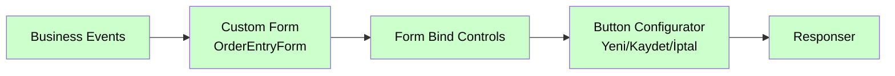

# Button Configurator

<div class="node-header">
  <span class="node-preview green-light">Button Configurator</span>
  <div class="meta-item"><strong>Inputs:</strong> <span class="io-badge in">1</span></div>
  <div class="meta-item"><strong>Outputs:</strong> <span class="io-badge out">1</span></div>
  <div class="meta-item"><strong>Kategori:</strong> trexMes service</div>
</div>

trexMes Main Form veya diğer operasyon formlarındaki **standart butonları** yapılandırır. Buton görünürlüğü, etiketi, varsayılan handler override durumu gibi ayarları tek seferde yönetir.

## Buton İndeksleri

Main Form ve operasyon formlarındaki butonlar **0-indexed** olarak sıralıdır. Aşağıdaki görselde her butonun ID numarası görünmektedir:

{ width="800" }

!!! info "Önemli"
    `props` listesindeki `p` değeri **1'den** başlar (kullanıcı dostu). Kod tarafında `ButtonIndexType = p - 1` dönüşümü yapılır.

## Property Tablosu

| Alan | Tip | Varsayılan | Açıklama |
|---|---|---|---|
| `name` | string | — | Canvas üzerinde gösterilecek ad |
| `formname` | string | _(boş)_ | Hedef form adı |
| `formainform` | boolean | `false` | Ana form (`AppForm`) mı? |
| `props` | array | `[]` | Buton konfigürasyon listesi |

## `props` Yapısı

Her satır 5 alandan oluşur:

| Anahtar | Açıklama | Örnek |
|---|---|---|
| `p` | Buton indeksi (1-based) | `1`, `2`, `3` |
| `v` | Varsayılan etiket (`DefaultCaption`) | `"Kaydet"` |
| `d` | Görünür mü? (`IsVisible`) | `true` |
| `e` | Default handler override? | `true` (kendi handler'ımız çalışsın) |
| `f` | Component adı (`ComponentName`) | `"btnSave"` |

```json
[
  {
    "p": "1",
    "v": "Yeni Sipariş",
    "d": true,
    "e": false,
    "f": "btnNewOrder"
  },
  {
    "p": "2",
    "v": "Kaydet",
    "d": true,
    "e": true,
    "f": "btnSave"
  },
  {
    "p": "5",
    "v": "İptal",
    "d": false,
    "e": false,
    "f": "btnCancel"
  }
]
```

## Çıkış Mesajı

```json
{
  "operationtype": "UIButtonConfig",
  "receiveddata": { /* event data */ },
  "value": [
    {
      "ButtonIndexType": 0,
      "DefaultCaption": "Yeni Sipariş",
      "IsVisible": true,
      "IsToOverrideDefaultHandler": false,
      "ComponentName": "btnNewOrder"
    },
    {
      "ButtonIndexType": 1,
      "DefaultCaption": "Kaydet",
      "IsVisible": true,
      "IsToOverrideDefaultHandler": true,
      "ComponentName": "btnSave"
    }
  ]
}
```

## `IsToOverrideDefaultHandler` Davranışı

| Değer | Anlam |
|---|---|
| `true` | Panel'in varsayılan buton işlevini **iptal et**, sadece bizim handler'ımız (`Form Events`) çalışsın |
| `false` | Panel'in standart işlevi devam etsin (örn. "İptal" panel default'unda formu kapatır) |

## Komponent İsmi Yeniden Tanımlama

`ComponentName` alanı sayesinde sistemdeki buton indeksini **özel bir isimle** çağırabilirsiniz. Bu sayede:

- Bir `Form Events` node'unda buton click yakalarken **indeks yerine isim** kullanabilirsiniz.
- Birden fazla projede aynı isim/iş mantığı tutarlı kalır.

## Tipik Akış



## Sık Karşılaşılan Hatalar

!!! failure "Buton hala görünmüyor / değişmedi"
    - `formname` doğru mu girildi? (`formainform: true` ise `AppForm`)
    - Buton indeksi geçerli aralıkta mı? (Görsele bakın)
    - Akışta `Custom Form` önce gelmiş mi?

!!! failure "Buton tıklaması cevapsız kalıyor"
    `IsToOverrideDefaultHandler: true` set ettiyseniz **mutlaka bir `Form Events`** ile buton click'i yakalayıp işlem yapın. Aksi takdirde tıklama sessizce yutulur.

## İpuçları

!!! tip "İsim standardizasyonu"
    `ComponentName`'leri `btnSave`, `btnCancel`, `btnNew` gibi prefix'li tutmak `Form Events` node'larında düzenli yakalama sağlar.

!!! tip "Konfigürasyonu reuse etmek"
    Aynı buton düzenini birden fazla formda kullanıyorsanız bu node'u **link out / link in** ile paylaşılabilir bir alt-akışa yerleştirin.

## İlgili

- [Custom Form](custom-form.md)
- [Form Events](form-events.md) — Buton tıklaması yakalama
- [Main Form Action](main-form-action.md) — Buton tetikleme
