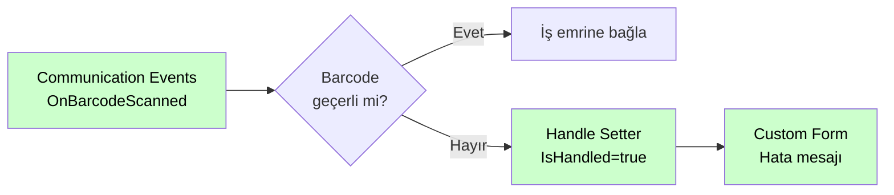

# Communication Events

<div class="node-header">
  <span class="node-preview green-light">Communication Events</span>
  <div class="meta-item"><strong>Inputs:</strong> <span class="io-badge in">0</span></div>
  <div class="meta-item"><strong>Outputs:</strong> <span class="io-badge out">1</span></div>
  <div class="meta-item"><strong>Kategori:</strong> trexMes service</div>
</div>

trexMes paneli ile **operatör veya harici cihaz arasındaki iletişim olaylarına** abone olur. Barkod okuma, seri port, IO kart, OPC ve benzeri dış kaynaklı etkileşimleri yakalar.

## Property Tablosu

| Alan | Tip | Varsayılan | Açıklama |
|---|---|---|---|
| `name` | string | — | Canvas üzerinde gösterilecek ad |
| `event` | string | _(boş)_ | Abone olunacak iletişim olayı |
| `ishandled` | boolean | `false` | Node-RED bu olayı handle ediyor mu? |

## Olay Listesi

| Olay | Açıklama |
|---|---|
| `OnAssemblyPictureSignalChanged` | Montaj resim gösterim sinyalinin değişimi sırasında fırlatılır. |
| `OnBarcodeScanned` | Uygulama ana ekranı veya COM barkod okuyucu ile gerçekleştirilen barkod okutma işlemlerinde tetiklenir. |
| `OnBarcodeScanning` | Barkod okutma işlemlerinde standart barkod kurguları çalıştırılmadan önce tetiklenir. IsHandled true ise standart işlem yapılmaz. |
| `OnNotificationMessageProcessing` | Bildirim mesajı alındığında tetiklenir. IsHandled true ise sadece mesaj durumu gösterildi olarak güncellenir. |
| `OnDigitalInputValueChanged` | Dijital input sinyal değeri değiştiğinde tetiklenir. |
| `OnDigitalInputValueChanging` | Dijital input sinyal değeri değişmek üzere olduğunda tetiklenir. |
| `OnDigitalOutputValueChanged` | Dijital output sinyal değeri değiştiğinde tetiklenir. |
| `OnDigitalOutputValueChanging` | Dijital output sinyal değeri değişmek üzere olduğunda tetiklenir. |
| `OnIOCardDataCoalesced` | IO kart üzerinden alınan sinyal verisinin çözümlenmesinden hemen önce tetiklenir. |
| `OnJobOrderStockBarcodeScanned` | İş emri veya stok barkodu taratılıp ilgili işlem gerçekleştirildiğinde tetiklenir. |
| `OnJobOrderStockBarcodeScanning` | İş emri veya stok barkodu taratıldığında tetiklenir. IsHandled true ise standart işlemler es geçilir. |
| `OnLotBarcodeScanning` | Sarf lot girişi için barkod okutma işlemi gerçekleştirildiğinde tetiklenir. IsHandled true ise standart işlemler es geçilir. |
| `OnNgpCommandProcessing` | trex Lite üzerinden gelen istek işlenmeden hemen önce tetiklenir. IsHandled true ise standart kurgu işletilmez. |
| `OnPortDataChanged` | OPC haberleşmesi üzerinden gerçekleşen veri portu değer değişimi işlendiğinde tetiklenir. |
| `OnPortDataChanging` | OPC haberleşmesi üzerinden gerçekleşen veri portu değer değişimi işlenmek üzere olduğunda tetiklenir. |
| `OnPortManagerConnected` | IO kart ile port yöneticisi arasında bağlantı gerçekleştirildiğinde tetiklenir. |
| `OnPortManagerInitialized` | Sinyal port yöneticisi ayağa kalktığında tetiklenir. |
| `OnPortManagerInitializing` | Sinyal port yöneticisi ayağa kalktığı esnada tetiklenir. |
| `OnPortParametersLoaded` | Sinyal port parametre tanımları yüklendiğinde tetiklenir. |
| `OnProductionConfirmationSignalChanged` | Üretim onay sinyali ile üretim onayı gerçekleştirildiğinde tetiklenir. |
| `OnProductionConfirmationSignalInputValuesSetting` | Üretim onay süreci sonrası sinyal input değerlerinin set edilmesi sırasında tetiklenir. |
| `OnSerialPortBarcodeScanning` | Seri port üzerinden barkod okutma işlemi gerçekleştirildiğinde standart işlemler öncesi tetiklenir. |
| `OnSerieBarcodeScanning` | Serili üretim barkod işlemleri gerçekleştirilmeden hemen önce tetiklenir. |
| `OnSocketMessageInterpreted` | OPC haberleşmesi amacı ile dinlenen TCP socket üzerinden gelen mesaj çözümlendiğinde tetiklenir. |
| `OnStoppageSignalChanged` | Duruş sinyal input durumu değiştiğinde tetiklenir. |
| `OnDefectEntrySignalChanged` | Iskarta giriş sinyal input durumu değiştiğinde tetiklenir. |

## `msg.payload` Yapısı

Communication Events, payload'u **düz (flat) birleştirilmiş** bir nesne olarak gönderir. Yapı şu sırayı izler:

1. **EventArgs alanları** — olaya özgü veriler, üst seviyede taşınır
2. **`IsHandled`** — akış kontrolü bayrağı
3. **`WorkStationStatusEntry`** — istasyonun anlık üretim durumu

```json
{
  "WorkStationId": 5,
  "Barcode": "STOCK-12345-SN-ABC123",
  "IsHandled": false,
  "WorkStationStatusEntry": {
    "WorkStationId": 0,
    "IsPlanLoaded": false,
    "IsStopped": false,
    "ProductionQuantity": 0.0,
    "ShiftId": 0,
    "ClientVersion": "",
    "...": "..."
  }
}
```

> Yukarıdaki örnek `OnBarcodeScanned` içindir. Her event kendi EventArgs alanlarını üst seviyede taşır.

!!! warning "IsHandled — akışı kesme"
    `IsHandled` alanı bulunan eventlarda, akış içinde bu değer `true` yapılırsa panel tarafındaki varsayılan işlem atlanır. Akışı kesmek veya veriyi değiştirmek için **Handle Setter** nodu kullanılır.

!!! info "Editörde önizleme"
    Event seçildiğinde editör içinde tam `msg.payload` yapısı **collapse edilebilir JSON ağacı** olarak görüntülenir. `IsHandled` içeren eventlar editörde amber uyarı bandı gösterir: iç objeler başlangıçta kapalı gelir, tıklanarak açılabilir.

## Örnek Kullanım



## İpuçları

!!! tip "Barkod yönlendirme"
    `OnBarcodeScanned` ile okunan barkodun içeriğine göre farklı üretim akışlarına yönlendirme yapabilirsiniz. `IsHandled: true` ile panelin kendi barkod işlemesini devre dışı bırakabilirsiniz.

!!! tip "Sinyal izleme"
    `OnDigitalInputValueChanged` ile IO kart giriş sinyallerini izleyebilir, belirli bir sinyal değişiminde üretim duruşu başlatabilir ya da alarm tetikleyebilirsiniz.

!!! tip "OPC veri günlüğü"
    `OnPortDataChanged` ile OPC tag değişimlerini InfluxDB veya MQTT'ye iletebilirsiniz.

## Argüman Referansı

Her event için `msg.payload` içindeki **EventArgs özel alanları** listelenmektedir.  
Tüm Communication Events payload'unda ayrıca **`IsHandled`** ve **`WorkStationStatusEntry`** da bulunur.

??? info "OnBarcodeScanned · OnJobOrderStockBarcodeScanned"
    Model: `BarcodeScannedEventArgs`
    ```json
    {
      "WorkStationId": 5,
      "Barcode": "STOCK-12345-SN-ABC123"
    }
    ```

??? info "OnBarcodeScanning · OnJobOrderStockBarcodeScanning · OnSerialPortBarcodeScanning"
    Model: `BarcodeScanningEventArgs`
    ```json
    {
      "WorkStationId": 5,
      "Barcode": "STOCK-12345-SN-ABC123",
      "IsBarcodeValid": true,
      "IsBarcodeChanged": true
    }
    ```

??? info "OnSerieBarcodeScanning"
    Model: `SerieBarcodeScanningEventArgs`
    ```json
    {
      "WorkStationId": 0,
      "Barcode": "",
      "IsBarcodeValid": false,
      "BarcodeValidationMessage": ""
    }
    ```

??? info "OnLotBarcodeScanning"
    Model: `LotBarcodeScanningEventArgs`
    ```json
    {
      "WorkStationId": 0,
      "LotNo": "",
      "StockId": 0,
      "JobOrderId": 0,
      "ItemNo": 0,
      "IsLotNoChanged": false
    }
    ```

??? info "OnNotificationMessageProcessing"
    Model: `NotificationMessageProcessingEventArgs`
    ```json
    {
      "WorkStationId": 0,
      "NotificationMessageId": 0,
      "Message": "",
      "TransactionType": 0,
      "TransactionId": 0,
      "TransactionQuantity": 0.0,
      "TransactionQuantityUnitType": 0
    }
    ```

??? info "OnAssemblyPictureSignalChanged · OnPortDataChanged · OnPortDataChanging · OnProductionConfirmationSignalChanged · OnStoppageSignalChanged"
    Model: `PortDataChangeEventArgs`
    ```json
    {
      "WorkstationId": 0,
      "Value": null,
      "Port": {
        "PortNo": 0,
        "PlcType": 0,
        "OpcIpAddress": "",
        "OpcPlcName": "",
        "OpcChannelName": "",
        "OpcTagDefinitionId": 0,
        "OpcTagDefinitionName": "",
        "DigitalInputType": 0,
        "IsHighSpeedCounter": false,
        "IsMultiCycle": false
      }
    }
    ```

??? info "OnDigitalInputValueChanged · OnDigitalInputValueChanging"
    Model: `DIChangeEventArgs` — Veri paketi tanımlanmamıştır.

??? info "OnDigitalOutputValueChanged · OnDigitalOutputValueChanging"
    Model: `DOChangeEventArgs` — Veri paketi tanımlanmamıştır.

??? info "OnIOCardDataCoalesced"
    Model: `IOCardDataCoalescedEventArgs`
    ```json
    {
      "Summary": {
        "PortName": "",
        "Data": ""
      }
    }
    ```

??? info "OnNgpCommandProcessing"
    Model: `NgpCommandProcessingEventArgs`
    ```json
    {
      "WorkStationId": 0,
      "IsProcessSuccessed": false,
      "ResponseMessage": "",
      "NgpCommand": {
        "WorkStationId": 0,
        "CommandId": 0,
        "CommandType": 0,
        "Command": "",
        "IsProcessed": false,
        "InsertUserId": 0,
        "InsertDate": null
      }
    }
    ```

??? info "OnPortManagerConnected"
    Model: `PortManagerConnectedEventArgs` — Veri paketi tanımlanmamıştır.

??? info "OnPortManagerInitialized"
    Model: `PortManagerInitializedEventArgs` — Veri paketi tanımlanmamıştır.

??? info "OnPortManagerInitializing"
    Model: `PortManagerInitializingEventArgs` — Veri paketi tanımlanmamıştır.

??? info "OnPortParametersLoaded"
    Model: `PortParametersLoadedEventArgs` — Veri paketi tanımlanmamıştır.

??? info "OnProductionConfirmationSignalInputValuesSetting"
    Model: `ProductionConfirmationSignalInputValuesSettingEventArgs`
    ```json
    {
      "WorkStationId": 0
    }
    ```

??? info "OnSocketMessageInterpreted"
    Model: `SocketMessageInterpretedEventArgs`
    ```json
    {
      "Summary": {
        "TagId": 0,
        "Time": 0,
        "Value": ""
      }
    }
    ```

??? info "OnDefectEntrySignalChanged"
    Model: `DefectEntrySignalChangedEventArgs`
    ```json
    {
      "WorkStationId": 0,
      "PortProcessType": 0
    }
    ```

## İlgili

- [Olay Nodları Genel Bakış](event-subscribers.md)
- [Handle Setter](handle-setter.md)
- [Responser](responser.md)
