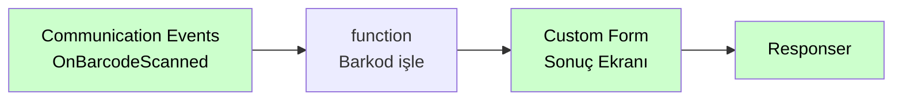

# Communication Events

<div class="node-header">
  <span class="node-preview green-light">Communication Events</span>
  <div class="meta-item"><strong>Inputs:</strong> <span class="io-badge in">0</span></div>
  <div class="meta-item"><strong>Outputs:</strong> <span class="io-badge out">1</span></div>
  <div class="meta-item"><strong>Kategori:</strong> trexMes service</div>
</div>

trexMes panelindeki **iletişim katmanı olaylarına** abone olur. PLC, OPC, Modbus, sensör veya diğer cihaz bağlantı durumu değişikliklerini yakalar.

## Property Tablosu

| Alan | Tip | Varsayılan | Açıklama |
|---|---|---|---|
| `name` | string | — | Canvas üzerinde gösterilecek ad |
| `method` | string | `get` | HTTP method (otomatik) |
| `event` | string | _(boş)_ | Panel'in tetikleyeceği HTTP path |
| `ishandled` | boolean | `false` | Node-RED handle ediyor mu? |

## Olay Listesi

`Event` alanı combobox ile seçilir. Mevcut seçenekler:

| Olay | Açıklama |
|---|---|
| `OnAssemblyPictureSignalChanged` | Montaj resim gösterim sinyalinin değişimi sırasında fırlatılır. |
| `OnBarcodeScanned` | Uygulama ana ekranı veya COM barkod okuyucu ile gerçekleştirilen barkod okutma işlemlerinde tetiklenir. |
| `OnBarcodeScanning` | Barkod okutma işlemlerinde standart barkod kurguları çalıştırılmadan önce tetiklenir. IsHandled true ise standart işlem yapılmaz. |
| `OnNotificationMessageProcessing` | Bildirim mesajı alındığında tetiklenir. IsHandled true ise sadece mesaj durumu gösterildi olarak güncellenir. |
| `OnDigitalInputValueChanged` | Dijital input sinyal değeri değiştiğinde tetiklenir. |
| `OnDigitalInputValueChanging` | Dijital input sinyal değeri değişmek üzere olduğunda tetiklenir. |
| `OnDigitalOutputValueChanged` | Dijital output sinyal değeri değiştiğinde tetiklenir. |
| `OnDigitalOutputValueChanging` | Dijital output sinyal değeri değişmek üzere olduğunda tetiklenir. |
| `OnIOCardDataCoalesced` | IO kart üzerinden alınan sinyal verisinin çözümlenmesinden hemen önce tetiklenir. |
| `OnJobOrderStockBarcodeScanned` | İş emri veya stok barkodu taratılıp ilgili işlem gerçekleştirildiğinde tetiklenir. |
| `OnJobOrderStockBarcodeScanning` | İş emri veya stok barkodu taratıldığında tetiklenir. IsHandled true ise standart işlemler es geçilir. |
| `OnLotBarcodeScanning` | Sarf lot girişi için barkod okutma işlemi gerçekleştirildiğinde tetiklenir. IsHandled true ise standart işlemler es geçilir. |
| `OnNgpCommandProcessing` | trex Lite üzerinden gelen istek işlenmeden hemen önce tetiklenir. IsHandled true ise standart kurgu işletilmez. |
| `OnPortDataChanged` | OPC haberleşmesi üzerinden gerçekleşen veri portu değer değişimi işlendiğinde tetiklenir. |
| `OnPortDataChanging` | OPC haberleşmesi üzerinden gerçekleşen veri portu değer değişimi işlenmek üzere olduğunda tetiklenir. |
| `OnPortManagerConnected` | IO kart ile port yöneticisi arasında bağlantı gerçekleştirildiğinde tetiklenir. |
| `OnPortManagerInitialized` | Sinyal port yöneticisi ayağa kalktığında tetiklenir. |
| `OnPortManagerInitializing` | Sinyal port yöneticisi ayağa kalktığı esnada tetiklenir. |
| `OnPortParametersLoaded` | Sinyal port parametre tanımları yüklendiğinde tetiklenir. |
| `OnProductionConfirmationSignalChanged` | Üretim onay sinyali ile üretim onayı gerçekleştirildiğinde tetiklenir. |
| `OnProductionConfirmationSignalInputValuesSetting` | Üretim onay süreci sonrası sinyal input değerlerinin set edilmesi sırasında tetiklenir. |
| `OnSerialPortBarcodeScanning` | Seri port üzerinden barkod okutma işlemi gerçekleştirildiğinde standart işlemler öncesi tetiklenir. |
| `OnSerieBarcodeScanning` | Serili üretim barkod işlemleri gerçekleştirilmeden hemen önce tetiklenir. |
| `OnSocketMessageInterpreted` | OPC haberleşmesi amacı ile dinlenen TCP socket üzerinden gelen mesaj çözümlendiğinde tetiklenir. |
| `OnStoppageSignalChanged` | Duruş sinyal input durumu değiştiğinde tetiklenir. |
| `OnDefectEntrySignalChanged` | Iskarta giriş sinyal input durumu değiştiğinde tetiklenir. |

## Örnek Kullanım



## Giriş Mesajı

```json
{
  "_msgid": "abc123",
  "payload": {
    "deviceId": "PLC-01",
    "deviceType": "Siemens S7-1200",
    "status": "Disconnected",
    "errorCode": "TIMEOUT",
    "timestamp": "2026-05-11T10:15:30Z"
  }
}
```

## İpuçları

!!! tip "Otomatik alarm"
    `PLCConnectionLost` olayı geldiğinde Slack/Teams/SMS bildirimi gönderen bir akış kurabilirsiniz.

!!! tip "Saha veri toplama"
    `SensorReading` olayını yüksek frekansta (saniyede 10+) işliyorsanız, debug node'unu kapatın, sadece InfluxDB/MQTT'ye yazın.

## İlgili

- [Olay Nodları Genel Bakış](event-subscribers.md)
- [Method Invoker](method-invoker.md)
