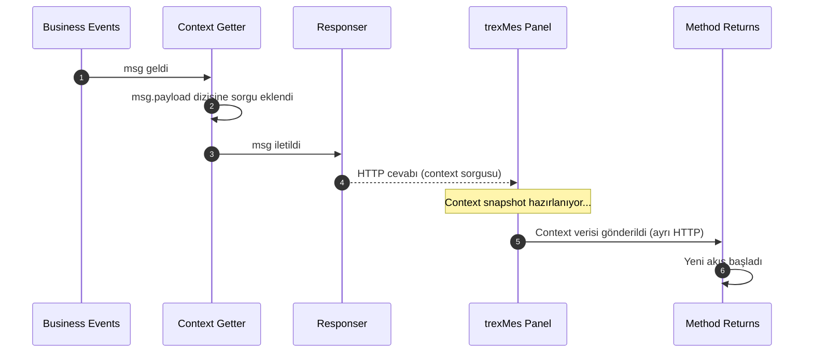
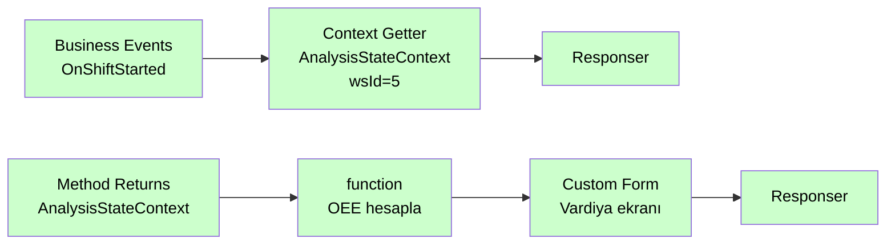

# Context Getter

<div class="node-header">
  <span class="node-preview green-light">Context Getter</span>
  <div class="meta-item"><strong>Inputs:</strong> <span class="io-badge in">1</span></div>
  <div class="meta-item"><strong>Outputs:</strong> <span class="io-badge out">1</span></div>
  <div class="meta-item"><strong>Kategori:</strong> trexMes service</div>
</div>

Belirtilen **WorkStation**'a ait bir **StateContext**'i trexMes panelinden sorgular. Sonuç asenkron olarak [Method Returns](method-returns.md) node'u üzerinden alınır.

## Özet

!!! info "Method Invoker kardeşi"
    Context Getter, Method Invoker ile aynı asenkron iletişim modelini kullanır. Fark şudur: Method Invoker bir **servis method'u çağırır**, Context Getter ise bir **StateContext snapshot'ı ister**.

## Property Tablosu

| Alan | Tip | Varsayılan | Açıklama |
|---|---|---|---|
| `name` | string | — | Node adı. **Method Returns ile eşleşmelidir** |
| `context` | combobox | `AnalysisStateContext` | Sorgulanacak StateContext |
| `workstationid` | num \| msg | `0` | Sorgulanacak istasyon ID'si |
| `workstationidType` | `"num"` \| `"msg"` | `"num"` | WorkStation ID değer kaynağı |

### Context Seçenekleri (25 adet)

| Context | Kapsam |
|---|---|
| `AnalysisStateContext` | OEE, performans, vardiya analizleri |
| `BarcodeStateContext` | Barkod okutma konfigürasyonu |
| `CapacityStateContext` | Çevrim süresi, max kapasite, hız |
| `ConsumptionStateContext` | Sarf tüketimi ve lot verileri |
| `CounterStateContext` | Üretim sayaçları ve sinyal portları |
| `DefectStateContext` | Iskarta miktarları ve konfigürasyonları |
| `EmployeeStateContext` | Personel giriş/çıkış ve takım bilgisi |
| `EnergyStateContext` | Enerji tüketim verileri (kW) |
| `EquipmentStateContext` | Mevcut ekipman bilgisi ve konfigürasyonu |
| `ForkliftStateContext` | Forklift görevi oluşturma ve takibi |
| `LabelStateContext` | Etiket yazıcı konfigürasyonu |
| `LineStateContext` | Hat üretimi, master istasyon, duruş aktarımı |
| `MaintenanceStateContext` | Bakım planı, aktif bakım iş emri |
| `OpcStateContext` | OPC üzerinden ekipman/stok/hız konfigürasyonu |
| `OperationStateContext` | Mevcut operasyon bilgileri |
| `ProcessDataStateContext` | Proses veri analiz değerleri |
| `ProductionConfirmationStateContext` | Üretim bildirimi konfigürasyon ve son kayıtlar |
| `ProductionPlanStateContext` | Yüklü plan bilgileri, stoklar, iş emirleri |
| `ProductionToleranceStateContext` | Üretim tolerans kontrol değerleri |
| `QualityControlStateContext` | Kalite kontrol tanımları ve output konfigürasyonları |
| `RobotModelStateContext` | Robot model üretim kurgusu |
| `ScaleStateContext` | Terazi ağırlık ve port verileri |
| `SerieStateContext` | Mevcut ürün seri barkodu |
| `StoppageStateContext` | Mevcut duruş bilgileri, süre, output konfigürasyonları |
| `WorkStationStateContext` | İstasyon kimlik ve iş merkezi bilgileri |

!!! tip "Property açıklamaları"
    Node editör panelinde Context seçimi değiştikçe, seçilen context'e ait tüm property'lerin açıklamaları WorkStation ID alanının altında görünür.

## Context İçerikleri

Her context, Method Returns node'u üzerinden geldiğinde `msg.payload` içinde aşağıdaki alanları taşır. Bağlantılı model olan alanlar (örn. `List<Stock>`) iç içe nesne olarak gelir.

??? info "AnalysisStateContext"
    | Alan | Tip | Açıklama |
    |---|---|---|
    | `ShiftProduction` | double | Mevcut vardiyadaki üretim (1. birim) |
    | `ShiftProduction2` | double | Mevcut vardiyadaki üretim (2. birim) |
    | `ShiftProduction3` | double | Mevcut vardiyadaki üretim (3. birim) |
    | `ShiftOeePercent` | double | Vardiya OEE yüzdesi |
    | `ShiftPerformancePercent` | double | Vardiya performans yüzdesi |
    | `ShiftAvailabilityPercent` | double | Vardiya kullanılabilirlik yüzdesi |
    | `ShiftQualityPercent` | double | Vardiya kalite yüzdesi |
    | `ShiftProducibleAmount` | double | Vardiyadaki toplam üretilebilir miktar |
    | `PlanPerformancePercent` | double | Aktif plan için hesaplanan performans yüzdesi |
    | `TargetOee` | double | İstasyon için hedef OEE yüzdesi |
    | `ShiftEfficiencyRefreshInterval` | int | Vardiya analiz yenileme aralığı (saniye; 60 = tetikle) |
    | `ShiftAverageSpeed` | double | Vardiyadaki ortalama üretim hızı |
    | `ShiftStoppageDuration` | int | Vardiyadaki toplam duruş süresi (saniye) |
    | `PlannedStopDuration` | double | Vardiyadaki planlı duruş süresi (saniye) |
    | `UnplannedStopDuration` | double | Vardiyadaki plansız duruş süresi (saniye) |
    | `PerformanceRangeOutputNo1` | int | 1. performans aralığı output port no |
    | `PerformanceRangeOutputNo1MinPercent` | int | 1. aralık minimum performans yüzdesi |
    | `PerformanceRangeOutputNo1MaxPercent` | int | 1. aralık maksimum performans yüzdesi |
    | `PerformanceRangeOutputNo2` | int | 2. performans aralığı output port no |
    | `PerformanceRangeOutputNo2MinPercent` | int | 2. aralık minimum performans yüzdesi |
    | `PerformanceRangeOutputNo2MaxPercent` | int | 2. aralık maksimum performans yüzdesi |
    | `PerformanceRangeOutputNo3` | int | 3. performans aralığı output port no |
    | `PerformanceRangeOutputNo3MinPercent` | int | 3. aralık minimum performans yüzdesi |
    | `PerformanceRangeOutputNo3MaxPercent` | int | 3. aralık maksimum performans yüzdesi |
    | `IsCalculationPerformanceRangeByPlanEnabled` | bool | Performans hesabı vardiyaya değil plana göre mi? |
    | `IsPerformanceOutputControlActive` | bool | Herhangi bir performans bazlı output konfigürasyonu var mı? |

??? info "BarcodeStateContext"
    | Alan | Tip | Açıklama |
    |---|---|---|
    | `DigitalOutputToBeActivatedOnBarcodeScan` | int | Barkod okutmada aktif edilecek output port no |
    | `IsWebBarcodeServiceEnabled` | bool | Web barkod servisinin aktif olup olmadığı |

??? info "CapacityStateContext"
    | Alan | Tip | Açıklama |
    |---|---|---|
    | `CyclePeriod` | double | Mevcut çevrim süresi |
    | `DynamicCyclePeriod` | double | Dinamik çevrim süresi |
    | `AverageCycleDuration` | double | Ortalama çevrim süresi |
    | `AverageSpeed` | double | Ortalama üretim hızı |
    | `InstantSpeed` | double | Anlık üretim hızı |
    | `MaxSpeed` | double | Tanımlı maksimum hız |
    | `MaxPlanCapacity` | double | Maksimum plan kapasitesi |
    | `MaxStationCapacity` | double | Maksimum istasyon kapasitesi |
    | `SpeedTimeMultiplier` | SpeedTimeMultiplier | Hız zaman çarpanı |
    | `LineSpeedMultiplier` | double | Hat hız çarpanı |
    | `SpeedCounterPortIndex` | int | Hız sayacı port indisi |
    | `SpeedCounterPortNo` | int | Hız sayacı port numarası |
    | `IsUsingEstimatedCyclePeriodEnabled` | bool | Tahmini çevrim süresi kullanılıyor mu? |
    | `IsSettingCyclePeriodDueToCoefficientChangeEnabled` | bool | Katsayı değişiminde çevrim süresi güncelleniyor mu? |
    | `IsMaxCapacityControlEnabled` | bool | Maksimum kapasite kontrolü aktif mi? |
    | `MaxCapacityControlTolerance` | int | Maksimum kapasite kontrol toleransı |
    | `IsCapacityValidationEnabled` | bool | Kapasite doğrulama aktif mi? |
    | `SpeedSamples` | List\<InstantSpeedSample\> | Anlık hız örnekleri |

??? info "ConsumptionStateContext"
    | Alan | Tip | Açıklama |
    |---|---|---|
    | `Consumptions` | List\<Consumption\> | Sarf tüketimleri ve lot verileri |
    | `InsufficientLotDigitalOutputNo` | int | Yetersiz lot durumunda output port no |
    | `IsConsideringOtherWorkStationsLotConsumptionEnabled` | bool | Diğer istasyonların lot tüketimi dikkate alınıyor mu? |
    | `OtherWorkStationLotConsumptionCalculationInvertal` | int | Diğer istasyon lot tüketimi hesaplama aralığı |
    | `MaterialLotBalanceCheckTimeInverval` | int | Malzeme lot bakiye kontrol aralığı |
    | `MaterialLotBalanceCheckUpSystemTimeInverval` | int | Malzeme lot bakiye sistem güncelleme aralığı |

??? info "CounterStateContext"
    | Alan | Tip | Açıklama |
    |---|---|---|
    | `Counter` | double | 1. üretim sayacı |
    | `Counter2` | double | 2. üretim sayacı |
    | `Counter3` | double | 3. üretim sayacı |
    | `MachineCounter` | double | Makine sayacı |
    | `TotalPortCounter` | double | Toplam port sayacı |
    | `LastCycleDuration` | double | Son çevrim süresi |
    | `LastCounterChangeTime` | DateTime | Son sayaç değişim zamanı |
    | `LastCounterChangeTimeWithMilliSeconds` | DateTime | Son sayaç değişim zamanı (ms dahil) |
    | `CounterIncrementDuringNoShift` | double | Vardiya dışı sayaç artışı |
    | `NoCountSignalStatus` | bool | Sayım yok sinyal durumu |
    | `IndexedSectionCounters` | double[] | Bölüm bazlı sayaçlar (1. birim) |
    | `IndexedSectionCounters2` | double[] | Bölüm bazlı sayaçlar (2. birim) |
    | `IndexedSectionCounters3` | double[] | Bölüm bazlı sayaçlar (3. birim) |
    | `IndexedSectionDefectCounters` | double[] | Bölüm bazlı ıskarta sayaçları (1. birim) |
    | `MachineStockCounter` | double[] | Makine stok sayaçları (1. birim) |
    | `MachineStockCounter2` | double[] | Makine stok sayaçları (2. birim) |
    | `MachineStockCounter3` | double[] | Makine stok sayaçları (3. birim) |
    | `LastRecordedCounter` | double | Son kaydedilen sayaç (1. birim) |
    | `LastRecordedCounter2` | double | Son kaydedilen sayaç (2. birim) |
    | `LastRecordedCounter3` | double | Son kaydedilen sayaç (3. birim) |
    | `CounterSignalPort` | SignalPort | Sayaç sinyal portu |
    | `InputSignalPort` | SignalPort | Giriş sinyal portu |
    | `DefaultSignalPort` | SignalPort | Varsayılan sinyal portu |
    | `AdditionalCounterSignalPorts` | SignalPort[] | Ek sayaç sinyal portları |
    | `MeterCutOffQuantityUnitType` | int | Metre kesim miktar birim tipi |
    | `IsEquipmentStockIndexBasedCounterEnabled` | bool | Ekipman-stok indis bazlı sayaç aktif mi? |
    | `IsIncreasingCounterViaBarcodeEnabled` | bool | Barkod ile sayaç artışı aktif mi? |
    | `IsActivatingDigitalOutputOnCounter1IncrementEnabled` | bool | Sayaç 1 artışında output aktif mi? |
    | `DigitalOutputToBeActivatedOnCounterIncrement` | int | Sayaç 1 artışında aktif edilecek output |
    | `DurationForOutputActivationOnCounterIncrement` | int | Sayaç 1 output aktif süre |
    | `IsActivatingDigitalOutputOnCounter2IncrementEnabled` | bool | Sayaç 2 artışında output aktif mi? |
    | `DigitalOutputToBeActivatedOnCounterIncrement2` | int | Sayaç 2 artışında aktif edilecek output |
    | `DurationForOutputActivationOnCounterIncrement2` | int | Sayaç 2 output aktif süre |

??? info "DefectStateContext"
    | Alan | Tip | Açıklama |
    |---|---|---|
    | `DefectQuantity` | double | Toplam ıskarta miktarı (1. birim) |
    | `DefectQuantity2` | double | Toplam ıskarta miktarı (2. birim) |
    | `DefectQuantity3` | double | Toplam ıskarta miktarı (3. birim) |
    | `MaterialDefectQuantity` | double | Malzeme ıskarta miktarı (1. birim) |
    | `MaterialDefectQuantity2` | double | Malzeme ıskarta miktarı (2. birim) |
    | `MaterialDefectQuantity3` | double | Malzeme ıskarta miktarı (3. birim) |
    | `StockDefectQuantity` | double[] | Stok bazlı ıskarta miktarları (1. birim) |
    | `StockDefectQuantity2` | double[] | Stok bazlı ıskarta miktarları (2. birim) |
    | `StockDefectQuantity3` | double[] | Stok bazlı ıskarta miktarları (3. birim) |
    | `CounterDifferenceCausedAutoDefectId` | int | Sayaç farkından otomatik ıskarta tanımı |
    | `IsUnitConversionForCounterDifferenceCausedDefectEnabled` | bool | Birim dönüşümü aktif mi? |
    | `CounterDifferenceCausedDefectMinuendQuantityType` | int | Eksilen miktar birim tipi |
    | `CounterDifferenceCausedDefectSubtrahendQuantityType` | int | Çıkarılan miktar birim tipi |
    | `IsUpdatingPreviousOperationPlanQuantityDueToScrapAmountEnabled` | bool | Önceki operasyon miktarı ıskartaya göre güncelleniyor mu? |
    | `IsUpdatingAllPreviousOperationsPlanQuantityDueToScrapAmountEnabled` | bool | Tüm önceki operasyonlar güncelleniyor mu? |
    | `IsCheckingDefectEntryIfGreaterThanCounterEnabled` | bool | Iskarta sayaçtan büyük ise uyarı aktif mi? |
    | `DefectSignalPorts` | SignalPort[] | Iskarta sinyal portları |

??? info "EmployeeStateContext"
    | Alan | Tip | Açıklama |
    |---|---|---|
    | `Team` | Team | Aktif takım ve operatör bilgisi |
    | `IsNotifyingIfEmployeeLoggedInAnotherWorkStationEnabled` | bool | Başka istasyonda giriş varsa bildirim |
    | `IsPreventingEmployeeLoginIfLoggedInAnotherWorkStationEnabled` | bool | Başka istasyonda giriş varsa engelle |
    | `IsLoggingInAndOutEmployeeViaBarcodeEnabled` | bool | Barkod ile giriş/çıkış aktif mi? |
    | `IsChangingEmployeeViaBarcodeEnabled` | bool | Barkod ile personel değişimi aktif mi? |
    | `EmployeeLoginLogoutDigitalOutputNo` | int | Personel giriş/çıkış output port no |
    | `ProductionWithoutEmployeeDigitalOutputNo` | int | Operatörsüz üretim output port no |

??? info "EnergyStateContext"
    | Alan | Tip | Açıklama |
    |---|---|---|
    | `EnergyCounterCount` | int | Enerji sayacı adedi |
    | `EnergyConsumptionsDuringWorkAsKilowatt` | double[] | Üretim sırasında tüketim (kW) |
    | `EnergyConsumptionsDuringStoppageAsKilowatt` | double[] | Duruş sırasında tüketim (kW) |
    | `EnergyConsumptionDuringStandByAsKilowatt` | double[] | Bekleme sırasında tüketim (kW) |

??? info "EquipmentStateContext"
    | Alan | Tip | Açıklama |
    |---|---|---|
    | `EquipmentId` | int | Mevcut ekipman referansı |
    | `EquipmentNo` | string | Ekipman numarası |
    | `EquipmentName` | string | Ekipman adı |
    | `EquipmentCoefficient` | double | Ekipman katsayısı |
    | `IsEquipmentValidationEnabled` | bool | Ekipman doğrulama aktif mi? |
    | `IsEquipmentSelectionOnPlanLoadEnabled` | bool | Plan yüklemede ekipman seçimi aktif mi? |
    | `IsEquipmentSelectionOnPlanLoadRequired` | bool | Plan yüklemede ekipman seçimi zorunlu mu? |

??? info "ForkliftStateContext"
    | Alan | Tip | Açıklama |
    |---|---|---|
    | `IsAutoForkliftOrderCreationEnabled` | bool | Otomatik forklift görevi oluşturma aktif mi? |
    | `AutoForkliftOrderInterval` | int | Otomatik forklift görevi aralığı |
    | `IsConsecutivelyForkliftOrderCreationDisabled` | bool | Art arda forklift görevi oluşturma devre dışı mı? |
    | `ForkliftTakeOrderAmountFrequency` | double[] | Forklift alma görevi miktar frekansı |
    | `LastForkliftTakeOrderProductionAmount` | double[] | Son forklift alma görevindeki üretim miktarı |
    | `ForkliftFetchOrderFrequency` | int | Forklift getirme görevi frekansı |
    | `LastForkliftFetchOrderProductionAmount` | double[] | Son forklift getirme görevindeki üretim miktarı |

??? info "LabelStateContext"
    | Alan | Tip | Açıklama |
    |---|---|---|
    | `LabelComPortNo` | string | Etiket yazıcı COM port numarası |

??? info "LineStateContext"
    | Alan | Tip | Açıklama |
    |---|---|---|
    | `CurrentLineId` | int | Mevcut hat referansı |
    | `LineNumbers` | int[] | Hat numaraları |
    | `MasterStationIds` | string | Master istasyon ID'leri |
    | `LineIds` | string | Hat ID'leri |
    | `LineStationIds` | string | Hat istasyon ID'leri |
    | `LineNextStationIds` | string | Hattaki sonraki istasyon ID'leri |
    | `LineBackStationIds` | string | Hattaki önceki istasyon ID'leri |
    | `LineStationOrderNo` | int | Hat içindeki istasyon sıra numarası |
    | `RelatedWorkStationId` | int | İlişkili istasyon ID'si |
    | `IsMasterStation` | bool | Master istasyon mu? |
    | `IsLineProductionEnabled` | bool | Hat üretimi aktif mi? |
    | `IsLineAssemblyProductionEnabled` | bool | Hat montaj üretimi aktif mi? |
    | `IsLinePalletingWorkStation` | bool | Hat paletleme istasyonu mu? |
    | `IsLinePackagingWorkStation` | bool | Hat paketleme istasyonu mu? |
    | `IsLineSerieProductionEnabled` | bool | Hat serili üretim aktif mi? |
    | `IsRandomLineWorkEnabled` | bool | Rastgele hat çalışması aktif mi? |
    | `IsListingAlreadyWorkedMasterStationJobsDisabled` | bool | Çalışılmış master istasyon işleri listeleme kapalı mı? |
    | `IsCheckingMasterStationOnPlanLoadDisabled` | bool | Plan yüklemede master istasyon kontrolü kapalı mı? |
    | `MasterStationJobControlInterval` | int | Master istasyon iş kontrol aralığı |
    | `StoppageReasonStationStoppageCauseId` | int | Duruş neden istasyonu duruş nedeni ID'si |
    | `IsLineStopStatusChanged` | bool | Hat durma durumu değişti mi? |
    | `IsCheckingLineStopStartTimeEnabled` | bool | Hat durma başlangıç zamanı kontrolü aktif mi? |

??? info "MaintenanceStateContext"
    | Alan | Tip | Açıklama |
    |---|---|---|
    | `CurrentOrder` | MaintenanceOrder | Aktif bakım iş emri |
    | `EmployeeEntries` | List\<MaintenanceEmployeeEntry\> | Bakım personel girişleri |
    | `AnyMaintenanceOrderActiveForCurrentEquipment` | bool | Mevcut ekipman için aktif bakım var mı? |
    | `IsMaintenanceWarningEnabled` | bool | Bakım uyarısı aktif mi? |
    | `IsMaintenanceWebModuleEnabled` | bool | Web bakım modülü aktif mi? |
    | `EquipmentPeriodicalMaintenancePlanId` | int | Periyodik bakım planı ID'si |
    | `EquipmentTargetCycleCount` | int | Hedef çevrim sayısı |
    | `EquipmentLastCycleCount` | int | Son çevrim sayısı |
    | `EquipmentLastMaintenanceCycleCount` | int | Son bakımdaki çevrim sayısı |
    | `EquipmentPeriodicalMaintenanceCycleCount` | int | Periyodik bakım çevrim sayısı |
    | `EquipmentAdditionalMaintenanceCycleCount` | int | Ek bakım çevrim sayısı |
    | `IsCreatingPeriodicalMaintenanceOrderWithoutWarningEnabled` | bool | Uyarısız periyodik bakım oluşturulsun mu? |
    | `MaintenanceOrderCompleterEmployeeId` | int | Bakımı tamamlayan personel ID'si |

??? info "OpcStateContext"
    | Alan | Tip | Açıklama |
    |---|---|---|
    | `IsOpcEquipmentDefined` | bool | OPC üzerinden ekipman tanımlı mı? |
    | `IsOpcStockDefined` | bool | OPC üzerinden stok tanımlı mı? |
    | `IsOpcSpeedDefined` | bool | OPC üzerinden hız tanımlı mı? |
    | `IsSpeedEstablishedViaOpc` | bool | Hız OPC üzerinden mi alınıyor? |

??? info "OperationStateContext"
    | Alan | Tip | Açıklama |
    |---|---|---|
    | `OperationId` | int | Mevcut operasyon referansı |
    | `OperationNo` | string | Operasyon numarası |
    | `OperationName` | string | Operasyon adı |
    | `IsCheckingPreviousOperationProductionControlOnJobListingEnabled` | bool | İş listelemede önceki operasyon üretim kontrolü aktif mi? |
    | `IsCheckingPreviousOperationWorkingControlOnJobListingEnabled` | bool | İş listelemede önceki operasyon çalışma kontrolü aktif mi? |

??? info "ProcessDataStateContext"
    Veri paketi tanımlanmamıştır; yalnızca metot çağrıları içerir.

??? info "ProductionConfirmationStateContext"
    | Alan | Tip | Açıklama |
    |---|---|---|
    | `ProductionConfirmationTime` | DateTime | Üretim onay zamanı |
    | `ProductionConfirmationTimeWithMilliSeconds` | DateTime | Üretim onay zamanı (ms dahil) |
    | `LastProductionConfirmationTime` | DateTime? | Son onay zamanı |
    | `LastSectionSaveTime` | DateTime? | Son bölüm kayıt zamanı |
    | `ProductionStartTime` | DateTime | Üretim başlangıç zamanı |
    | `LastProductionReceiptQuantity` | double | Son üretim fişi miktarı |
    | `LastPlanReceiptId` | int | Son plan fişi ID'si |
    | `LastProductionReceiptIds` | string | Son üretim fişi ID'leri |
    | `IsLastProductionReceiptIntegratedSuccessfully` | bool | Son fiş entegrasyonu başarılı mı? |
    | `ReceiptIntegrationType` | ReceiptIntegrationType | Fiş entegrasyon tipi |
    | `IsProductionApproveEnabled` | bool | Üretim onayı aktif mi? |
    | `IsShiftChiefRequiredToCompleteProduction` | bool | Vardiya şefi onayı zorunlu mu? |
    | `IsProductionAmountChangedManually` | bool | Üretim miktarı manuel değiştirildi mi? |
    | `OppositeLotNo` | string | Karşı lot numarası |
    | `LotDescription` | string | Lot açıklaması |
    | `PlanReceiptReservedValue1` | double | Plan fişi rezerv değer 1 |
    | `PlanReceiptReservedValue2` | double | Plan fişi rezerv değer 2 |
    | `PlanReceiptReservedValue3` | double | Plan fişi rezerv değer 3 |
    | `IsUnapprovedProductionConfirmationEnabled` | bool | Onaysız üretim bildirimi aktif mi? |
    | `ProductionConfirmationDigitalOutputNo` | int | Üretim onay output port no |
    | `IsShowingDefectEntryBeforeConfirmationEnabled` | bool | Onay öncesi ıskarta girişi gösterilsin mi? |
    | `IsRequestingNonCompleteReceiptBarcodeEnabled` | bool | Yarım kasa fişi barkodu isteniyor mu? |
    | `IsRequestingUnderPerfomanceCauseEnabled` | bool | Düşük performans nedeni isteniyor mu? |
    | `UnderPerformanceLimitPercent` | int | Düşük performans sınırı yüzdesi |
    | `AutomaticReceiptQuantityUnitType1` | int | Otomatik fiş 1. miktar birim tipi |
    | `AutomaticReceiptQuantityUnitType2` | int | Otomatik fiş 2. miktar birim tipi |
    | `AutomaticReceiptQuantityUnitType3` | int | Otomatik fiş 3. miktar birim tipi |
    | `IsModifyingProductionEntriesOnProductionApproveEnabled` | bool | Onay sırasında üretim girişleri değiştirilebilir mi? |
    | `UserDefinedDataList` | Dictionary\<string, object\> | Kullanıcı tanımlı veri listesi |

??? info "ProductionPlanStateContext"
    | Alan | Tip | Açıklama |
    |---|---|---|
    | `PlanId` | int | Aktif plan referansı |
    | `PlanQuantity` | double | Planlanan üretim miktarı (1. birim) |
    | `PlanQuantity2` | double | Planlanan üretim miktarı (2. birim) |
    | `PlanQuantity3` | double | Planlanan üretim miktarı (3. birim) |
    | `LeftAmountForPlanCompletion` | double | Plana tamamlanmasına kalan miktar (1. birim) |
    | `LeftAmountForPlanCompletion2` | double | Plana tamamlanmasına kalan miktar (2. birim) |
    | `LeftAmountForPlanCompletion3` | double | Plana tamamlanmasına kalan miktar (3. birim) |
    | `PlanTotalProductionQuantity` | double | Toplam üretim miktarı (1. birim) |
    | `PlanTotalProductionQuantity2` | double | Toplam üretim miktarı (2. birim) |
    | `PlanTotalProductionQuantity3` | double | Toplam üretim miktarı (3. birim) |
    | `PlanTotalDefectQuantity` | double | Toplam ıskarta miktarı (1. birim) |
    | `PlanTotalDefectQuantity2` | double | Toplam ıskarta miktarı (2. birim) |
    | `PlanTotalDefectQuantity3` | double | Toplam ıskarta miktarı (3. birim) |
    | `PlanWorkStartDate` | DateTime? | Plan yüklenme zamanı |
    | `PlanStartDate` | DateTime? | Planın başlangıç zamanı |
    | `PlanDurationAsDays` | double | Plan toplam süresi (gün) |
    | `PlanNote` | string | Plan notu |
    | `PlanDescription` | string | Plan açıklaması |
    | `TraceNo` | string | Takip numarası |
    | `PlanSetupDuration` | int | Hazırlık duruş süresi (saniye) |
    | `PlanSetupStoppageCauseId` | int | Hazırlık duruş nedeni referansı |
    | `PlanRequiredEmployeeCount` | int | Gereken minimum operatör sayısı |
    | `PlanCycleOfPulse` | double | Sinyal bölen değeri |
    | `PlannedCyclePeriod` | double | Planlanan çevrim süresi |
    | `PreviousPlanId` | int | Bir önceki plan referansı |
    | `LastProducedStockId` | int | Son üretilen stok referansı |
    | `PlanProductCount` | int | Üretilecek ürün çeşit sayısı |
    | `PlanMaterialCount` | int | Sarf malzeme çeşit sayısı |
    | `ProductionPlanReceiptCount` | int | Üretim fiş sayısı |
    | `Stocks` | List\<Stock\> | Üretilecek stoklar |
    | `JobOrderId` | int[] | İş emri referansları (stok indisli) |
    | `ProductTreeId` | int[] | Ürün ağacı referansları (stok indisli) |
    | `PlanItemNo` | int[] | Plan detay sıra numaraları |
    | `PlanItemStatus` | int[] | Plan detay durumları |

??? info "ProductionToleranceStateContext"
    | Alan | Tip | Açıklama |
    |---|---|---|
    | `ProductionToleranceDueToNetWorkTime` | int | Net çalışma süresine göre üretim toleransı |
    | `MinProductionToleranceDueToSignalCounter` | int | Sinyal sayacına göre minimum tolerans |
    | `MaxProductionToleranceDueToSignalCounter` | int | Sinyal sayacına göre maksimum tolerans |
    | `IsMinProductionToleranceDueToPlanAmountEnabled` | bool | Plan miktarına göre minimum tolerans aktif mi? |
    | `IsMaxProductionToleranceDueToPlanAmountEnabled` | bool | Plan miktarına göre maksimum tolerans aktif mi? |
    | `MinProductionToleranceDueToPlanAmount` | int | Plan miktarına göre minimum tolerans |
    | `MaxProductionToleranceDueToPlanAmount` | int | Plan miktarına göre maksimum tolerans |
    | `IsMinProductionToleranceDueToStockUnitEnabled` | bool | Stok birimine göre minimum tolerans aktif mi? |
    | `IsMaxProductionToleranceDueToStockUnitEnabled` | bool | Stok birimine göre maksimum tolerans aktif mi? |
    | `MinProductionToleranceDueToStockUnit` | int | Stok birimine göre minimum tolerans |
    | `MaxProductionToleranceDueToStockUnit` | int | Stok birimine göre maksimum tolerans |
    | `StockUnitProductionToleranceUnitType` | int | Stok birimi tolerans tipi |

??? info "QualityControlStateContext"
    | Alan | Tip | Açıklama |
    |---|---|---|
    | `AnyInitialControlDefinitionExists` | bool | İlk kontrol tanımı var mı? |
    | `AnyFrequentialControlDefinitionExists` | bool | Frekans kontrol tanımı var mı? |
    | `AnyFinalControlDefinitionExists` | bool | Son kontrol tanımı var mı? |
    | `AnyUserDefinedControlDefinitionExists` | bool | Kullanıcı tanımlı kontrol var mı? |
    | `AnyUserDefinedTemplateExists` | bool | Kullanıcı tanımlı şablon var mı? |
    | `InitialControlTemplate` | QualityControlTemplate | İlk kontrol şablonu |
    | `InitialControlDefinitions` | TechnicalControlDefinition[] | İlk kontrol tanımları |
    | `FrequentialControlTemplate` | QualityControlTemplate | Frekans kontrol şablonu |
    | `FrequentialControlDefinitions` | TechnicalControlDefinition[] | Frekans kontrol tanımları |
    | `FinalControlTemplate` | QualityControlTemplate | Son kontrol şablonu |
    | `FinalControlDefinitions` | TechnicalControlDefinition[] | Son kontrol tanımları |
    | `UserDefinedControlTemplates` | List\<QualityControlTemplate\> | Kullanıcı tanımlı şablonlar |
    | `TechnicalControlEvents` | List\<TechnicalControlEvent\> | Teknik kontrol olayları |
    | `InitialInspectionInterval` | int | İlk kontrol aralığı |
    | `IsDisplayingQualityReceiptMessageOnCreationEnabled` | bool | Oluşturmada kalite fiş mesajı gösterilsin mi? |
    | `IsQualityWebModuleEnabled` | bool | Kalite web modülü aktif mi? |
    | `IsQualityWebModuleAutoLoginEnabled` | bool | Kalite web modülü otomatik giriş aktif mi? |
    | `DigitalOutputToBeActivatedOnQualityReceiptAccepted` | int | Onaylanan kalite fişinde output port no |
    | `DigitalOutputToBeActivatedOnQualityReceiptRejected` | int | Reddedilen kalite fişinde output port no |
    | `DigitalOutputToBeActivatedOnQualityReceiptWaiting` | int | Bekleyen kalite fişinde output port no |

??? info "RobotModelStateContext"
    | Alan | Tip | Açıklama |
    |---|---|---|
    | `IsRobotModelProductionEnabled` | bool | Robot model üretimi aktif mi? |
    | `IsRobotModelStockProductionEnabled` | bool | Robot model stok üretimi aktif mi? |
    | `LastRobotModelNo` | string | Son robot model numarası |
    | `LastRobotModelStockIds` | int[] | Son robot model stok ID'leri |
    | `LastRobotModelMultipliers` | double[] | Son robot model çarpanları |
    | `IsLastRobotModelStoppageModel` | bool | Son model duruş modeli miydi? |

??? info "ScaleStateContext"
    | Alan | Tip | Açıklama |
    |---|---|---|
    | `GrossWeight` | double | Brüt ağırlık |
    | `TareWeight` | double | Tare ağırlık |
    | `ScalePortData` | string | Terazi port ham verisi |
    | `ScaleDataPort` | SignalPort | Terazi veri portu |

??? info "SerieStateContext"
    | Alan | Tip | Açıklama |
    |---|---|---|
    | `CurrentProductBarcodeSerie` | ProductSerieInfo | Mevcut ürün seri barkod bilgisi |

??? info "StoppageStateContext"
    | Alan | Tip | Açıklama |
    |---|---|---|
    | `CurrentStoppageId` | int | Aktif duruş nedeni referansı |
    | `CurrentStoppage` | StoppageCause | Aktif duruş nedeni |
    | `IsPlannedStoppage` | bool | Planlı duruş mu? |
    | `StoppageStartTime` | DateTime | Duruş başlangıç zamanı |
    | `StoppageStartTimeWithMilliSeconds` | DateTime | Duruş başlangıç zamanı (ms dahil) |
    | `CurrentStoppageDuration` | int | Mevcut duruş süresi (saniye) |
    | `CurrentPlannedStoppageDuration` | int | Mevcut planlı duruş süresi (saniye) |
    | `TotalStoppageDuration` | int | Toplam duruş süresi |
    | `CurrentStoppageEstimatedDuration` | int | Tahmini duruş süresi |
    | `CurrentStoppageEndQuantity` | double | Duruşun biteceği üretim miktarı |
    | `StatusChangeTime` | DateTime | Durum değişim zamanı |
    | `CurrentStatusDurationAsSeconds` | int | Mevcut durum süresi (saniye) |
    | `ProductionDuringStoppage` | double | Duruş sırasındaki üretim (1. birim) |
    | `ProductionDuringStoppage2` | double | Duruş sırasındaki üretim (2. birim) |
    | `ProductionDuringStoppage3` | double | Duruş sırasındaki üretim (3. birim) |
    | `IsStoppageSelectedByEmployee` | bool | Duruş operatör tarafından mı seçildi? |
    | `IfStoppageStartedViaSignal` | bool | Duruş sinyal ile mi başladı? |
    | `StoppageSignalPortNo` | int | Duruş sinyal port numarası |
    | `StoppagePriority` | int | Duruş önceliği |
    | `ReasonEquipmentId` | int | Duruş neden ekipman ID'si |
    | `SignalStopType` | TrexStopType | Sinyal duruş tipi |
    | `LineStopType` | TrexStopType | Hat duruş tipi |
    | `StoppageBackgroundColor` | EdgeColor | Duruş arka plan rengi |
    | `StoppageForegroundColor` | EdgeColor | Duruş ön plan rengi |
    | `IfAuthorizationRequired` | bool | Yetkilendirme gerekli mi? |
    | `IfInteractionOrAuthorizationRequired` | bool | Etkileşim veya yetkilendirme gerekli mi? |
    | `NoShiftStoppageId` | int | Vardiya dışı duruş ID'si |
    | `IsCurrentStoppageShiftBreakStoppage` | bool | Mevcut duruş vardiya molası mı? |
    | `WorkStationSetupStoppageCauseId` | int | İstasyon hazırlık duruş nedeni ID'si |
    | `UndefinedStoppageChangeMinLimit` | int | Tanımsız duruş değişim alt limiti |
    | `UndefinedStoppageChangeMaxLimit` | int | Tanımsız duruş değişim üst limiti |
    | `ShortStoppageIgnoreLimit` | int | Kısa duruş yok sayma limiti |
    | `UndefinedStoppageDigitalOutputNo` | int | Tanımsız duruş output port no |
    | `PlannedStoppageEndDigitalOutputNo` | int | Planlı duruş bitiş output port no |
    | `WorkingStateDigitalOutputNo` | int | Çalışma durumu output port no |
    | `IsUndefinedStoppageOutputControlActive` | bool | Tanımsız duruş output kontrolü aktif mi? |
    | `StopStartDescription` | string | Duruş başlangıç açıklaması |
    | `StopEndDescription` | string | Duruş bitiş açıklaması |

??? info "WorkStationStateContext"
    | Alan | Tip | Açıklama |
    |---|---|---|
    | `WorkStationId` | int | İstasyon referansı |
    | `WorkStationNo` | string | İstasyon numarası |
    | `WorkStationName` | string | İstasyon adı |
    | `TranslatedWorkStationName` | string | Çevrilmiş istasyon adı |
    | `WorkStationGroup` | string | İstasyon grubu |
    | `Description` | string | İstasyon açıklaması |
    | `WorkCenterId` | int | İş merkezi referansı |
    | `WorkCenterNo` | string | İş merkezi numarası |
    | `WorkCenterName` | string | İş merkezi adı |
    | `StationEquipmentId` | int | İstasyon sabit ekipman referansı |
    | `MachineType` | MachineType | Makine tipi |
    | `PreviousWorkStationId` | int | Önceki istasyon referansı |
    | `NextWorkStationId` | int | Sonraki istasyon referansı |
    | `RequiredEmployeeCount` | int | Gereken operatör sayısı |
    | `WorkStationCycleUnitType` | CycleUnitType | Çevrim birimi tipi |
    | `WorkStationCycleUnitName` | string | Çevrim birimi adı |
    | `QuantityDisplayFormat` | string | Miktar görüntüleme formatı |
    | `MaxCycleOfCoefficient` | int | Maksimum çevrim katsayısı |
    | `MaxCycleOfPulse` | int | Maksimum çevrim puls |
    | `MaxStockCoefficient` | int | Maksimum stok katsayısı |
    | `IsHidingOnStationSelectionEnabled` | bool | İstasyon seçiminde gizleme aktif mi? |

## Çıkış Mesajı

Context Getter, **Method Invoker ile aynı `msg.payload` array pattern'ini** kullanır. Sorgu nesnesi `msg.payload` dizisine eklenir:

```json
// msg.payload (array)
[
  {
    "message"      : "ProductionPlanStateContext",
    "valuelabel"   : 5,
    "name"         : "PlanContext",
    "operationtype": "ContextGetterProcess"
  }
]
```

Önceki node'dan gelen `msg.payload` bir nesne ise (dizi değil) önce `receiveddata` olarak saklanır, ardından diziye sarılır — bu sayede zincirdeki veriler kaybolmaz.

| Alan | Açıklama |
|---|---|
| `message` | Seçili StateContext adı |
| `valuelabel` | Sorgulanacak istasyon ID'si |
| `name` | Node adı — Method Returns eşleşmesi bu alanla yapılır |
| `operationtype` | Sabit: `"ContextGetterProcess"` |

## Çalışma Modeli



## Tipik Akış



## Method Returns ile Bağlantı

!!! warning "Name eşleşmesi zorunludur"
    Context Getter node'unun `name` alanı, ilgili **Method Returns** node'undaki `methodname` seçimi ile **birebir** eşleşmelidir.

```
Context Getter  →  name: "ProductionPlanStateContext"
Method Returns  →  methodname: "ProductionPlanStateContext"   ✓
```

Method Returns editör panelinde açılır liste, akıştaki tüm Method Invoker ve Context Getter node adlarını otomatik listeler; elle yazmak gerekmez.

## WorkStation ID Kaynağı

`workstationidType` değerine göre iki farklı kullanım:

=== "Sabit sayı (num)"

    ```
    WorkStation ID: 5   (num)
    ```
    Her çağrıda aynı istasyon sorgulanır.

=== "Mesajdan oku (msg)"

    ```
    WorkStation ID: payload.workStationId   (msg)
    ```
    Önceki node'dan gelen mesaj içindeki değer kullanılır. Dinamik istasyon seçimi için tercih edilir.

## Örnek Senaryo — Üretim Planı Verisi Okuma

1. `Business Events` — `OnOrderStarted` tetiklenir; `msg.payload.workStationId = 3`
2. `Context Getter` — `ProductionPlanStateContext`, workstationid = `msg.payload.workStationId`
3. `Responser` — çağrı akışı kapandı
4. Panel plan verisini hazırlar ve gönderir
5. `Method Returns` (adı: `ProductionPlanStateContext`) tetiklenir
6. `function` node — `msg.payload.PlanQuantity`, `msg.payload.LeftAmountForPlanCompletion` okunur
7. `Custom Form` — plan durumu ekranda gösterilir

## Sık Karşılaşılan Hatalar

!!! failure "Method Returns tetiklenmiyor"
    - Context Getter'ın `name` alanı ile Method Returns'teki `methodname` uyuşuyor mu?
    - Context Getter akışa eklenip **deploy** edildi mi?

!!! failure "WorkStation ID 0 geliyor"
    `workstationidType` = `msg` seçiliyken önceki node'dan gerekli alan gelmiyor olabilir. Bir `debug` node ile `msg` içeriğini kontrol edin.

!!! failure "Context verisi boş"
    İlgili WorkStation panelde tanımlı değil veya context o an dolu değil olabilir. Panel log'larını kontrol edin.

## İlgili

- [Method Returns](method-returns.md) — Context sorgu cevabını yakala
- [Method Invoker](method-invoker.md) — Servis method çağrısı için
- [Responser](responser.md) — Her akışın sonu
