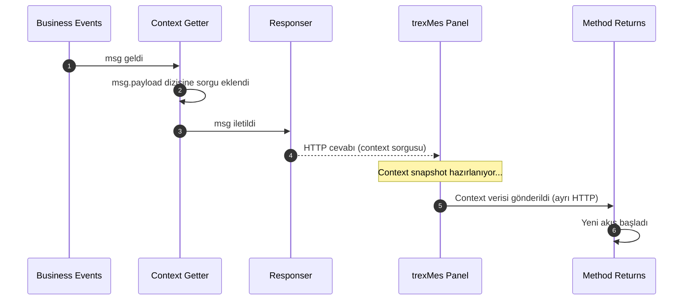
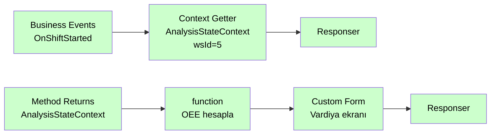

# Context Getter

<div class="node-header">
  <span class="node-preview green-light">Context Getter</span>
  <div class="meta-item"><strong>Inputs:</strong> <span class="io-badge in">1</span></div>
  <div class="meta-item"><strong>Outputs:</strong> <span class="io-badge out">1</span></div>
  <div class="meta-item"><strong>Kategori:</strong> trexMes service</div>
</div>

Belirtilen **WorkStation**'a ait bir **StateContext**'i trexMes panelinden sorgular. Sonuç asenkron olarak [Method Returns](method-returns.md) node'u üzerinden alınır.

## Özet

!!! info "Method Invoker kardeşi"
    Context Getter, Method Invoker ile aynı asenkron iletişim modelini kullanır. Fark şudur: Method Invoker bir **servis method'u çağırır**, Context Getter ise bir **StateContext snapshot'ı ister**.

## Property Tablosu

| Alan | Tip | Varsayılan | Açıklama |
|---|---|---|---|
| `name` | string | — | Node adı. **Method Returns ile eşleşmelidir** |
| `context` | combobox | `AnalysisStateContext` | Sorgulanacak StateContext |
| `workstationid` | num \| msg | `0` | Sorgulanacak istasyon ID'si |
| `workstationidType` | `"num"` \| `"msg"` | `"num"` | WorkStation ID değer kaynağı |

### Context Seçenekleri (25 adet)

| Context | Kapsam |
|---|---|
| `AnalysisStateContext` | OEE, performans, vardiya analizleri |
| `BarcodeStateContext` | Barkod okutma konfigürasyonu |
| `CapacityStateContext` | Çevrim süresi, max kapasite, hız |
| `ConsumptionStateContext` | Sarf tüketimi ve lot verileri |
| `CounterStateContext` | Üretim sayaçları ve sinyal portları |
| `DefectStateContext` | Iskarta miktarları ve konfigürasyonları |
| `EmployeeStateContext` | Personel giriş/çıkış ve takım bilgisi |
| `EnergyStateContext` | Enerji tüketim verileri (kW) |
| `EquipmentStateContext` | Mevcut ekipman bilgisi ve konfigürasyonu |
| `ForkliftStateContext` | Forklift görevi oluşturma ve takibi |
| `LabelStateContext` | Etiket yazıcı konfigürasyonu |
| `LineStateContext` | Hat üretimi, master istasyon, duruş aktarımı |
| `MaintenanceStateContext` | Bakım planı, aktif bakım iş emri |
| `OpcStateContext` | OPC üzerinden ekipman/stok/hız konfigürasyonu |
| `OperationStateContext` | Mevcut operasyon bilgileri |
| `ProcessDataStateContext` | Proses veri analiz değerleri |
| `ProductionConfirmationStateContext` | Üretim bildirimi konfigürasyon ve son kayıtlar |
| `ProductionPlanStateContext` | Yüklü plan bilgileri, stoklar, iş emirleri |
| `ProductionToleranceStateContext` | Üretim tolerans kontrol değerleri |
| `QualityControlStateContext` | Kalite kontrol tanımları ve output konfigürasyonları |
| `RobotModelStateContext` | Robot model üretim kurgusu |
| `ScaleStateContext` | Terazi ağırlık ve port verileri |
| `SerieStateContext` | Mevcut ürün seri barkodu |
| `StoppageStateContext` | Mevcut duruş bilgileri, süre, output konfigürasyonları |
| `WorkStationStateContext` | İstasyon kimlik ve iş merkezi bilgileri |

!!! tip "Property açıklamaları"
    Node editör panelinde Context seçimi değiştikçe, seçilen context'e ait tüm property'lerin açıklamaları WorkStation ID alanının altında görünür.

## Çıkış Mesajı

Context Getter, **Method Invoker ile aynı `msg.payload` array pattern'ini** kullanır. Sorgu nesnesi `msg.payload` dizisine eklenir:

```json
// msg.payload (array)
[
  {
    "message"      : "ProductionPlanStateContext",
    "valuelabel"   : 5,
    "name"         : "PlanContext",
    "operationtype": "ContextGetterProcess"
  }
]
```

Önceki node'dan gelen `msg.payload` bir nesne ise (dizi değil) önce `receiveddata` olarak saklanır, ardından diziye sarılır — bu sayede zincirdeki veriler kaybolmaz.

| Alan | Açıklama |
|---|---|
| `message` | Seçili StateContext adı |
| `valuelabel` | Sorgulanacak istasyon ID'si |
| `name` | Node adı — Method Returns eşleşmesi bu alanla yapılır |
| `operationtype` | Sabit: `"ContextGetterProcess"` |

## Çalışma Modeli



## Tipik Akış



## Method Returns ile Bağlantı

!!! warning "Name eşleşmesi zorunludur"
    Context Getter node'unun `name` alanı, ilgili **Method Returns** node'undaki `methodname` seçimi ile **birebir** eşleşmelidir.

```
Context Getter  →  name: "ProductionPlanStateContext"
Method Returns  →  methodname: "ProductionPlanStateContext"   ✓
```

Method Returns editör panelinde açılır liste, akıştaki tüm Method Invoker ve Context Getter node adlarını otomatik listeler; elle yazmak gerekmez.

## WorkStation ID Kaynağı

`workstationidType` değerine göre iki farklı kullanım:

=== "Sabit sayı (num)"

    ```
    WorkStation ID: 5   (num)
    ```
    Her çağrıda aynı istasyon sorgulanır.

=== "Mesajdan oku (msg)"

    ```
    WorkStation ID: payload.workStationId   (msg)
    ```
    Önceki node'dan gelen mesaj içindeki değer kullanılır. Dinamik istasyon seçimi için tercih edilir.

## Örnek Senaryo — Üretim Planı Verisi Okuma

1. `Business Events` — `OnOrderStarted` tetiklenir; `msg.payload.workStationId = 3`
2. `Context Getter` — `ProductionPlanStateContext`, workstationid = `msg.payload.workStationId`
3. `Responser` — çağrı akışı kapandı
4. Panel plan verisini hazırlar ve gönderir
5. `Method Returns` (adı: `ProductionPlanStateContext`) tetiklenir
6. `function` node — `msg.payload.PlanQuantity`, `msg.payload.LeftAmountForPlanCompletion` okunur
7. `Custom Form` — plan durumu ekranda gösterilir

## Sık Karşılaşılan Hatalar

!!! failure "Method Returns tetiklenmiyor"
    - Context Getter'ın `name` alanı ile Method Returns'teki `methodname` uyuşuyor mu?
    - Context Getter akışa eklenip **deploy** edildi mi?

!!! failure "WorkStation ID 0 geliyor"
    `workstationidType` = `msg` seçiliyken önceki node'dan gerekli alan gelmiyor olabilir. Bir `debug` node ile `msg` içeriğini kontrol edin.

!!! failure "Context verisi boş"
    İlgili WorkStation panelde tanımlı değil veya context o an dolu değil olabilir. Panel log'larını kontrol edin.

## İlgili

- [Method Returns](method-returns.md) — Context sorgu cevabını yakala
- [Method Invoker](method-invoker.md) — Servis method çağrısı için
- [Responser](responser.md) — Her akışın sonu
