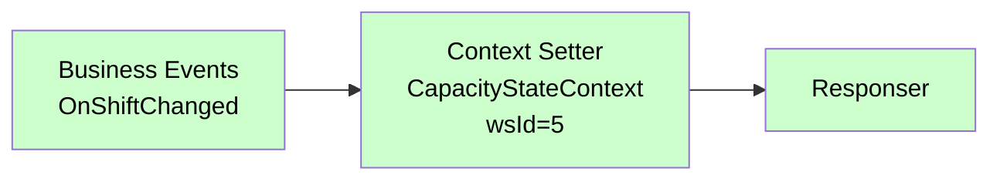

# Context Setter

<div class="node-header">
  <span class="node-preview green-light">Context Setter</span>
  <div class="meta-item"><strong>Inputs:</strong> <span class="io-badge in">1</span></div>
  <div class="meta-item"><strong>Outputs:</strong> <span class="io-badge out">1</span></div>
  <div class="meta-item"><strong>Kategori:</strong> trexMes service</div>
</div>

Belirtilen **WorkStation**'a ait bir **StateContext** üzerinde bir veya birden fazla property değerini programatik olarak ayarlar.

## Özet

!!! info "Context Getter kardeşi"
    Context Getter bir StateContext'i **okur**; Context Setter ise bir StateContext'e **yazar**. Context Getter'ın aksine asenkron değildir — panel değerleri doğrudan `Responser` üzerinden iletilir, ayrı bir `Method Returns` akışı gerekmez.

## Property Tablosu

| Alan | Tip | Varsayılan | Açıklama |
|---|---|---|---|
| `name` | string | — | Node adı |
| `context` | combobox | `AnalysisStateContext` | Değer atanacak StateContext |
| `workstationid` | num \| msg | `0` | Hedef istasyon ID'si |
| `workstationidType` | `"num"` \| `"msg"` | `"num"` | WorkStation ID değer kaynağı |
| `items` | array | `[]` | Atanacak property listesi (`n`, `v`, `vt`) |

### items Dizisi

Her öğe üç alandan oluşur:

| Alan | Açıklama |
|---|---|
| `n` | Property adı (string) |
| `v` | Atanacak değer |
| `vt` | Değer tipi: `str`, `num`, `bool`, `msg`, `flow`, `global`, `json`, `env`, `jsonata` |

### Context Seçenekleri (25 adet)

Context Getter ile birebir aynı context listesini destekler. Editörde context seçildiğinde o context'e ait property açıklamaları otomatik görüntülenir.

| Context | Kapsam |
|---|---|
| `AnalysisStateContext` | OEE, performans, vardiya analizleri |
| `BarcodeStateContext` | Barkod okutma konfigürasyonu |
| `CapacityStateContext` | Çevrim süresi, max kapasite, hız |
| `ConsumptionStateContext` | Sarf tüketimi ve lot verileri |
| `CounterStateContext` | Üretim sayaçları ve sinyal portları |
| `DefectStateContext` | Iskarta miktarları ve konfigürasyonları |
| `EmployeeStateContext` | Personel giriş/çıkış ve takım bilgisi |
| `EnergyStateContext` | Enerji tüketim verileri (kW) |
| `EquipmentStateContext` | Mevcut ekipman bilgisi ve konfigürasyonu |
| `ForkliftStateContext` | Forklift görevi oluşturma ve takibi |
| `LabelStateContext` | Etiket yazıcı konfigürasyonu |
| `LineStateContext` | Hat üretimi, master istasyon |
| `MaintenanceStateContext` | Bakım planı, aktif bakım iş emri |
| `OpcStateContext` | OPC üzerinden ekipman/stok/hız konfigürasyonu |
| `OperationStateContext` | Mevcut operasyon bilgileri |
| `ProcessDataStateContext` | Proses veri analiz değerleri |
| `ProductionConfirmationStateContext` | Üretim bildirimi konfigürasyon ve son kayıtlar |
| `ProductionPlanStateContext` | Yüklü plan bilgileri, stoklar, iş emirleri |
| `ProductionToleranceStateContext` | Üretim tolerans kontrol değerleri |
| `QualityControlStateContext` | Kalite kontrol tanımları ve output konfigürasyonları |
| `RobotModelStateContext` | Robot model üretim kurgusu |
| `ScaleStateContext` | Terazi ağırlık ve port verileri |
| `SerieStateContext` | Mevcut ürün seri barkodu |
| `StoppageStateContext` | Mevcut duruş bilgileri, süre, output konfigürasyonları |
| `WorkStationStateContext` | İstasyon kimlik ve iş merkezi bilgileri |

!!! tip "Property açıklamaları"
    Node editör panelinde Context seçimi değiştikçe, seçilen context'e ait tüm property'lerin açıklamaları WorkStation ID alanının altında görünür.

## Çıkış Mesajı

`msg.payload` dizisine eklenen operasyon:

```json
{
  "message"      : "CapacityStateContext",
  "valuelabel"   : 5,
  "name"         : "SpeedSetter",
  "operationtype": "ContextSetterProcess",
  "items": [
    { "itemname": "InstantSpeed", "value": 120 },
    { "itemname": "CyclePeriod",  "value": 30  }
  ]
}
```

| Alan | Açıklama |
|---|---|
| `message` | Seçili StateContext adı |
| `valuelabel` | Hedef istasyon ID'si |
| `name` | Node adı |
| `operationtype` | Sabit: `"ContextSetterProcess"` |
| `items[].itemname` | Atanacak property adı |
| `items[].value` | Hesaplanmış değer |

## Değer Tipi Çözümleme

`vt` değerine göre değerler çalışma anında hesaplanır:

| `vt` | Kaynak |
|---|---|
| `str` | Sabit string |
| `num` | `Number(v)` dönüşümü |
| `bool` | `v === 'true'` |
| `msg` | `msg` içinden okunur (`RED.util.getMessageProperty`) |
| `flow` | Flow context'inden okunur |
| `global` | Global context'inden okunur |
| `json` | `JSON.parse(v)` |
| `env` | Ortam değişkeni |
| `jsonata` | JSONata ifadesi değerlendirilir |

## Tipik Akış



## Context Getter ile Farkı

| Özellik | Context Getter | Context Setter |
|---|---|---|
| Amaç | Context'i oku | Context'e yaz |
| Asenkron | Evet (Method Returns) | Hayır |
| items dizisi | Yok | Var |
| operationtype | `ContextGetterProcess` | `ContextSetterProcess` |
| Method Returns | Gerekli | Gerekmez |

## WorkStation ID Kaynağı

=== "Sabit sayı (num)"

    ```
    WorkStation ID: 5   (num)
    ```
    Her çağrıda aynı istasyon hedeflenir.

=== "Mesajdan oku (msg)"

    ```
    WorkStation ID: payload.workStationId   (msg)
    ```
    Önceki node'dan gelen mesaj içindeki değer kullanılır.

## Örnek Senaryo — Anlık Hız Güncelleme

1. `Business Events` — `OnProductionCounterIncreased` tetiklenir
2. `function` node — `msg.newSpeed = msg.payload.InstantSpeed * 1.05` hesaplar
3. `Context Setter` — `CapacityStateContext`, Item: `InstantSpeed` = `msg.newSpeed` (msg)
4. `Responser` — panel güncellendi

## Sık Karşılaşılan Hatalar

!!! failure "Değer uygulanmıyor"
    - Doğru WorkStation ID girildi mi?
    - Property adı büyük/küçük harf duyarlıdır. Context Getter ile okuyarak alanı doğrulayın.

!!! failure "msg tipi değer boş geliyor"
    `vt = msg` seçiliyken belirtilen yol önceki node'dan gelmiyor olabilir. `debug` node ile kontrol edin.

## İlgili

- [Context Getter](context-getter.md) — StateContext okuma
- [Method Invoker](method-invoker.md) — Servis method çağrısı
- [Responser](responser.md) — Her akışın sonu
