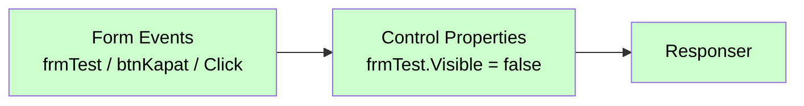
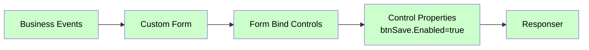

# Control Properties

<div class="node-header">
  <span class="node-preview green-light">Control Properties</span>
  <div class="meta-item"><strong>Inputs:</strong> <span class="io-badge in">1</span></div>
  <div class="meta-item"><strong>Outputs:</strong> <span class="io-badge out">1</span></div>
  <div class="meta-item"><strong>Kategori:</strong> trexMes service</div>
</div>

Form üzerindeki kontrollerin **görsel ve davranışsal özelliklerini** çalışma zamanında ayarlar. Visible, Enabled, Text, ForeColor gibi her türlü property atamasını yapar.

## Ne Zaman Kullanılır?

Form üzerindeki herhangi bir kontrolün (`Label`, `Button`, `TextBox`, `Panel`, vb.) **herhangi bir özelliğini** çalışma zamanında değiştirmek için kullanılır: metni güncelleme, görünürlük, renk, etkinleştirme/devre dışı bırakma, boyut…

**Formun kendisini kapatmak** için de kullanılır — formun `Visible` property'si `false` yapılır.

!!! info "Form Bind Controls ile farkı"
    `Control Properties` **özellik** atar; `Form Bind Controls` yalnızca **Grid datasource veya web kontrol source** değeri atamak için kullanılır.

    - Bir Label veya Button'un `Text`'ini değiştirmek → **Control Properties**
    - Bir formu kapatmak → **Control Properties** (`Visible = false`)
    - Bir Grid'in `DataSource`'una JSON array bağlamak → **Form Bind Controls**

## Kullanımı

1. **Form Name** listesinden değişiklik yapılacak formu seç.
2. Değiştirilecek kontrol trexEdge **ana formuna** (`AppForm`) aitse **"For Main-Form"** seçeneğini işaretle. Kendi `Custom Form`'un için bu seçimi **yapma**.
3. **Add** butonuna tıkla; listeye yeni bir satır eklenir.
4. **Control** alanına hedef kontrolün adını gir (XML'deki `name` ile birebir). Örnek: `btnOk`
5. **Property** alanına değiştirilecek özelliğin adını gir. Örnek: `Text`
6. **Value** bölümünde değer kaynağını seç (`msg.`, `flow.`, `global.`, sabit `string`, `bool`, `num` vb.) ve değeri gir.

```
Control : btnOk
Property: Text
Value   : msg.  →  payload.orderLabel
```

## Property Tablosu

| Alan | Tip | Varsayılan | Açıklama |
|---|---|---|---|
| `name` | string | — | Canvas üzerinde gösterilecek ad |
| `formname` | string | _(boş)_ | Hedef form adı |
| `formainform` | boolean | `false` | Ana form (`AppForm`) mı? |
| `props` | array | `[]` | Özellik atama listesi |

## `props` Yapısı

Her satır 4 alan içerir:

| Anahtar | Açıklama | Örnek |
|---|---|---|
| `p` | Kontrol adı (ControlName) | `btnSubmit` |
| `v` | Özellik adı (PropertyName) | `Enabled` |
| `d` | Değer veya path | `true` |
| `dt` | Değer kaynağı (dataType) | `bool` |

```json
[
  { "p": "btnSubmit", "v": "Enabled",   "d": "true",          "dt": "bool" },
  { "p": "lblTitle",  "v": "Text",      "d": "Yeni Sipariş",  "dt": "str"  },
  { "p": "txtQty",    "v": "ForeColor", "d": "Red",           "dt": "str"  },
  { "p": "btnSave",   "v": "Visible",   "d": "payload.canSave","dt": "msg" }
]
```

## `dataType` Çeşitleri

`dt` alanı değerin nereden okunacağını belirler:

| `dataType` | Anlam | Tipik Kullanım |
|---|---|---|
| `msg` | Mesaj nesnesinden | Dinamik değerler |
| `flow` | Flow context | Geçici state |
| `global` | Global context | Sabit ayarlar |
| `num` | Sabit sayı | `42`, `100` |
| `json` | Sabit JSON | `{"color":"red"}` |
| `bool` | Sabit boolean | `true`, `false` |
| `jsonata` | JSONata ifadesi | `$count(payload.items) > 5` |
| _diğer_ | Sabit string | `"Red"`, `"Verdana"` |

## Çıkış Mesajı

```json
{
  "operationtype": "ControlProperties",
  "receiveddata": { /* event data */ },
  "name": "OrderForm",
  "value": [
    { "ControlName": "btnSubmit", "PropertyName": "Enabled",   "Value": true   },
    { "ControlName": "lblTitle",  "PropertyName": "Text",      "Value": "Yeni" },
    { "ControlName": "txtQty",    "PropertyName": "ForeColor", "Value": "Red"  }
  ]
}
```

## Asenkron İşlem Modeli

Node, tüm property atamalarını **`Promise.all`** ile paralel çözümler:

```javascript
let tasks = node.props.map((item) => {
    return new Promise((resolve, reject) => {
        switch (item.dt) {
            case 'msg':    computedValue = RED.util.getMessageProperty(msg, item.d); break;
            case 'flow':   computedValue = node.context().flow.get(item.d); break;
            case 'global': computedValue = node.context().global.get(item.d); break;
            case 'jsonata':
                // Async JSONata çözümlemesi
                let expr = RED.util.prepareJSONataExpression(item.d, node);
                RED.util.evaluateJSONataExpression(expr, msg, (err, result) => {
                    err ? reject(err) : resolve({
                        ControlName: item.p,
                        PropertyName: item.v,
                        Value: result
                    });
                });
                return;
            // ...
        }
        resolve({ ControlName: item.p, PropertyName: item.v, Value: computedValue });
    });
});

Promise.all(tasks).then((bindcontrols) => { /* msg.payload.push */ });
```

## Tipik Property İsimleri

WinForm kontrolleri için en sık kullanılan özellikler:

| Property | Tip | Örnek Değer |
|---|---|---|
| `Visible` | bool | `true` / `false` |
| `Enabled` | bool | `true` / `false` |
| `Text` | string | `"Kaydet"` |
| `BackColor` | string | `"Red"`, `"#FF0000"` |
| `ForeColor` | string | `"White"` |
| `Font.Bold` | bool | `true` |
| `Width` | number | `200` |
| `Height` | number | `40` |

## Form Kapatma

Bir Custom Form'u programatik olarak kapatmak için formun adını hem **Form Name** hem **Control** alanına girin ve `Visible` property'sini `false` yapın.

### Yapılandırma

1. **Form Name** listesinden kapatılacak formu seç (örn. `frmTest`)
2. **Add** butonuna tıkla
3. **Control** alanına formun adını gir (örn. `frmTest`)
4. **Property** alanına `Visible` gir
5. **Value** olarak `bool` → `false` seç

```
Form Name : frmTest
Control   : frmTest
Property  : Visible
Value     : bool  →  false
```

### Akış Örneği — Buton ile Formu Kapat



!!! tip "Aynı node'da birden fazla işlem"
    Formu kapatırken aynı `Control Properties` node'una ek satırlar ekleyerek başka işlemler de yapabilirsiniz. Örneğin formu kapatıp aynı anda başka bir kontrolü güncelleyebilirsiniz.

## Tipik Akış



## Önemli Notlar

!!! warning "Property isimleri büyük harfle başlar"
    WinForm property isimleri **PascalCase**'dir: `Visible`, `Enabled`, `Text`, `BackColor` — küçük harfle başlamazlar.

!!! warning "Form henüz açılmadıysa"
    `Control Properties` panele property atama gönderir; ancak form henüz açılmamışsa atama uygulanamaz. **Akışta önce `Custom Form` olmalıdır**.

## Sık Karşılaşılan Hatalar

!!! failure "Property uygulanmıyor"
    - Property adı yazımı doğru mu? (`Visible` ≠ `visible`)
    - Kontrol adı XML'deki ile eşleşiyor mu?
    - `dataType` seçimi tutarlı mı? `bool` seçtiyseniz değer `"true"`/`"false"` string olmalı.

!!! failure "JSONata hatası"
    JSONata ifadesi sentaks hatası içeriyorsa node hata fırlatır. İfadeyi önce başka bir akışta `change` node'unda test edin.

## İpuçları

!!! tip "Toplu disable/enable"
    Bir formun tüm input'larını disable etmek istiyorsanız her birini tek tek listelemek yerine bir `function` node ile dinamik liste oluşturun ve `dataType: jsonata` ile döndürün.

!!! tip "Renkler için string formatı"
    Renk değerleri için **WinForm Color enum** isimleri (`Red`, `LightBlue`, `Crimson`) veya **HTML hex** (`#FF0000`) kullanılabilir.

## İlgili

- [Custom Form](custom-form.md)
- [Form Bind Controls](form-bind-controls.md)
- [Button Configurator](button-configurator.md)
- [Mesaj Yapısı — dataType](../baslangic/mesaj-yapisi.md#datatype-cozumleme)
