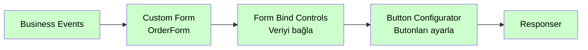

# Custom Form

<div class="node-header">
  <span class="node-preview green-light">Custom Form</span>
  <div class="meta-item"><strong>Inputs:</strong> <span class="io-badge in">1</span></div>
  <div class="meta-item"><strong>Outputs:</strong> <span class="io-badge out">1</span></div>
  <div class="meta-item"><strong>Kategori:</strong> trexMes service</div>
</div>

trexMes panelinde **çalışma zamanında özel form** açar. XML formatında tanımlanmış form tasarımını panele gönderir. Panel bu XML'i parse ederek WinForm UI'ı oluşturur.

## Özet

`Custom Form` bu paketin **görsel arayüz** tarafının kalbidir. Modal dialog veya ana form (main form) üzerine yeni içerik basabilirsiniz. Form içeriği XML formatındadır ve genellikle birlikte gelen **Custom Form Designer** aracı ile görsel olarak tasarlanır.

## Property Tablosu

| Alan | Tip | Varsayılan | Açıklama |
|---|---|---|---|
| `name` | string | — | Form'un panel tarafındaki adı |
| `customformxml` | string | _(boş)_ | XML formatında form tasarımı |
| `isstyled` | boolean | `false` | Form stillendirilmiş mi? |
| `formainform` | boolean | `false` | Ana form üzerinde mi göstereceğiz? |
| `designformname` | string | _(boş)_ | Linked Form Design node'unun adı |

## XML Kaynak Seçenekleri

Form XML'i **iki kaynaktan** sağlanabilir:

1. **Doğrudan `customformxml`** alanına yapıştırılarak
2. **`Form Design`** config node'undan link verilerek (`designformname` ile)

```javascript
if (node.designformname) {
    RED.nodes.eachNode(function (n) {
        if (n.type === "Form Design" && n.name === node.designformname) {
            if (n.formdesignxml) {
                selectedXml = n.formdesignxml;
            }
        }
    });
}
if (node.customformxml !== "") {
    selectedXml = node.customformxml;  // Inline override
}
```

!!! tip "Hangi kaynak kullanılır?"
    `customformxml` alanı dolu ise her zaman **o** kullanılır. Boş bırakırsanız `Form Design` config node'undaki XML kullanılır. Bu sayede aynı tasarımı birden fazla `Custom Form` node'unda paylaşabilirsiniz.

## `formainform` Davranışı

| Değer | Anlam | `operationtype` | `continueevent` |
|---|---|---|---|
| `false` | Modal dialog olarak aç | `CustomDialog` | `Continue` |
| `true` | Ana formu güncelle (`AppForm`) | `MainForm` | `Break` |

## Çıkış Mesajı

`msg.payload` array'ine eklenen operasyon:

```json
{
  "operationtype": "CustomDialog",
  "receiveddata": { "orderNo": "ORD-001" },
  "name": "OrderEntryForm",
  "continueevent": "Continue",
  "customformxml": "<form>...</form>",
  "isstyled": true
}
```

## XML Formatı

Form XML'i `trexForm.Designer` tarafından üretilen **WinForms tabanlı** bir formattır. Kök eleman `<Object name="CustomForm" type="trexForm.Designer.CustomForm, ...">` şeklindedir; her kontrol de ayrı bir `<Object>` olarak iç içe tanımlanır.

### Genel Yapı

```xml
<Object name="CustomForm" type="trexForm.Designer.CustomForm, trexForm.Designer, Version=1.0.0.0, Culture=neutral, PublicKeyToken=null" version="1">
    <!-- Form özellikleri -->
    <AutoValidate>EnablePreventFocusChange</AutoValidate>
    <BackColor>Control</BackColor>
    <ClientSize>600, 400</ClientSize>
    <Font>Microsoft Sans Serif, 8.25pt</Font>
    <Name>CustomForm</Name>

    <!-- Kontroller — her biri ayrı <Object> -->
    <Object type="System.Windows.Forms.Label, System.Windows.Forms, ..." name="lblBaslik">
        <Text>Başlık</Text>
        <Location>20, 20</Location>
        <Size>200, 30</Size>
        <TabIndex>0</TabIndex>
    </Object>

    <Object type="System.Windows.Forms.Button, System.Windows.Forms, ..." name="btnTamam">
        <Text>TAMAM</Text>
        <Location>20, 100</Location>
        <Size>120, 40</Size>
        <TabIndex>1</TabIndex>
    </Object>
</Object>
```

### Örnek: Label ve Buton

Aşağıdaki XML, form üzerinde bir adet büyük başlık etiketi ve sarı zemin renkli bir buton tanımlar:

```xml
<Object name="CustomForm" type="trexForm.Designer.CustomForm, trexForm.Designer, Version=1.0.0.0, Culture=neutral, PublicKeyToken=null" version="1">
    <AutoValidate>EnablePreventFocusChange</AutoValidate>
    <BackColor>LightCoral</BackColor>
    <ClientSize>556, 369</ClientSize>
    <AutoScaleDimensions>6, 13</AutoScaleDimensions>
    <Cursor>Default</Cursor>
    <Font>Microsoft Sans Serif, 8.25pt</Font>
    <ForeColor>ControlText</ForeColor>
    <Name>CustomForm</Name>
    <RightToLeft>No</RightToLeft>

    <Object type="System.Windows.Forms.Label, System.Windows.Forms, Version=4.0.0.0, Culture=neutral, PublicKeyToken=b77a5c561934e089" name="lblMesaj">
        <TextAlign>MiddleCenter</TextAlign>
        <Text>Label1</Text>
        <Dock>Top</Dock>
        <Font>Microsoft Sans Serif, 20.25pt, style=Bold</Font>
        <Location>0, 0</Location>
        <Name>lblMesaj</Name>
        <Size>556, 145</Size>
        <TabIndex>1</TabIndex>
    </Object>

    <Object type="System.Windows.Forms.Button, System.Windows.Forms, Version=4.0.0.0, Culture=neutral, PublicKeyToken=b77a5c561934e089" name="btnTamam">
        <BackColor>Yellow</BackColor>
        <FlatAppearance control="true">
            <Object type="System.Windows.Forms.FlatButtonAppearance, System.Windows.Forms, Version=4.0.0.0, Culture=neutral, PublicKeyToken=b77a5c561934e089" name="FlatButtonAppearance1"/>
        </FlatAppearance>
        <Text>TAMAM</Text>
        <UseVisualStyleBackColor>False</UseVisualStyleBackColor>
        <Font>Microsoft Sans Serif, 15.75pt</Font>
        <Location>174, 251</Location>
        <Name>btnTamam</Name>
        <Size>192, 100</Size>
        <TabIndex>0</TabIndex>
    </Object>
</Object>
```

Bu tasarımda:

- `lblMesaj` — forma üstten (`Dock: Top`) sabitlenen, 20.25pt kalın fontlu bir etiket
- `btnTamam` — sarı arka planlı, ortada konumlandırılmış bir buton

!!! info "Form Events ile Olay Dinleme"
    Form üzerindeki kontrol olayları (buton tıklaması, değer değişimi vb.) **Form Events** nodu ile dinlenebilir. `btnTamam`'ın tıklanmasını yakalamak için `Form Events` nodunu aynı akışa ekleyin ve ilgili kontrol adını (`btnTamam`) belirtin.

### Sık Kullanılan Kontrol Tipleri

| Kontrol | `type` Değeri (kısaltılmış) |
|---|---|
| Etiket | `System.Windows.Forms.Label` |
| Buton | `System.Windows.Forms.Button` |
| Metin Kutusu | `System.Windows.Forms.TextBox` |
| Sayısal Giriş | `System.Windows.Forms.NumericUpDown` |
| Onay Kutusu | `System.Windows.Forms.CheckBox` |
| Açılır Liste | `System.Windows.Forms.ComboBox` |
| DataGridView | `System.Windows.Forms.DataGridView` |

!!! tip "Tasarımı elle yazmayın"
    XML formatı karmaşık olduğundan **Custom Form Designer** aracını kullanın. Designer'dan dışa aktarılan XML doğrudan `customformxml` alanına yapıştırılabilir.

## Custom Form Designer Entegrasyonu

Node arayüzünde **"Designer'da Aç"** butonu bulunur. Bu buton `customFormDesigner.exe` aracını başlatır:

```javascript
RED.httpAdmin.post("/custom-form/run-exe", function (req, res) {
    const exePath = RED.settings.functionGlobalContext.customFormDesignerPath;
    const process = spawn(exePath, [filename + "|" + xmlContent]);
    // Designer kapandığında çıktıyı oku
    const outputPath = "c:\\temp\\" + filename + "_form_design.xml";
});
```

### Gereksinimler

1. **Windows** işletim sistemi
2. `customFormDesigner.exe` dosyası mevcut
3. Node-RED `settings.js` içinde tanımlı:

```javascript
functionGlobalContext: {
    customFormDesignerPath: "C:\\trex\\tools\\customFormDesigner.exe"
}
```

4. Çıktı dosyası `C:\temp\<formname>_form_design.xml` konumuna yazılır.

## Form Design Config Node

`Custom Form` ile birlikte `Form Design` adında ayrı bir config node tipi de kaydedilir. Bu node yalnızca XML içeriğini tutar; akışa eklenemez (palette'te görünmez).

| Alan | Açıklama |
|---|---|
| `name` | Tasarım adı (birden fazla form için ayırt edici) |
| `formdesignxml` | XML içeriği |

Custom Form node'unda `designformname` alanına bu config'in adını yazarak link verirsiniz.

## Tipik Akış



## Sık Karşılaşılan Hatalar

!!! failure "Designer çalışmıyor"
    `settings.js` içinde `customFormDesignerPath` tanımlı mı? Dosya yolu doğru ve dosya gerçekten var mı?

!!! failure "Designer Output not found"
    Designer'ın çıktıyı yazacağı `C:\temp\` klasörü erişilebilir mi? Node-RED'in yazma izni var mı?

!!! failure "Form panelde gözükmüyor"
    - `customformxml` veya `designformname` boş kalmış olabilir
    - XML formatı geçerli mi? (Açıkta kalmış tag, geçersiz attribute)
    - Akış sonunda `Responser` var mı?

## İpuçları

!!! tip "XML'i versiyon kontrolüne alın"
    `customformxml` alanına büyük XML yapıştırmak yerine **`Form Design` config node** kullanın. Bu node'un içeriği flow JSON'una dahil olur ve git'te değişiklikleri takip edebilirsiniz.

!!! tip "Stillendirme"
    `isstyled: true` seçeneği, panel tarafının form içeriğine **temaya özel stilleri** uygulamasını sağlar. Custom temalarla çalışıyorsanız mutlaka aktif edin.

## İlgili Nodlar

- [Form Bind Controls](form-bind-controls.md) — Form alanlarına veri bağlama
- [Control Properties](control-properties.md) — Kontrol özelliklerini ayarlama
- [Button Configurator](button-configurator.md) — Form butonlarını yapılandırma
- [Form Events](form-events.md) — Form etkileşim olayları
