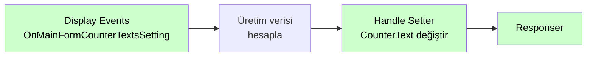

# Display Events

<div class="node-header">
  <span class="node-preview green-light">Display Events</span>
  <div class="meta-item"><strong>Inputs:</strong> <span class="io-badge in">0</span></div>
  <div class="meta-item"><strong>Outputs:</strong> <span class="io-badge out">1</span></div>
  <div class="meta-item"><strong>Kategori:</strong> trexMes service</div>
</div>

trexMes panelinde **arayüz bileşenlerinin oluşturulması ve görünüm yapılandırma olaylarına** abone olur. Bir form veya kontrol hazırlanmadan önce tetiklenerek içerik, düzen veya stil değiştirme imkânı tanır.

## Property Tablosu

| Alan | Tip | Varsayılan | Açıklama |
|---|---|---|---|
| `name` | string | — | Canvas üzerinde gösterilecek ad |
| `event` | string | _(boş)_ | Abone olunacak görüntüleme olayı |
| `ishandled` | boolean | `false` | Node-RED bu olayı handle ediyor mu? |

## Olay Listesi

| Olay | Açıklama |
|---|---|
| `OnBarcodeTextBoxSetting` | Ana ekranda barkod metin kutusu ayarları yapılandırılırken tetiklenir. |
| `OnCommandKeyProcessing` | Arayüzde komut tuşu girdisi işlenirken tetiklenir. |
| `OnDefectEntryOperatorConfirmationFailed` | Iskarta girişinde ek operatör onayı istendiği ve onay alınamadığı durumda tetiklenir. |
| `OnDefectSelected` | Iskarta buton seçim işlemi gerçekleştirildiğinde ve miktar giriş ekranı gösterilmeden hemen önce tetiklenir. IsHandled true ise alternatif ıskarta ekranı kullanılabilir. |
| `OnEventDetailSelectionsListing` | Olay detay seçimleri listelenmeden hemen önce tetiklenir. |
| `OnForkliftTakeTransferSelecting` | Forklift mamul-yarı mamul götürme operasyonu gerçekleştirilmek istendiğinde tetiklenir. IsHandled true ise standart kurgu işletilmez. |
| `OnJobInformationEquipmentCounterTextSetting` | İş bilgi panelinde ekipman sayaç metinleri ayarlanırken tetiklenir. |
| `OnJobLoadColumnCellFormatSetting` | İş seçim ekranı gridinde satır renklendirme için kullanılabilir. IsHandled true ise renkler argümanlardan alınır. |
| `OnJobOrderSearching` | İş emri seçim ekranında arama yerinde barkod okutulduktan sonra tetiklenir. |
| `OnMainFormCounterTextsSetting` | Ana form üzerinde gösterilen sayaç metinleri ayarlanırken tetiklenir. |
| `OnMainFormNoteTextSetting` | Ana form üzerinde gösterilen not metni ayarlanırken tetiklenir. |
| `OnMainUserControlJobOrderPanelClicked` | trex Edge ana ekranın sağ kısmındaki üretilen iş emirleri tablarından biri tıklandığında tetiklenir. |
| `OnOperationSpecFormOpening` | Manuel ya da otomatik olarak operasyon parametreleri ekranı açılmadan hemen önce tetiklenir. |
| `OnOperatorCreatingDefectEntry` | Iskarta ekranında kaydet butonuna basıldığı sırada her ıskarta için tetiklenir. |
| `OnOperatorPlanLoadButtonClicking` | Operatör tarafından iş yükle butonuna basıldığında tetiklenir. IsHandled true ise alternatif iş yükleme akışı kullanılabilir. |
| `OnOperatorPlanLoaded` | Operatör planı yüklendikten sonra tetiklenir. |
| `OnOtherOperationsFormClosed` | Diğer işlemler formu kapatıldığında tetiklenir. |
| `OnPitchLabelSetting` | İlgili ekranlarda pitch etiket metni ayarlanırken tetiklenir. |
| `OnPlanContinueQuestionAsking` | Üretim sonrası "İşe Devam Edilecek Mi?" sorusu sorulmadan hemen önce tetiklenir. |
| `OnPlanSearching` | İş seçim ekranında üretim planı arama işleminden hemen önce tetiklenir. |
| `OnPlanSelectionDetailClicked` | İş seçim ekranında Detay butonuna tıklandığında tetiklenir. |
| `OnPlanSelectionFormOpening` | Plan seçim formu açılmadan hemen önce tetiklenir. |
| `OnProductionAmountLeftTextSetting` | Ekrandaki kalan üretim miktarı metni ayarlanırken tetiklenir. |
| `OnProductionApproveFormOpening` | Üretim onay ekranı açılmadan hemen önce tetiklenir. |
| `OnProductionApproveGridSet` | Üretim onay ekranı grid temel ayarları uygulanırken tetiklenir. |
| `OnProductionApproveGridSetting` | Üretim onay ekranında iş emri - stok üretim detay gridine veri doldurulma anında tetiklenir. |
| `OnProductionApproveOperatorDataGridSetting` | Üretim onay ekranında operatör veri gridi yapılandırılırken tetiklenir. |
| `OnScreenSaverShowning` | Ekran koruyucu gösterilme anında tetiklenir. IsHandled true ise ekran koruyucu gösterilmez. |
| `OnShiftEventFormOpening` | Vardiya olay formu açılmadan önce tetiklenir. |
| `OnUIButtonConfigurationSet` | Arayüz buton konfigürasyonları ayarlanırken tetiklenir. |
| `OnWorkStationSelected` | İstasyon seçim işlemi gerçekleştirildiğinde tetiklenir. |
| `OnStoppageDescriptionFormOpening` | Duruş açıklama formu açılmadan önce tetiklenir. IsHandled true ise alternatif açıklama ekranı kullanılabilir. |
| `OnStockEquipmentMatchDisplaying` | Stok-ekipman eşleşme bilgisi gösterilirken tetiklenir. |
| `OnDefectEntryDataGridSetting` | Hata giriş tablosu yapılandırılırken tetiklenir. |

## `msg.payload` Yapısı

Display Events, payload'u **düz (flat) birleştirilmiş** bir nesne olarak gönderir. Yapı şu sırayı izler:

1. **EventArgs alanları** — olaya özgü veriler, üst seviyede taşınır
2. **`IsHandled`** — akış kontrolü bayrağı
3. **`WorkStationStatusEntry`** — istasyonun anlık üretim durumu

```json
{
  "Counter2CaptionText": "",
  "CounterText": "",
  "Counter2Text": "",
  "IsHandled": false,
  "WorkStationStatusEntry": {
    "WorkStationId": 0,
    "IsPlanLoaded": false,
    "IsStopped": false,
    "ProductionQuantity": 0.0,
    "ShiftId": 0,
    "ClientVersion": "",
    "...": "..."
  }
}
```

> Yukarıdaki örnek `OnMainFormCounterTextsSetting` içindir.

### EventArgs içermeyen eventlar

Aşağıdaki 5 event kendi EventArgs veri alanı taşımaz; payload yalnızca `IsHandled` ve `WorkStationStatusEntry` içerir:

| Olay |
|---|
| `OnBarcodeTextBoxSetting` |
| `OnOperatorPlanLoadButtonClicking` |
| `OnOperatorPlanLoaded` |
| `OnProductionApproveOperatorDataGridSetting` |
| `OnScreenSaverShowning` |

```json
{
  "IsHandled": false,
  "WorkStationStatusEntry": {
    "WorkStationId": 0,
    "...": "..."
  }
}
```

!!! warning "IsHandled — akışı kesme"
    `IsHandled` alanı bulunan eventlarda, akış içinde bu değer `true` yapılırsa panel tarafındaki varsayılan render/konfigürasyon adımı atlanır. Bu sayede arayüz bileşenlerinin içeriği veya görünümü tamamen Node-RED akışından kontrol edilebilir.

!!! info "Editörde önizleme"
    Event seçildiğinde editör içinde tam `msg.payload` yapısı **collapse edilebilir JSON ağacı** olarak görüntülenir. `IsHandled` içeren eventlar editörde amber uyarı bandı gösterir: iç objeler başlangıçta kapalı gelir, tıklanarak açılabilir.

## Örnek Kullanım



## İpuçları

!!! tip "Dinamik sayaç metinleri"
    `OnMainFormCounterTextsSetting` ile `CounterText` alanını Node-RED akışından set ederek panelde gösterilen sayaç değerlerini anlık veriden besleyebilirsiniz.

!!! tip "Hata kaydı öncesi kontrol"
    `OnOperatorCreatingDefectEntry` ile operatörün gireceği hata kaydını doğrulayabilir ya da ek alanlar zorunlu kılabilirsiniz. `IsHandled: true` ile kayıt işlemini tamamen ele alabilirsiniz.

!!! tip "UI butonu koşullu gösterme"
    `OnUIButtonConfigurationSet` ile butonların görünürlük veya aktiflik durumunu üretim koşullarına göre dinamik olarak belirleyebilirsiniz.

!!! tip "Ekran koruyucu kontrolü"
    `OnScreenSaverShowning` ile belirli koşullarda ekran koruyucuyu engelleyebilir (`IsHandled: true`) veya kendi özel idle ekranınızı gösterebilirsiniz.

## Argüman Referansı

Her event için `msg.payload` içindeki **EventArgs özel alanları** listelenmektedir.  
Tüm Display Events payload'unda ayrıca **`IsHandled`** ve **`WorkStationStatusEntry`** da bulunur.

!!! note "EventArgs alanı olmayan eventlar"
    `OnBarcodeTextBoxSetting`, `OnOperatorPlanLoadButtonClicking`, `OnOperatorPlanLoaded`, `OnProductionApproveOperatorDataGridSetting`, `OnScreenSaverShowning` — Payload yalnızca `IsHandled` ve `WorkStationStatusEntry` içerir.

??? info "OnMainFormCounterTextsSetting"
    Model: `MainFormCounterTextsSettingEventArgs`
    ```json
    {
      "Counter2CaptionText": "",
      "Counter2Text": "",
      "Counter3CaptionText": "",
      "Counter3Text": "",
      "CounterCaptionText": "",
      "CounterText": ""
    }
    ```

??? info "OnMainFormNoteTextSetting"
    Model: `MainFormNoteTextSettingEventArgs`
    ```json
    {
      "NoteText": ""
    }
    ```

??? info "OnProductionAmountLeftTextSetting"
    Model: `ProductionAmountLeftTextSettingEventArgs`
    ```json
    {
      "LeftAmountText": ""
    }
    ```

??? info "OnPitchLabelSetting"
    Model: `PitchLabelSettingEventArgs`
    ```json
    {
      "PlanId": 0,
      "Pitch": 0.0
    }
    ```

??? info "OnJobInformationEquipmentCounterTextSetting"
    Model: `JobInformationEquipmentCounterTextSettingEventArgs`
    ```json
    {
      "EquipmentCounterText": ""
    }
    ```

??? info "OnCommandKeyProcessing"
    Model: `CommandKeyProcessingEventArgs`
    ```json
    {
      "Key": null
    }
    ```

??? info "OnMainUserControlJobOrderPanelClicked"
    Model: `MainUserControlJobOrderPanelClickedEventArgs`
    ```json
    {
      "SelectedStockIndex": 0
    }
    ```

??? info "OnDefectEntryOperatorConfirmationFailed"
    Model: `DefectEntryOperatorConfirmationFailedEventArgs`
    ```json
    {
      "WorkStationId": 0,
      "DefectId": 0,
      "ConfirmationMessage": ""
    }
    ```

??? info "OnDefectSelected"
    Model: `DefectSelectedEventArgs`
    ```json
    {
      "WorkStationId": 0,
      "DefectId": 0,
      "EntryResult": {
        "EmployeeId": 0,
        "Quantity": 0.0,
        "Quantity2": 0.0,
        "Quantity3": 0.0,
        "Quantity4": 0.0,
        "StartMeter": 0.0,
        "EndMeter": 0.0,
        "IsApproved": false,
        "IsToPrintLabel": false
      }
    }
    ```

??? info "OnOperatorCreatingDefectEntry"
    Model: `DefectEntryCreatingEventArgs`
    ```json
    {
      "EntrySummary": {
        "WorkStationId": 0,
        "PlanId": 0,
        "JobOrderId": 0,
        "StockId": 0,
        "DefectId": 0,
        "DefectType": 0,
        "EmployeeId": 0,
        "Quantity": 0.0,
        "Quantity2": 0.0,
        "Quantity3": 0.0,
        "IsAdditionalDefect": false,
        "IsMaterialDefect": false,
        "IsSubProductDefect": false
      }
    }
    ```

??? info "OnEventDetailSelectionsListing"
    Model: `EventDetailSelectionsListingEventArgs`
    ```json
    {
      "WorkStationId": 0,
      "Selections": []
    }
    ```

??? info "OnForkliftTakeTransferSelecting"
    Model: `ForkliftTakeTransferSelectingEventArgs`
    ```json
    {
      "WorkStationId": 10
    }
    ```

??? info "OnJobLoadColumnCellFormatSetting"
    Model: `JobLoadColumnCellFormatSettingEventArgs`
    ```json
    {
      "SelectedDataRow": {},
      "BackBrush": {
        "R": 0, "G": 0, "B": 0,
        "HexCode": ""
      },
      "ForeBrush": {
        "R": 0, "G": 0, "B": 0,
        "HexCode": ""
      }
    }
    ```

??? info "OnJobOrderSearching"
    Model: `JobOrderSearchingEventArgs`
    ```json
    {
      "JobOrderSearchIndex": 0,
      "SearchFilteredText": ""
    }
    ```

??? info "OnPlanSearching"
    Model: `PlanSearchingEventArgs`
    ```json
    {
      "PlanSearchIndex": 0,
      "SearchFilteredText": ""
    }
    ```

??? info "OnPlanSelectionDetailClicked"
    Model: `PlanSelectionDetailClickedEventArgs`
    ```json
    {
      "PlanId": 0
    }
    ```

??? info "OnPlanSelectionFormOpening"
    Model: `PlanSelectionFormOpeningEventArgs`
    ```json
    {
      "IsPlanToBeChanged": false,
      "IsNextPlanToBeSelected": false,
      "NewPlanId": 0,
      "Status": false,
      "WorkStationIds": ""
    }
    ```

??? info "OnPlanContinueQuestionAsking"
    Model: `PlanContinueQuestionAskingEventArgs`
    ```json
    {
      "IsPlanContinuing": false
    }
    ```

??? info "OnOperationSpecFormOpening"
    Model: `OperationSpecFormOpeningEventArgs`
    ```json
    {
      "OperationSpecResult": false
    }
    ```

??? info "OnProductionApproveFormOpening"
    Model: `ProductionApproveFormOpeningEventArgs`
    ```json
    {
      "IsApproved": false
    }
    ```

??? info "OnProductionApproveGridSet"
    Model: `ProductionApproveGridSetEventArgs`
    ```json
    {
      "Grid": null
    }
    ```

??? info "OnProductionApproveGridSetting"
    Model: `ProductionApproveGridSettingEventArgs`
    ```json
    {
      "ColumnSettings": [
        { "Name": "", "Caption": "", "IsReadOnly": false }
      ],
      "SummaryViewModels": {
        "PlanId": 0,
        "ReceiptId": 0,
        "ReceiptNo": "",
        "StockId": 0,
        "StockNo": "",
        "StockName": "",
        "PlanQuantity": 0.0,
        "PlanQuantity2": 0.0,
        "PlanQuantity3": 0.0,
        "Quantity": 0.0,
        "Quantity2": 0.0,
        "Quantity3": 0.0
      }
    }
    ```

??? info "OnShiftEventFormOpening"
    Model: `ShiftEventFormOpeningEventArgs`
    ```json
    {
      "IsUndefinedStoppage": false,
      "Stoppages": [
        {
          "WorkStationId": 0,
          "StoppageCauseId": 0,
          "StoppageStartTime": "2026-01-01T00:00:00"
        }
      ]
    }
    ```

??? info "OnOtherOperationsFormClosed"
    Model: `DialogFormClosedEventArgs` — EventArgs özgü alan yoktur.

??? info "OnUIButtonConfigurationSet"
    Model: `UIButtonConfigurationSetEventArgs`
    ```json
    {
      "Configuration": {}
    }
    ```

??? info "OnWorkStationSelected"
    Model: `WorkStationSelectedEventArgs`
    ```json
    {
      "Summary": {
        "WorkStationId": 0,
        "WorkStationName": "",
        "WorkStationNo": ""
      }
    }
    ```

??? info "OnStoppageDescriptionFormOpening"
    Model: `StoppageDescriptionFormOpeningEventArgs`
    ```json
    {
      "StoppageCauseId": 0,
      "StoppageEventType": 0,
      "IsDescriptionRequired": false,
      "StoppageDetail": {
        "Desciption": "",
        "SubDetail": ""
      }
    }
    ```

??? info "OnStockEquipmentMatchDisplaying"
    Model: `StockEquipmentMatchDisplayingEventArgs`
    ```json
    {
      "WorkStationId": 0
    }
    ```

## İlgili

- [Olay Nodları Genel Bakış](event-subscribers.md)
- [Handle Setter](handle-setter.md)
- [Responser](responser.md)
