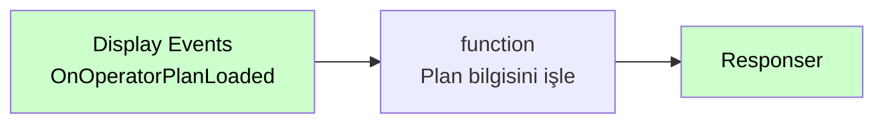

# Display Events

<div class="node-header">
  <span class="node-preview green-light">Display Events</span>
  <div class="meta-item"><strong>Inputs:</strong> <span class="io-badge in">0</span></div>
  <div class="meta-item"><strong>Outputs:</strong> <span class="io-badge out">1</span></div>
  <div class="meta-item"><strong>Kategori:</strong> trexMes service</div>
</div>

trexMes panelindeki **gösterim (display) seviyesi olaylarına** abone olur. Ekran yenileme, sayfa değişimi, görünüm geçişi gibi UI gösterim olaylarını yakalar.

## Property Tablosu

| Alan | Tip | Varsayılan | Açıklama |
|---|---|---|---|
| `name` | string | — | Canvas üzerinde gösterilecek ad |
| `method` | string | `get` | HTTP method (otomatik) |
| `event` | string | _(boş)_ | Panel'in tetikleyeceği HTTP path |
| `ishandled` | boolean | `false` | Node-RED handle ediyor mu? |

## Olay Listesi

`Event` alanı combobox ile seçilir. Mevcut seçenekler:

| Olay | Açıklama |
|---|---|
| `OnBarcodeTextBoxSetting` | Ana ekranda barkod metin kutusu ayarları yapılandırılırken tetiklenir. |
| `OnCommandKeyProcessing` | Arayüzde komut tuşu girdisi işlenirken tetiklenir. |
| `OnDefectEntryOperatorConfirmationFailed` | Iskarta girişinde ek operatör onayı istendiği ve onay alınamadığı durumda tetiklenir. |
| `OnDefectSelected` | Iskarta buton seçim işlemi gerçekleştirildiğinde ve miktar giriş ekranı gösterilmeden hemen önce tetiklenir. IsHandled true ise alternatif ıskarta ekranı kullanılabilir. |
| `OnEventDetailSelectionsListing` | Olay detay seçimleri listelenmeden hemen önce tetiklenir. |
| `OnForkliftTakeTransferSelecting` | Forklift mamul-yarı mamul götürme operasyonu gerçekleştirilmek istendiğinde tetiklenir. IsHandled true ise standart kurgu işletilmez. |
| `OnJobInformationEquipmentCounterTextSetting` | İş bilgi panelinde ekipman sayaç metinleri ayarlanırken tetiklenir. |
| `OnJobLoadColumnCellFormatSetting` | İş seçim ekranı gridinde satır renklendirme için kullanılabilir. IsHandled true ise renkler argümanlardan alınır. |
| `OnJobOrderSearching` | İş emri seçim ekranında arama yerinde barkod okutulduktan sonra tetiklenir. |
| `OnMainFormCounterTextsSetting` | Ana form üzerinde gösterilen sayaç metinleri ayarlanırken tetiklenir. |
| `OnMainFormNoteTextSetting` | Ana form üzerinde gösterilen not metni ayarlanırken tetiklenir. |
| `OnMainUserControlJobOrderPanelClicked` | trex Edge ana ekranın sağ kısmındaki üretilen iş emirleri tablarından biri tıklandığında tetiklenir. |
| `OnOperationSpecFormOpening` | Manuel ya da otomatik olarak operasyon parametreleri ekranı açılmadan hemen önce tetiklenir. |
| `OnOperatorCreatingDefectEntry` | Iskarta ekranında kaydet butonuna basıldığı sırada her ıskarta için tetiklenir. |
| `OnOperatorPlanLoadButtonClicking` | Operatör tarafından iş yükle butonuna basıldığında tetiklenir. IsHandled true ise alternatif iş yükleme akışı kullanılabilir. |
| `OnOperatorPlanLoaded` | Operatör planı yüklendikten sonra tetiklenir. |
| `OnOtherOperationsFormClosed` | Diğer işlemler formu kapatıldığında tetiklenir. |
| `OnPitchLabelSetting` | İlgili ekranlarda pitch etiket metni ayarlanırken tetiklenir. |
| `OnPlanContinueQuestionAsking` | Üretim sonrası "İşe Devam Edilecek Mi?" sorusu sorulmadan hemen önce tetiklenir. |
| `OnPlanSearching` | İş seçim ekranında üretim planı arama işleminden hemen önce tetiklenir. |
| `OnPlanSelectionDetailClicked` | İş seçim ekranında Detay butonuna tıklandığında tetiklenir. |
| `OnPlanSelectionFormOpening` | Plan seçim formu açılmadan hemen önce tetiklenir. |
| `OnProductionAmountLeftTextSetting` | Ekrandaki kalan üretim miktarı metni ayarlanırken tetiklenir. |
| `OnProductionApproveFormOpening` | Üretim onay ekranı açılmadan hemen önce tetiklenir. |
| `OnProductionApproveGridSet` | Üretim onay ekranı grid temel ayarları uygulanırken tetiklenir. |
| `OnProductionApproveGridSetting` | Üretim onay ekranında iş emri - stok üretim detay gridine veri doldurulma anında tetiklenir. |
| `OnProductionApproveOperatorDataGridSetting` | Üretim onay ekranında operatör veri gridi yapılandırılırken tetiklenir. |
| `OnScreenSaverShowning` | Ekran koruyucu gösterilme anında tetiklenir. IsHandled true ise ekran koruyucu gösterilmez. |
| `OnShiftEventFormOpening` | Vardiya olay formu açılmadan önce tetiklenir. |
| `OnUIButtonConfigurationSet` | Arayüz buton konfigürasyonları ayarlanırken tetiklenir. |
| `OnWorkStationSelected` | İstasyon seçim işlemi gerçekleştirildiğinde tetiklenir. |
| `OnStoppageDescriptionFormOpening` | Duruş açıklama formu açılmadan önce tetiklenir. IsHandled true ise alternatif açıklama ekranı kullanılabilir. |
| `OnStockEquipmentMatchDisplaying` | Stok-ekipman eşleşme bilgisi gösterilirken tetiklenir. |

## Örnek Kullanım



## Giriş Mesajı

```json
{
  "_msgid": "abc123",
  "payload": {
    "fromPage": "HomeView",
    "toPage": "OrderView",
    "timestamp": "2026-05-11T11:20:00Z",
    "trigger": "user"
  }
}
```

## İlgili

- [Olay Nodları Genel Bakış](event-subscribers.md)
- [Form Events](form-events.md)
