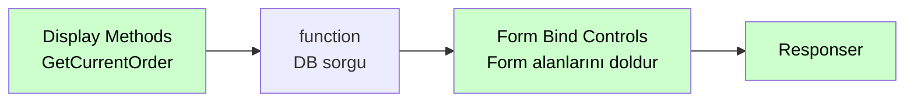

# Display Methods

<div class="node-header">
  <span class="node-preview green-light">Display Methods</span>
  <div class="meta-item"><strong>Inputs:</strong> <span class="io-badge in">0</span></div>
  <div class="meta-item"><strong>Outputs:</strong> <span class="io-badge out">1</span></div>
  <div class="meta-item"><strong>Kategori:</strong> trexMes service</div>
</div>

trexMes ana form (Main Form) üzerindeki **özel metod tetikleyicilerine** abone olur. Ana ekran üzerindeki tek başına çağrılan metodları yakalar.

## Property Tablosu

| Alan | Tip | Varsayılan | Açıklama |
|---|---|---|---|
| `name` | string | — | Canvas üzerinde gösterilecek ad |
| `method` | string | `get` | HTTP method (otomatik) |
| `event` | string | _(boş)_ | Panel'in tetikleyeceği HTTP path |

## Olay Listesi

`Event` alanı combobox ile seçilir. Mevcut seçenekler:

| Olay | Açıklama |
|---|---|
| `GetMainUserControl` | Ana kullanıcı kontrolünü döndürmek için tetiklenir. |
| `GetUIButtonConfiguration` | Arayüz buton konfigürasyonunu döndürmek için tetiklenir. |

## Örnek Kullanım



## Giriş Mesajı

```json
{
  "_msgid": "abc123",
  "payload": {
    "methodName": "GetCurrentOrder",
    "parameters": {
      "machineId": "M-12"
    }
  }
}
```

## İlgili

- [Olay Nodları Genel Bakış](event-subscribers.md)
- [Method Returns](method-returns.md)
- [Method Invoker](method-invoker.md)
