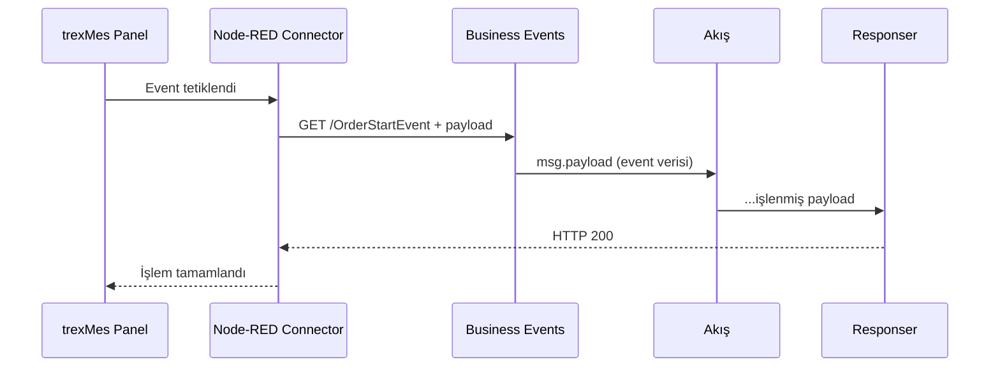
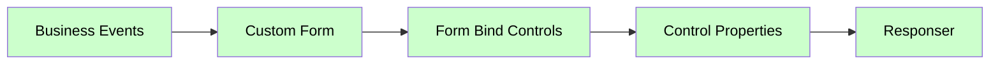

# Olay (Event) Nodları — Genel Bakış

Paket, trexMes panellerinden gelen olayları yakalamak için **8 ayrı event node tipi** sağlar. Hepsi `event-subscribers.js` dosyasında tanımlanmış olup **aynı altyapıyı** paylaşır; yalnızca **kategori amacıyla** ayrılmıştır.

## Olay Node Listesi

| Node | Tipik Kullanım |
|---|---|
| [Business Events](business-events.md) | İş akışı olayları (plan yükleme, üretim tamamlanma, vardiya değişimi…) |
| [System Events](system-events.md) | Sistem seviyesi olaylar (panel açılışı, kapanışı, periyodik timer) |
| [Communication Events](communication-events.md) | Barkod, IO kart, OPC, seri port, sinyal değişimleri |
| [Display Events](display-events.md) | Arayüz bileşeni yapılandırma ve görünüm olayları |
| [Form Events](form-events.md) | Form etkileşim olayları (button click, focus, validate) |
| [Display Methods](display-methods.md) | Ana form metod tetikleyicileri |
| [Method Returns](method-returns.md) | Method invocation cevapları |

!!! note "Tüm event node'ları temelde aynıdır"
    Pakete bakıldığında **8 farklı event tipi olmasına rağmen** kod tarafında hepsi aynı `EventSubscribers` fonksiyon iskeletini kullanır. Aralarındaki tek fark **palette üzerindeki kategori adıdır**. Bu sayede akışınızda hangi olayın hangi gruba ait olduğunu **görsel** olarak ayırt edebilirsiniz.

## Ortak Özellikler

### I/O

Tüm event node'ları: **0 giriş, 1 çıkış**

### Renk

<span class="node-preview green-light">Business Events</span>
Açık yeşil — Servis kategorisi.

### Property Tablosu (Ortak)

| Alan | Tip | Varsayılan | Açıklama |
|---|---|---|---|
| `name` | string | — | Node-RED canvas üzerinde gösterilecek ad |
| `event` | string | _(boş)_ | Panel'in çağıracağı HTTP path |
| `ishandled` | boolean | `false` | Bu olay Node-RED tarafından mı handle edilecek? |

> `suffix` alanı yalnızca **Business Events** node'una aittir. Diğer event tiplerinde bulunmaz.

## Çalışma Mantığı



## Olay Kayıt Listesi (Subscription)

Deploy anında her event node, `trex Subscriber`'ın çağrısı üzerinden **otomatik tespit edilir**. Panel tarafına gönderilecek listenin yapısı:

```javascript
RED.nodes.eachNode(function (n) {
    if (eventTypes.has(n.type)) {
        let runtimeNode = RED.nodes.getNode(n.id);
        let eName = runtimeNode.event.replace(/\//g, "");
        matchingNodes.push(eName);
        if (runtimeNode.ishandled === true) {
            matchingHandlers.push(eName + "|handled");
        }
    }
});
```

## Tipik Akış Yapısı



## Giriş Mesajı (`msg`)

Olay tetiklendiğinde aşağıdaki yapıda mesaj üretilir:

```json
{
  "_msgid": "abc123",
  "req": { /* Express HTTP request */ },
  "res": { /* HTTP response wrapper */ },
  "payload": { /* Panel'den gelen ham olay verisi */ }
}
```

| Alan | Açıklama |
|---|---|
| `req` | Express Request nesnesi — IP, headers, query bilgileri |
| `res` | Cevap wrapper — `Responser` bunu kullanır |
| `payload` | Panel'in gönderdiği event verisi (yapısı event tipine göre değişir) |

## `msg.payload` Yapısı — Kategoriye Göre

Her event kategorisi farklı bir payload yapısı gönderir:

| Kategori | Payload yapısı |
|---|---|
| **Business Events** | Yalnızca EventArgs alanları (düz nesne) |
| **Communication Events** | EventArgs alanları + `IsHandled` + `WorkStationStatusEntry` |
| **Display Events** | EventArgs alanları + `IsHandled` + `WorkStationStatusEntry` |
| **System Events** | `{ Item1: WorkStationStatusEntryModel, Item2: ProductionPlanDetailModel, Item3: EmployeeInfo[], Item4: StoppageStateContext }` |

## Editörde Payload Önizleme

Event combobox'ından bir olay seçildiğinde, editör içinde o olaya ait **tam `msg.payload` yapısı** görüntülenir:

- Yapı **collapse edilebilir JSON ağacı** olarak gösterilir
- Kök nesne açık, iç objeler ve diziler **başlangıçta kapalı** gelir; başlığa tıklanarak açılır
- `IsHandled` alanı bulunan eventlarda editörde **amber uyarı bandı** görünür:
  > ⚡ **IsHandled** destekli — akışı kesme veya veri değiştirme yapılabilir

## `ishandled` Kavramı

Olay tipi panel tarafında **varsayılan bir işleyiciye** sahip olabilir. Node-RED akışınız bu olayı yakaladığında panele:

- `ishandled = true` → "Bu olayı ben işledim, sen de işleyiciyi tetikleme."
- `ishandled = false` → "Sen kendi işleyicini de çalıştır."

Bu davranışı **akış ortasında dinamik** değiştirmek için [Handle Setter](handle-setter.md) kullanın.

!!! info "IsHandled desteği event kategorisine göre değişir"
    `IsHandled` yalnızca **Communication Events** ve **Display Events** kategorilerinde geçerlidir. Business Events bazı eventlarda `IsHandled` içerebilir; System Events içermez.

## Notlar

!!! tip "Event isminde slash"
    `event` alanına `/OnPlanLoaded` veya `OnPlanLoaded` yazabilirsiniz. Node otomatik olarak başına `/` ekler. Panel kayıt listesinde slash'lar **kaldırılarak** gönderilir.

!!! warning "Aynı event ismi tekrar etmemeli"
    Aynı `event` ismine sahip birden fazla node varsa HTTP path çakışması olur. Farklı kategorilerde olsalar bile aynı ismi kullanmayın. Birden fazla node aynı Business Event'ı dinlemesi gerekiyorsa `suffix` alanı kullanın.

!!! tip "Form Events'te `formname`"
    `Form Events` node'unda `ishandled` yerine **`formname`** alanı vardır. Hangi forma ait olduğunu belirtir.

## Hızlı Karşılaştırma

| Node | Özel Alan | Payload yapısı |
|---|---|---|
| Business Events | `suffix` | EventArgs alanları |
| System Events | — | Item1 / Item2 / Item3 / Item4 |
| Communication Events | — | EventArgs + IsHandled + WorkStationStatusEntry |
| Display Events | — | EventArgs + IsHandled + WorkStationStatusEntry |
| Form Events | `formname` | Form'a özgü |
| Display Methods | — | Method'a özgü |
| Method Returns | `methodname` | Return değeri |

## WorkStationId ile İstasyon Bazlı Değişken Yönetimi

Her event tipinden gelen `msg.payload` içinde mutlaka bir **`WorkStationId`** alanı bulunur. Bu integer değer, panelin benzersiz kimliğidir ve birden fazla istasyonun aynı Node-RED akışını kullandığı ortamlarda **istasyon bazlı ayrım** yapmayı sağlar.

### Neden WorkStationId ile key-value kullanılmalı?

Eğer bir flow veya global değişken tüm istasyonlara ait veri tutacaksa, doğrudan `flow.set('myVariable', value)` şeklinde yazıldığında bir istasyonun verisi diğerinin üzerine yazar. Bunun yerine `WorkStationId` değeri **key** olarak kullanılır:

```javascript
// WorkStationId al
let workStationId = msg.payload.WorkStationId;

// Mevcut değişkeni oku (yoksa boş obje başlat)
let myVariable = flow.get('myVariable') || {};

// Bu istasyona ait değeri güncelle
myVariable[workStationId] = 'Deneme';

// Geri kaydet
flow.set('myVariable', myVariable);
```

Artık herhangi bir function node içinden istasyona özgü değere erişilebilir:

```javascript
let workStationId = msg.payload.WorkStationId;
let myVariable = flow.get('myVariable') || {};
let value = myVariable[workStationId]; // Sadece bu istasyonun değeri
```

### Genel değişken şablonu

```javascript
// --- Yazma ---
let wsId = msg.payload.WorkStationId;
let store = flow.get('storeName') || {};
store[wsId] = { /* istasyona özgü veri */ };
flow.set('storeName', store);

// --- Okuma ---
let wsId = msg.payload.WorkStationId;
let store = flow.get('storeName') || {};
let entry = store[wsId]; // undefined ise bu istasyon için henüz veri yok
```

!!! tip "global değişkenler için de aynı pattern"
    Birden fazla flow arasında paylaşılacak veriler için `flow.get/set` yerine `global.get/set` kullanın; key yapısı aynıdır.

!!! tip "WorkStationId her zaman erişilebilir"
    `WorkStationId` Business Events'te doğrudan `msg.payload.WorkStationId` olarak gelir. Communication ve Display Events'te de aynı şekilde payload'un üst seviyesinde bulunur. System Events'te ise `msg.payload.Item1.WorkStationId` yolundan erişilir.

!!! warning "WorkStationId integer'dır"
    Key olarak integer kullanıldığında `{}` içinde sayısal key oluşur (`{5: ...}`). Bu tamamen geçerlidir; ancak JSON serileştirme gerektiren durumlarda string'e çevirmek (`String(wsId)`) tercih edilebilir.

## Sonraki Adım

Her event tipinin kendi sayfasında **özel kullanım örnekleri** ve tam payload yapısı bulunur. Sol menüden istediğinizi seçin.
