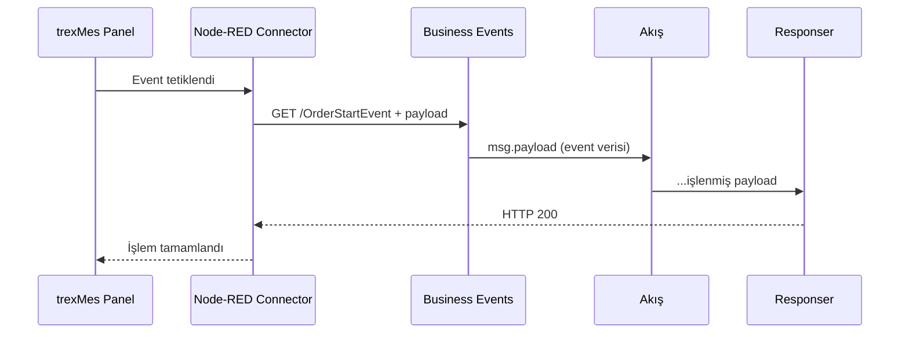
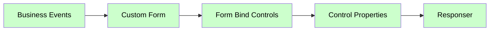

# Olay (Event) Nodları — Genel Bakış

Paket, trexMes panellerinden gelen olayları yakalamak için **8 ayrı event node tipi** sağlar. Hepsi `event-subscribers.js` dosyasında tanımlanmış olup **aynı altyapıyı** paylaşır; yalnızca **kategori amacıyla** ayrılmıştır.

## Olay Node Listesi

| Node | Tipik Kullanım |
|---|---|
| [Business Events](business-events.md) | İş akışı olayları (sipariş başlama, üretim bitirme, vardiya değişimi…) |
| [System Events](system-events.md) | Sistem seviyesi olaylar (boot, login, shutdown, lock) |
| [Communication Events](communication-events.md) | İletişim katmanı olayları (PLC, OPC, modbus, sensör) |
| [Display Events](display-events.md) | UI üzerindeki gösterim olayları |
| [Form Events](form-events.md) | Form etkileşim olayları (button click, focus, validate) |
| [Display Methods](display-methods.md) | Ana form metod tetikleyicileri |
| [Method Returns](method-returns.md) | Method invocation cevapları |

!!! note "Tüm event node'ları temelde aynıdır"
    Pakete bakıldığında **8 farklı event tipi olmasına rağmen** kod tarafında hepsi `EventSubscribers` adlı tek bir fonksiyon ile oluşturulmuştur. Aralarındaki tek fark **palette üzerindeki kategori adıdır**. Bu sayede akışınızda hangi olayın hangi gruba ait olduğunu **görsel** olarak ayırt edebilirsiniz.

## Ortak Özellikler

### I/O

Tüm event node'ları: **0 giriş, 1 çıkış**

### Renk

<span class="node-preview green-light">Business Events</span>
Açık yeşil — Servis kategorisi.

### Property Tablosu (Ortak)

| Alan | Tip | Varsayılan | Açıklama |
|---|---|---|---|
| `name` | string | — | Node-RED canvas üzerinde gösterilecek ad |
| `method` | string | `get` | HTTP method (otomatik) |
| `event` | string | _(boş)_ | Panel'in çağıracağı HTTP path |
| `ishandled` | boolean | `false` | Bu olay Node-RED tarafından mı handle edilecek? |
| `suffix` | string | — | _(Sadece `Business Events`)_ Event ismine eklenecek son ek |

## Çalışma Mantığı



## Olay Kayıt Listesi (Subscription)

Deploy anında her event node, `trex Subscriber`'ın çağrısı üzerinden **otomatik tespit edilir**. Panel tarafına gönderilecek listenin yapısı:

```javascript
RED.nodes.eachNode(function (n) {
    if (eventTypes.has(n.type)) {
        let runtimeNode = RED.nodes.getNode(n.id);
        let eName = runtimeNode.event.replace(/\//g, "");
        matchingNodes.push(eName);
        if (runtimeNode.ishandled === true) {
            matchingHandlers.push(eName + "|handled");
        }
    }
});
```

### `eventTypes` Set'i (JS tarafından)

```javascript
const eventTypes = new Set([
    "Business Events",
    "System Events",
    "Communication Events",
    "Display Events",
    "Form Events",
    "Display Methods",
    "Method Returns"
]);
```

## Tipik Akış Yapısı



## Giriş Mesajı (`msg`)

Olay tetiklendiğinde aşağıdaki yapıda mesaj üretilir:

```json
{
  "_msgid": "abc123",
  "req": { /* Express HTTP request */ },
  "res": { /* HTTP response wrapper */ },
  "payload": { /* Panel'den gelen ham olay verisi */ }
}
```

| Alan | Açıklama |
|---|---|
| `req` | Express Request nesnesi — IP, headers, query bilgileri |
| `res` | Cevap wrapper — `Responser` bunu kullanır |
| `payload` | Panel'in gönderdiği query/body verisi |

## `ishandled` Kavramı

Olay tipi panel tarafında **varsayılan bir işleyiciye** sahip olabilir. Node-RED akışınız bu olayı yakaladığında panele:

- `ishandled = true` → "Bu olayı ben işledim, sen de işleyiciyi tetikleme."
- `ishandled = false` → "Sen kendi işleyicini de çalıştır."

Bu davranışı **akış ortasında dinamik** değiştirmek için [Handle Setter](handle-setter.md) kullanın.

## Notlar

!!! tip "Event isminde slash"
    `event` alanına `/OrderStart` veya `OrderStart` yazabilirsiniz. Node otomatik olarak başına `/` ekler. Panel kayıt listesinde slash'lar **kaldırılarak** gönderilir.

!!! warning "Aynı event ismi tekrar etmemeli"
    Aynı `event` ismine sahip birden fazla node varsa HTTP path çakışması olur. Farklı kategorilerde olsalar bile aynı ismi kullanmayın.

!!! tip "Form Events'te `formname`"
    `Form Events` node'unda `ishandled` yerine **`formname`** alanı vardır. Hangi forma ait olduğunu belirtir.

## Hızlı Karşılaştırma

| Node | Özel Alan | Tipik Path Örneği |
|---|---|---|
| Business Events | `suffix` | `/OrderStartEvent` |
| System Events | — | `/SystemBootEvent` |
| Communication Events | — | `/PLCConnectionLost` |
| Display Events | — | `/DisplayRefresh` |
| Form Events | `formname` | `/MainForm_ButtonClick` |
| Display Methods | — | `/GetCurrentOrder` |
| Method Returns | `methodname` | `/OrderCreated` |

## Sonraki Adım

Her event tipinin kendi sayfasında **özel kullanım örnekleri** bulunur. Sol menüden istediğinizi seçin.
