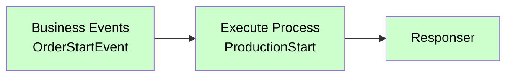

# Execute Process

<div class="node-header">
  <span class="node-preview green-light">Execute Process</span>
  <div class="meta-item"><strong>Inputs:</strong> <span class="io-badge in">1</span></div>
  <div class="meta-item"><strong>Outputs:</strong> <span class="io-badge out">1</span></div>
  <div class="meta-item"><strong>Kategori:</strong> trexMes service</div>
</div>

trexMes panel tarafında tanımlı bir **process'i tetikler**. Method çağrısından farklı olarak `Execute Process` parametre almaz — sadece process ismini panele bildirir, panel kendi mantığına göre işletim yapar.

## Property Tablosu

| Alan | Tip | Varsayılan | Açıklama |
|---|---|---|---|
| `name` | string | — | Canvas üzerinde gösterilecek ad |
| `processname` | string | _(boş)_ | Tetiklenecek process adı |

## Çıkış Mesajı

```json
{
  "operationtype": "ExecuteProcess",
  "receiveddata": { /* event data */ },
  "message": "ProductionStart"
}
```

`message` alanı `processname` değerini taşır.

## Tipik Akış



## Method Invoker vs Execute Process Karşılaştırması

| | Method Invoker | Execute Process |
|---|---|---|
| Parametre alır mı? | Evet | Hayır |
| Cevap döner mi? | Evet (Method Returns ile) | Hayır |
| Tipik kullanım | Veri sorgulama / işleme | Önceden tanımlı işlemi başlatma |
| Asenkron mu? | Evet | Fire-and-forget |

## Örnek Senaryolar

- **`ProductionStart`** — Üretim sürecini başlat
- **`ShiftChange`** — Vardiya değişimi prosedürünü tetikle
- **`DailyClose`** — Gün sonu kapanış işlemleri
- **`PrintReport`** — Standart raporu yazıcıya gönder
- **`BackupData`** — Yedekleme prosedürü

## Sık Karşılaşılan Hatalar

!!! failure "Process tetiklenmiyor"
    - `processname` panel tarafındaki process tanımıyla **birebir** mi eşleşiyor?
    - Panel tarafında bu process gerçekten tanımlı mı?

!!! failure "Process başladı ama sonuç bilinmiyor"
    `Execute Process` cevap dönmediği için işlem **fire-and-forget**'tir. Sonuç bilmek istiyorsanız `Method Invoker` kullanın veya panel tarafından bir `Business Events` ile process tamamlanma bildirimi göndermesini sağlayın.

## İpuçları

!!! tip "Tetik ve dinle pattern'i"
    Process tetikledikten sonra "tamamlandı" olayı için ayrı bir event node ile dinleme yapın:

    ```
    [Akış 1] OrderEvent → Execute Process (ProductionStart) → Responser
    [Akış 2] Business Events (ProductionStartedEvent) → ...
    ```

!!! tip "İsimlendirme standardı"
    Process isimlerini **PascalCase** ile yazın (`ProductionStart`, `DailyClose`). Bu, panel tarafındaki C# enumlarıyla uyumlu olur.

## İlgili

- [Method Invoker](method-invoker.md) — Parametreli method çağrısı
- [Execute Script](execute-script.md) — Form üzerinde script çalıştır
- [Mesaj Yapısı](../baslangic/mesaj-yapisi.md)
