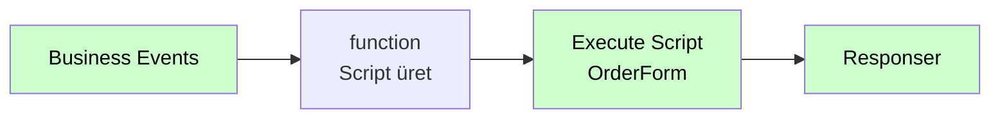

# Execute Script

<div class="node-header">
  <span class="node-preview green-light">Execute Script</span>
  <div class="meta-item"><strong>Inputs:</strong> <span class="io-badge in">1</span></div>
  <div class="meta-item"><strong>Outputs:</strong> <span class="io-badge out">1</span></div>
  <div class="meta-item"><strong>Kategori:</strong> trexMes service</div>
</div>

Belirli bir form üzerinde **özel script kodu çalıştırır**. Panel tarafında script motorunu tetikleyerek karmaşık UI manipülasyonlarını gerçekleştirir.

## Property Tablosu

| Alan | Tip | Varsayılan | Açıklama |
|---|---|---|---|
| `name` | string | — | Canvas üzerinde gösterilecek ad |
| `formname` | string | _(boş)_ | Script'i çalıştıracak form |
| `script` | string | _(boş)_ | Script kodu |

## Dinamik Script (`msg.script`)

Eğer akış içinde `msg.script` değişkeni set edilmişse, node bu değeri **statik `script` alanı yerine** kullanır:

```javascript
let script = msg.script;
if (script === undefined || script === null) {
    script = node.script;  // fallback
}
```

Bu sayede script içeriği akış içinde dinamik olarak üretilebilir.

## Çıkış Mesajı

```json
{
  "operationtype": "ExecuteScript",
  "receiveddata": { /* event data */ },
  "name": "OrderForm",
  "message": "if(value > 100) { btnAlert.Visible = true; }"
}
```

## Tipik Akış



## Örnek Script'ler

### Koşullu Görünürlük

```csharp
if (txtQty.Text != "" && int.Parse(txtQty.Text) > 100) {
    lblWarning.Visible = true;
    lblWarning.Text = "Yüksek miktar uyarısı!";
} else {
    lblWarning.Visible = false;
}
```

### Toplam Hesaplama

```csharp
decimal toplam = decimal.Parse(txtBirimFiyat.Text) * decimal.Parse(txtAdet.Text);
txtToplam.Text = toplam.ToString("N2");
```

### Renk Değiştirme

```csharp
if (cmbStatus.SelectedItem.ToString() == "Acil") {
    pnlMain.BackColor = Color.Red;
} else {
    pnlMain.BackColor = Color.White;
}
```

## Önemli Notlar

!!! info "Script dili paneldedir"
    Bu node script içeriğine **dokunmaz**; sadece panele iletir. Script dili (genellikle C# veya VB.NET) ve sentaks **panel'in script motoruna** bağlıdır.

!!! warning "Form aktif olmalı"
    Script'in çalışacağı form panel üzerinde **açık** olmalıdır. Aksi takdirde panel script'i çalıştıramaz.

!!! warning "Güvenlik"
    Script içeriğini kullanıcı girdisinden oluşturuyorsanız (örn. form alanından) **enjeksiyon riski** vardır. Mutlaka sanitize edin.

## Sık Karşılaşılan Hatalar

!!! failure "Script çalışmıyor"
    - `formname` doğru mu girildi?
    - Hedef form gerçekten açık mı?
    - Script sentaks hatası içeriyor olabilir — panel logunu kontrol edin.

!!! failure "msg.script ile script alanı çelişiyor"
    Her ikisi de doluysa `msg.script` öncelik kazanır. Statik alan değişmiyor görünebilir.

## İpuçları

!!! tip "Script şablonu"
    Karmaşık script'leri akış içinde `function` node ile parametre değerlerine göre dinamik üretin:

    ```javascript
    msg.script = `lbl1.Text = "${msg.payload.title}";
                  txt2.Text = "${msg.payload.value}";`;
    return msg;
    ```

!!! tip "Birden fazla satır"
    Script çok satırlı olabilir; node düz string olarak gönderir. Panel tarafı satır sonlarını da işler.

## İlgili

- [Custom Form](custom-form.md)
- [Control Properties](control-properties.md) — Property atama için tercih edin
- [Method Invoker](method-invoker.md) — Karmaşık iş mantığı için
