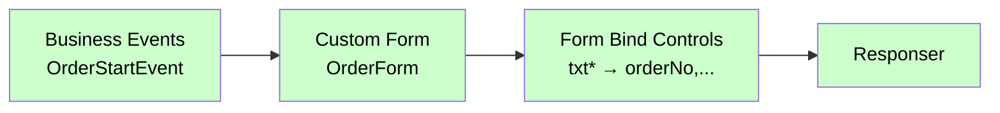

# Form Bind Controls

<div class="node-header">
  <span class="node-preview green-light">Form Bind Controls</span>
  <div class="meta-item"><strong>Inputs:</strong> <span class="io-badge in">1</span></div>
  <div class="meta-item"><strong>Outputs:</strong> <span class="io-badge out">1</span></div>
  <div class="meta-item"><strong>Kategori:</strong> trexMes service</div>
</div>

Custom Form üzerindeki **Grid'in datasource** veya **web kontrolünün source** değerini dinamik olarak atar.

!!! warning "Kullanım kapsamı"
    Bu node yalnızca **Grid (`DataGridView` vb.) datasource** veya **web kontrol source** ataması için kullanılır.
    Bir Label, Button veya TextBox'ın metnini/rengini değiştirmek için **[Control Properties](control-properties.md)** nodunu kullan.

## Ne Zaman Kullanılır?

| Senaryo | Doğru Node |
|---|---|
| Formdaki Grid'e JSON array bağla | **Form Bind Controls** |
| Web kontrolünün source'unu ata | **Form Bind Controls** |
| Label Text'ini değiştir | Control Properties |
| Button'u gizle / aktif et | Control Properties |
| TextBox'a değer yaz | Control Properties |

## Kullanımı

1. **Form Name** listesinden hedef formu seç.
2. **Data** alanına Grid'e atanacak JSON array değişkenini belirt (örn. `msg.` → `payload`).
3. **Add** butonuna tıkla; listeye yeni bir satır eklenir.
4. **Control** alanına Grid'in adını gir. Örnek: `dbGrid`

```
Form Name : OrderForm
Data      : msg.  →  payload          ← JSON array buradan okunur
Control   : dbGrid                    ← Grid'in XML'deki name değeri
```

## Property Tablosu

| Alan | Tip | Varsayılan | Açıklama |
|---|---|---|---|
| `name` | string | — | Canvas üzerinde gösterilecek ad |
| `formname` | string | _(boş)_ | Hangi formun kontrollerine bağlanacak? |
| `formainform` | boolean | `false` | Ana form (`AppForm`) mı? |
| `props` | array | `[]` | Bağlama listesi: `{p: controlName, v: fieldName}` |
| `data` | string | _(boş)_ | Veriyi nereden okuyacağız (path) |
| `dataType` | string | — | Kaynak: `msg`, `flow`, `global`, vs. |

## `props` Yapısı

Editör arayüzünde her satır iki sütundan oluşur:

| Sütun | Anahtar | Açıklama |
|---|---|---|
| **Property** (`p`) | Kontrol adı | XML'deki `name` attribute'u (örn. `txtOrderNo`) |
| **Value** (`v`) | Field adı | Verinin içindeki property adı (örn. `orderNo`) |

```json
[
  { "p": "txtOrderNo",  "v": "orderNo" },
  { "p": "txtCustomer", "v": "customer" },
  { "p": "txtQty",      "v": "qty" }
]
```

## Veri Kaynağı (`data` + `dataType`)

`dataType` ile değer şu kaynaklardan okunabilir:

| `dataType` | `data` örneği | Anlamı |
|---|---|---|
| `msg` | `payload.order` | `msg.payload.order` |
| `flow` | `currentOrder` | `flow.get("currentOrder")` |
| `global` | `defaultUser` | `global.get("defaultUser")` |

[Tüm `dataType` seçenekleri →](../baslangic/mesaj-yapisi.md#datatype-cozumleme)

## Çıkış Mesajı

```json
{
  "operationtype": "BindControl",
  "receiveddata": { /* event data */ },
  "name": "OrderForm",
  "bindcontrols": [
    { "Name": "txtOrderNo",  "FieldName": "orderNo" },
    { "Name": "txtCustomer", "FieldName": "customer" },
    { "Name": "txtQty",      "FieldName": "qty" }
  ],
  "value": {
    "orderNo": "ORD-001",
    "customer": "ACME",
    "qty": 100
  }
}
```

## `formainform` Davranışı

| Değer | `formname` Otomatik | Senaryo |
|---|---|---|
| `false` | Kullanıcı tanımlı | Custom dialog'a bağlama |
| `true` | `"AppForm"` | Ana form'a bağlama |

```javascript
var formname = node.formname;
if (n.formainform == true) {
    formname = "AppForm";
}
```

## Tipik Akış



## Önemli Konular

### `value` Hesaplama Mantığı

`value` alanı **tek bir nesne** olarak gönderilir; panel her kontrol için kendi `FieldName`'i bu nesneden okur.

Eğer `data` boş bırakılırsa `value: null` olur ve panel `receiveddata`'yı kullanır.

### Birden Fazla Form

Her form için ayrı bir `Form Bind Controls` node'u kullanın. Aynı node birden fazla formu yönetemez.

## Sık Karşılaşılan Hatalar

!!! failure "Form alanları boş kalıyor"
    - Kontrol adları (`p`) XML'deki `name` ile **birebir** eşleşiyor mu? (Büyük/küçük harf duyarlı)
    - `dataType` doğru mu? `msg` seçtiniz ama `data` yolu yanlış olabilir.
    - Akışta `Custom Form` `Form Bind Controls`'tan **önce** geliyor mu?

!!! failure "Veri yapısı uyumsuz"
    `value` nesnesinde `FieldName` ile eşleşen property olmalı. Örnek: `bindcontrol` `{Name: "txtA", FieldName: "a"}` ise `value.a` mevcut olmalı.

## İpuçları

!!! tip "JSONata ile dönüştürme"
    Veriyi olduğu gibi bağlamak yerine dönüştürmek istiyorsanız:

    1. Önce bir `function` veya `change` node ile veriyi şekillendirin
    2. Sonuçları `flow` context'e koyun
    3. `Form Bind Controls`'ta `dataType: flow` kullanın

!!! tip "Kontrol isimlendirme standartı"
    XML form tasarımında kontrol isimlerini tip prefix'leriyle adlandırın (`txt*` textbox, `chk*` checkbox, `cb*` combobox). Bu, debug'ı kolaylaştırır.

## İlgili

- [Custom Form](custom-form.md) — Form tasarımı
- [Control Properties](control-properties.md) — Statik özellik atama
- [Mesaj Yapısı](../baslangic/mesaj-yapisi.md)
