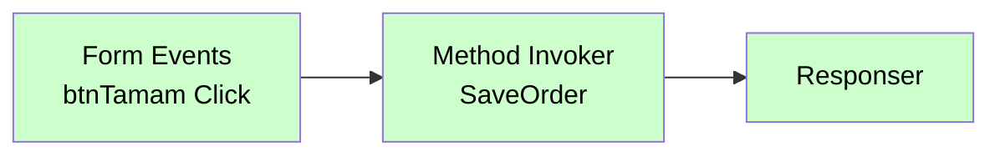

# Form Events

<div class="node-header">
  <span class="node-preview green-light">Form Events</span>
  <div class="meta-item"><strong>Inputs:</strong> <span class="io-badge in">0</span></div>
  <div class="meta-item"><strong>Outputs:</strong> <span class="io-badge out">1</span></div>
  <div class="meta-item"><strong>Kategori:</strong> trexMes service</div>
</div>

Form üzerindeki **etkileşim olaylarına** abone olur. Button click, focus, blur, validate gibi UI tetiklemelerini yakalar.

## Property Tablosu

| Alan | Tip | Varsayılan | Açıklama |
|---|---|---|---|
| `name` | string | — | Canvas üzerinde gösterilecek ad |
| `method` | string | `post` | HTTP method (otomatik) |
| `formname` | string | `CustomForm` | İzlenecek formun adı (combobox'tan seçilir — akıştaki `Custom Form` node'larını listeler) |
| `control` | string | _(boş)_ | İzlenecek kontrolün adı (örn. `btnTamam`) |
| `eventname` | string | `Click` | Kontrol olayı türü (combobox ile seçilir) |
| `formainform` | boolean | `false` | Ana form (AppForm) üzerindeki kontrol mü? |
| `eventtime` | string | `After` | Olay zamanı: `After` veya `Before` (`formainform=true` iken görünür) |

!!! note "Özel yapı"
    `Form Events`, diğer event node'larından farklıdır: form adı + kontrol adı + olay türü kombinasyonuna abone olur. `formname` alanı, akıştaki mevcut `Custom Form` node'larını otomatik listeleyen bir combobox'tır.

## Olay Türleri (`eventname`)

`eventname` alanı combobox ile seçilir. Mevcut seçenekler:

| Olay Türü | Açıklama |
|---|---|
| `Click` | Kontrol tıklandığında |
| `Changed` | Kontrol değeri değiştiğinde |
| `Load` | Kontrol yüklendiğinde |
| `Tick` | Zamanlayıcı olayı |
| `KeyEnter` | Enter tuşuna basıldığında |
| `SelectionChanged` | Seçim değiştiğinde |

## Örnek Kullanım



## Giriş Mesajı

Button click örnek:

```json
{
  "_msgid": "abc123",
  "payload": {
    "formName": "OrderForm",
    "controlName": "btnSubmit",
    "eventType": "click",
    "formData": {
      "orderNo": "ORD-001",
      "qty": 100,
      "customer": "ACME"
    }
  }
}
```

## İpuçları

!!! tip "Form alanlarını okumak"
    Button click event'inde `payload.formData` içerisinde **tüm form alanlarının** anlık değerleri gelir. Bu sayede her alan için ayrı event tanımlamak gerekmez.

!!! tip "Validate event"
    Form kaydedilmeden önce bir `validate` event tanımlarsanız, sunucu tarafında validasyon yapıp `Handle Setter` ile akışı kesebilirsiniz.

## İlgili

- [Olay Nodları Genel Bakış](event-subscribers.md)
- [Button Configurator](button-configurator.md)
- [Main Form Action](main-form-action.md)
