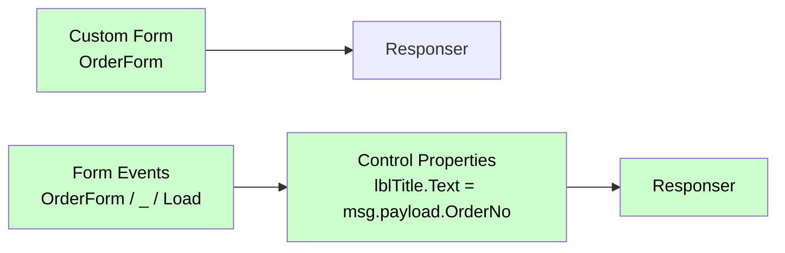
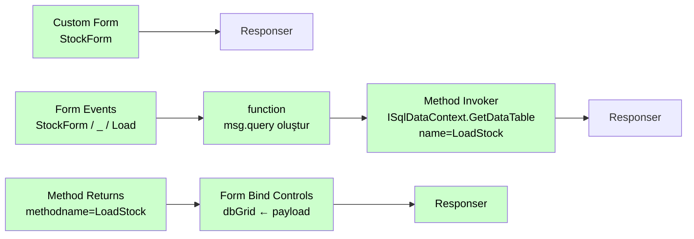
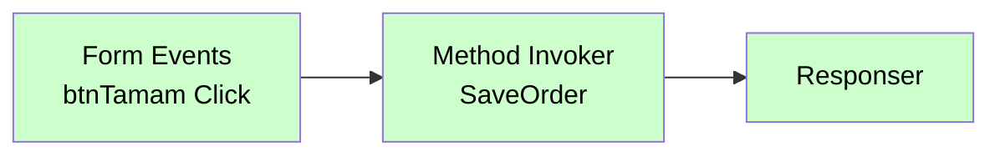

# Form Events

<div class="node-header">
  <span class="node-preview green-light">Form Events</span>
  <div class="meta-item"><strong>Inputs:</strong> <span class="io-badge in">0</span></div>
  <div class="meta-item"><strong>Outputs:</strong> <span class="io-badge out">1</span></div>
  <div class="meta-item"><strong>Kategori:</strong> trexMes service</div>
</div>

Form üzerindeki **etkileşim olaylarına** abone olur. Buton tıklaması, form yüklenme, değer değişikliği gibi UI tetiklemelerini yakalar.

## Property Tablosu

| Alan | Tip | Varsayılan | Açıklama |
|---|---|---|---|
| `name` | string | — | Canvas üzerinde gösterilecek ad |
| `method` | string | `post` | HTTP method (otomatik) |
| `formname` | string | `CustomForm` | İzlenecek formun adı (combobox'tan seçilir — akıştaki `Custom Form` node'larını listeler) |
| `control` | string | _(boş)_ | İzlenecek kontrolün adı (örn. `btnTamam`) |
| `eventname` | string | `Click` | Kontrol olayı türü (combobox ile seçilir) |
| `formainform` | boolean | `false` | Ana form (AppForm) üzerindeki kontrol mü? |
| `eventtime` | string | `After` | Olay zamanı: `After` veya `Before` (`formainform=true` iken görünür) |

!!! note "Özel yapı"
    `Form Events`, diğer event node'larından farklıdır: form adı + kontrol adı + olay türü kombinasyonuna abone olur. `formname` alanı, akıştaki mevcut `Custom Form` node'larını otomatik listeleyen bir combobox'tır.

## Olay Türleri (`eventname`)

`eventname` alanı combobox ile seçilir. Mevcut seçenekler:

| Olay Türü | Açıklama |
|---|---|
| `Click` | Kontrol tıklandığında |
| `Changed` | Kontrol değeri değiştiğinde |
| `Load` | Kontrol yüklendiğinde |
| `Tick` | Zamanlayıcı olayı |
| `KeyEnter` | Enter tuşuna basıldığında |
| `SelectionChanged` | Seçim değiştiğinde |

## Form Yüklenme (Load) Olayı

Formun açıldığı anda otomatik tetiklemek için `Load` eventi kullanılır. Kontrol adı olarak **`_`** (alt çizgi) girilir — bu, form genelinde load olayını temsil eder.

| Alan | Değer |
|---|---|
| **Form Name** | Hedef `Custom Form` node'unun adı |
| **Control** | `_` |
| **Event Name** | `Load` |

!!! info "Neden `_`?"
    `_` kontrolüne ait Load event'i, formun kendisinin yüklenme anını temsil eder. Belirli bir kontrole ait Load değil, formun açılış tetiklemesidir.

### Senaryo 1 — Açılışta Kontrol Değerlerini Göster

Form açıldığında bazı label veya textbox değerlerini doldurmak için `Control Properties` kullanılır.



**Akış 1 — Formu aç:**

| Node | Tip | Ayar |
|---|---|---|
| — | Business Events | İlgili event |
| — | Custom Form | name=`OrderForm` |
| — | Responser | — |

**Akış 2 — Load olayında değerleri ata:**

| Node | Tip | Ayar |
|---|---|---|
| — | Form Events | formname=`OrderForm`, control=`_`, eventname=`Load` |
| — | Control Properties | `lblTitle.Text` → `msg.` payload.OrderNo |
| — | Responser | — |

---

### Senaryo 2 — Açılışta Grid'e Veri Yükle

Form açıldığında grid'e SQL sorgusu ile veri doldurmak için `ISqlDataContext` + `Form Bind Controls` kombinasyonu kullanılır.



**Akış 1 — Formu aç:**

| Node | Tip | Ayar |
|---|---|---|
| — | Business Events | İlgili event |
| — | Custom Form | name=`StockForm` |
| — | Responser | — |

**Akış 2 — Load olayında SQL çek:**

| Node | Tip | Ayar |
|---|---|---|
| — | Form Events | formname=`StockForm`, control=`_`, eventname=`Load` |
| SQL hazırla | function | `msg.query = \`SELECT TOP 100 * FROM STOCK\`; return msg;` |
| LoadStock | Method Invoker | service=`ISqlDataContext`, method=`GetDataTable`, params: `query`→`msg.query` |
| — | Responser | — |

**Akış 3 — Sonucu grid'e bağla:**

| Node | Tip | Ayar |
|---|---|---|
| — | Method Returns | methodname=`LoadStock` |
| — | Form Bind Controls | formname=`StockForm`, data=`msg.payload`, control=`dbGrid` |
| — | Responser | — |

---

## Örnek Kullanım — Buton Tıklaması



## Giriş Mesajı

Button click örnek:

```json
{
  "_msgid": "abc123",
  "payload": {
    "formName": "OrderForm",
    "controlName": "btnSubmit",
    "eventType": "click",
    "formData": {
      "orderNo": "ORD-001",
      "qty": 100,
      "customer": "ACME"
    }
  }
}
```

## İpuçları

!!! tip "Form alanlarını okumak"
    Button click event'inde `payload.formData` içerisinde **tüm form alanlarının** anlık değerleri gelir. Bu sayede her alan için ayrı event tanımlamak gerekmez.

!!! tip "Validate event"
    Form kaydedilmeden önce bir `validate` event tanımlarsanız, sunucu tarafında validasyon yapıp `Handle Setter` ile akışı kesebilirsiniz.

## İlgili

- [Olay Nodları Genel Bakış](event-subscribers.md)
- [Button Configurator](button-configurator.md)
- [Main Form Action](main-form-action.md)
