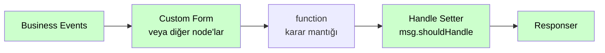

# Handle Setter

<div class="node-header">
  <span class="node-preview green-light">Handle Setter</span>
  <div class="meta-item"><strong>Inputs:</strong> <span class="io-badge in">1</span></div>
  <div class="meta-item"><strong>Outputs:</strong> <span class="io-badge out">1</span></div>
  <div class="meta-item"><strong>Kategori:</strong> trexMes service</div>
</div>

`IsHandled` özelliği bulunan Event node'larını içeren akışlarda, diğer trexMes node'larının **ardından** zincire eklenir ve olayın handle durumunu çalışma zamanında set eder. `IsHandled = true` ayarlandığında panel, ilgili olaya ait tüm işlemleri keser.

## Özet

`IsHandled` özelliği olan Event node'ları (`Business Events`, `Form Events` vb.) bu değeri statik olarak tanımlar. `Handle Setter` ise akışın o noktasındaki duruma göre — örneğin bir önceki node'dan gelen veriye veya flow context'e bakarak — bu kararı **dinamik olarak** verir.

!!! info "Konumu"
    `Handle Setter`, akıştaki diğer trexMes node'larından sonra, `Responser`'dan önce gelir. Akışı **tetiklemez**; yalnızca `msg.payload` array'ine `TrexEventHandler` operasyonu ekler.

## Property Tablosu

| Alan | Tip | Varsayılan | Açıklama |
|---|---|---|---|
| `name` | string | — | Node-RED canvas üzerinde gösterilecek ad |
| `isHandled` | any | — | Handle değeri veya kaynak path |
| `isHandledType` | string | `bool` | Değerin nereden okunacağı: `bool`, `msg`, `flow` |

### `isHandledType` Seçenekleri

| Tip | Anlamı | Örnek `isHandled` |
|---|---|---|
| `bool` | Sabit boolean | `true` veya `false` |
| `msg` | Mesaj nesnesinden oku | `payload.isHandled` |
| `flow` | Flow context'ten oku | `currentHandledState` |

## Çıkış Mesajı

`msg.payload` array'ine şu operasyonu ekler:

```json
{
  "operationtype": "TrexEventHandler",
  "continueevent": false
}
```

`continueevent` değeri **`isHandled`'in tersidir**:

| `isHandled` | `continueevent` | Anlam |
|---|---|---|
| `true` | `false` | "Node-RED handle etti, panel kendi işleyicisini ÇALIŞTIRMASIN" |
| `false` | `true` | "Panel kendi işleyicisini de çalıştırsın" |

## Davranış Kodu

```javascript
let isHandled;
switch (node.isHandledType) {
    case "bool":
        isHandled = node.isHandled;
        break;
    case "msg":
        isHandled = RED.util.getMessageProperty(msg, node.isHandled);
        break;
    case "flow":
        isHandled = node.context().flow.get(node.isHandled);
        break;
}

isHandled = (isHandled === true);  // Strict cast

if (!Array.isArray(msg.payload)) {
    node.status({ fill: "red", shape: "ring",
                  text: "payload should be a json array" });
    return;
}

msg.payload.push({
    operationtype: "TrexEventHandler",
    continueevent: !isHandled
});
```

## Tipik Kullanım

`Handle Setter`, diğer trexMes node'larından sonra, `Responser`'dan hemen önce konumlanır:



`IsHandled = true` olduğunda panel, bu olaya bağlı kendi işleyicisini **çalıştırmaz**; işlem kesilir.

### Örnek Function Node Kodu

Akış içinde karar verip `Handle Setter`'a yönlendirmek için:

```javascript
// function node içinde
const orderNo = msg.payload.orderNo;
const isPremium = await checkPremium(orderNo);

// Premium siparişleri biz işleyelim, diğerlerini panel
msg.shouldHandle = isPremium;  // bool
return msg;
```

Ardından `Handle Setter`'da:

- `isHandled`: `shouldHandle`
- `isHandledType`: `msg`

## Önemli Uyarı

!!! warning "msg.payload array olmak zorunda"
    `Handle Setter` `msg.payload`'ın **array** olmasını bekler. Eğer öncesinde bir form/event node çalışmamışsa array olmayacaktır.

    Çözüm: Önce bir `Custom Form` veya benzeri node'tan geçirin, ya da function node ile:

    ```javascript
    if (!Array.isArray(msg.payload)) {
        msg.payload = [];
    }
    return msg;
    ```

## Durum Göstergesi

Hata durumunda node altında:

```
[red ring] payload should be a json array
```

## Sık Karşılaşılan Hatalar

!!! failure "payload should be a json array"
    Yukarıdaki uyarı bölümüne bakın — `msg.payload` array değil.

!!! failure "isHandled her zaman false"
    `isHandledType` doğru ayarlanmış mı? `bool` seçtiyseniz `isHandled` alanında değer literal `true`/`false` olmalıdır.

## İlgili Nodlar

- [Olay Nodları](event-subscribers.md) — Tüm event node'ları statik `Is Handled` alanına sahiptir
- [Mesaj Yapısı](../baslangic/mesaj-yapisi.md) — `TrexEventHandler` operationtype detayı
