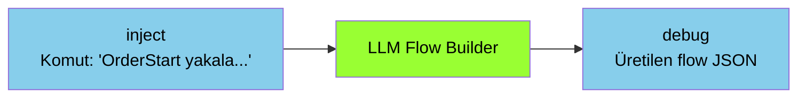

# LLM Flow Builder

<div class="node-header">
  <span class="node-preview green-bright">LLM Flow Builder</span>
  <div class="meta-item"><strong>Inputs:</strong> <span class="io-badge in">1</span></div>
  <div class="meta-item"><strong>Outputs:</strong> <span class="io-badge out">1</span></div>
  <div class="meta-item"><strong>Kategori:</strong> trexMes service</div>
</div>

**Yapay zekâ ile Node-RED akışı üreten** asistan node. Bir LLM (Large Language Model) sağlayıcısına doğal dilde komut göndererek otomatik akış JSON'u üretir; isterseniz akışı otomatik olarak import ve deploy edebilir.

!!! info "Diğer node'lardan farkı"
    Bu node trexMes operasyonu üretmez — Node-RED ortamında **geliştirici asistanı** olarak çalışır. Akış JSON'ı üreterek geliştirici verimliliğini artırır.

## Property Tablosu

### Ana Node (`llm-flow-builder`)

| Alan | Tip | Varsayılan | Açıklama |
|---|---|---|---|
| `name` | string | — | Canvas üzerinde gösterilecek ad |
| `llmConfig` | config node | _(boş)_ | LLM bağlantı yapılandırması |
| `autoImport` | boolean | `false` | Üretilen akışı otomatik import et |
| `autoDeploy` | boolean | `false` | Import sonrası otomatik deploy et |
| `lastPrompt` | string | _(boş)_ | Node editöründeki prompt alanına yazılan son komut |
| `nrAdminUser` | credential (text) | _(boş)_ | Node-RED admin kullanıcı adı |
| `nrAdminPass` | credential (password) | _(boş)_ | Node-RED admin şifresi |

### Config Node (`llm-flow-builder-config`)

| Alan | Tip | Açıklama |
|---|---|---|
| `name` | string | Config takma adı |
| `provider` | enum | LLM sağlayıcısı |
| `apiUrl` | string | API endpoint |
| `modelName` | string | Model adı |
| `apiKey` | password (credential) | API anahtarı |

## Desteklenen LLM Sağlayıcıları

Config node **7 sağlayıcı** için preset sunar:

| Provider | API URL | Varsayılan Model | Auth Yöntemi |
|---|---|---|---|
| **OpenAI** | `https://api.openai.com/v1/chat/completions` | `gpt-4o` | Bearer token |
| **Anthropic** | `https://api.anthropic.com/v1/messages` | `claude-sonnet-4-20250514` | `x-api-key` header |
| **Google Gemini** | `https://generativelanguage.googleapis.com/v1beta/...` | `gemini-2.0-flash` | `x-goog-api-key` header |
| **DeepSeek** | `https://api.deepseek.com/v1/chat/completions` | `deepseek-chat` | Bearer token |
| **Mistral** | `https://api.mistral.ai/v1/chat/completions` | `mistral-large-latest` | Bearer token |
| **Groq** | `https://api.groq.com/openai/v1/chat/completions` | `llama-3.3-70b-versatile` | Bearer token |
| **trex Lens AI** | _(manuel)_ | _(manuel)_ | Bearer token |

!!! info "Gemini API anahtarı"
    Gemini için [Google AI Studio](https://aistudio.google.com/apikey) üzerinden API anahtarı alın. Google Cloud servis hesabı (JSON) veya OAuth token **çalışmaz** — yalnızca `AIza...` formatındaki API key geçerlidir.

## Sistem Prompt

Node, sistem promptunu her zaman **paket klasöründeki `systemprompt.txt` dosyasından** otomatik olarak okur. Editörden değiştirilemez; dosyayı doğrudan düzenleyin. Dosya her mesajda yeniden okunduğundan Node-RED yeniden başlatılmadan güncellenebilir.

`systemprompt.txt` LLM'e şunları öğretir:

- Node-RED akış JSON formatını ve zorunlu kuralları
- `node-red-trexmes-service` paketindeki tüm node tiplerini ve property'lerini
- **Business, Communication, Display ve System Events node'larının tüm event adlarını ve Türkçe açıklamalarını**
- Tipik akış desenlerini (observe, form, button handling, conditional handle) örneklerle

### Event Seçimi

LLM, verilen prompta göre açıklamaları okuyarak en uygun event'i otomatik seçer. Örneğin:

| Prompt | Seçilen Event | Node Tipi |
|---|---|---|
| `"Barkod okununca akış başlasın"` | `OnBarcodeScanned` | Communication Events |
| `"Plan yüklendiğinde form aç"` | `OnPlanLoaded` | Business Events |
| `"Uygulama açılışında karşılama göster"` | `OnApplicationStarted` | System Events |
| `"Operatör iş yükle butonuna bastığında..."` | `OnOperatorPlanLoadButtonClicking` | Display Events |
| `"Duruş başladığında bildir"` | `OnStoppageStarted` | Business Events |

!!! tip "Açıklayıcı prompt yazın"
    Senaryo ne kadar açık anlatılırsa LLM event seçimi o kadar isabetli olur. "Üretim onaylandığında" gibi ifadeler `OnProductionConfirmed` ile eşleşir; "sayaç arttığında" ise `OnProductionCounterIncreased` ile.

## Editörden Doğrudan Akış Üretme

Node editörünü açtığınızda **Prompt** alanına doğal dilde komutunuzu yazıp **Üret** butonuna basabilirsiniz. Bu sayede `inject` node'una gerek kalmadan akışı doğrudan editör içinden üretebilirsiniz.

```
1. Node'u çift tıkla → editörü aç
2. Prompt alanına komutu yaz
3. "Üret" butonuna tıkla
4. autoImport açıksa akış otomatik import edilir
5. autoDeploy da açıksa deploy da yapılır
```

!!! info "Node deploy edilmiş olmalı"
    Editörden üretim yapabilmek için node'un önceden **Deploy edilmiş** olması gerekir. Deploy edilmemiş bir node için "Node bulunamadı — önce Deploy edin." hatası alırsınız.

!!! tip "Prompt kaydedilir"
    Editörde yazdığınız prompt Deploy sonrasında korunur. Bir sonraki açılışta kaldığınız yerden devam edebilirsiniz.

## Üretilen Akışın Group İçine Alınması

Üretilen tüm node'lar otomatik olarak tek bir **Group** içine yerleştirilir:

- **Group adı**: `Created By LLM Flow Builder`
- **Stil**: Mavi kenarlı, açık mavi arka plan
- Canvas üzerinde üretilen akışlar birbirinden görsel olarak ayrışır
- Birden fazla üretim yapılırsa her üretim kendi Group'unda yer alır

## Tipik Akış



### Komut Örnekleri

| Komut | Seçilen Event | Üretilen Akış |
|---|---|---|
| `"Plan yüklenince form aç"` | `OnPlanLoaded` (Business) | trex Subscriber + Business Events + Custom Form + Responser |
| `"Barkod okunduğunda sipariş bilgisini göster"` | `OnBarcodeScanned` (Communication) | trex Subscriber + Communication Events + Custom Form + Form Bind Controls + Responser |
| `"Uygulama açılışında karşılama ekranı göster"` | `OnApplicationStarted` (System) | trex Subscriber + System Events + Custom Form + Responser |
| `"Operatör iş yükle butonuna bastığında alternatif akış çalıştır"` | `OnOperatorPlanLoadButtonClicking` (Display) | trex Subscriber + Display Events(ishandled=true) + Handle Setter + Responser |
| `"Duruş başladığında debug'a yaz"` | `OnStoppageStarted` (Business) | trex Subscriber + Business Events + debug + Responser |
| `"İş yüklendiğinde stok listesi grid'i olan form aç, Tamam ile kapat"` | `OnPlanLoaded` (Business) | **4 akış** — aşağıya bakın |

### Tam Senaryo: Form + SQL Grid + Kapat Butonu

```
- İş yüklendiği zaman bir form aç.
- Forma data Grid nesnesi ekle.
- Form açıldıktan sonra "SELECT TOP 10 * FROM STOCK" sorgusunu çalıştır
- Dönüş verisini formdaki gridde göster.
- Tamam butonu ile formun kapanmasını sağla.
```

Bu senaryo **4 bağımsız akış** üretir:

```mermaid
flowchart TD
    subgraph "Akış 1 — Form Aç"
        A1[Business Events\nOnPlanLoaded] --> B1[Custom Form\nfrmStok\ndgStok + btnTamam]
        B1 --> C1[Responser]
    end

    subgraph "Akış 2 — Form Yüklenince SQL Çalıştır"
        A2[Form Events\nfrmStok / _ / Load] --> B2[function\nmsg.query = SELECT TOP 10 ...]
        B2 --> C2[Method Invoker\nISqlDataContext.GetDataTable\nname=GetStock]
        C2 --> D2[Responser]
    end

    subgraph "Akış 3 — SQL Sonucunu Grid'e Bağla"
        A3[Method Returns\nGetStock] --> B3[Form Bind Controls\nfrmStok / dgStok\npayload.Result.Result]
        B3 --> C3[Responser]
    end

    subgraph "Akış 4 — Tamam ile Formu Kapat"
        A4[Form Events\nfrmStok / btnTamam / Click] --> B4[Control Properties\nfrmStok.Visible = false]
        B4 --> C4[Responser]
    end

    style B1 fill:#ccffcc,color:#000
    style C2 fill:#ccffcc,color:#000
    style B3 fill:#ccffcc,color:#000
    style B4 fill:#ccffcc,color:#000
```



| Akış | Node'lar | Not |
|---|---|---|
| **1 — Form Aç** | Business Events → Custom Form → Responser | `customformxml` içinde `dgStok` (DataGridView) + `btnTamam` (Button) |
| **2 — SQL Çalıştır** | Form Events (`control="_"`, `Load`) → function → Method Invoker → Responser | `control="_"` form-level Load olayını yakalar |
| **3 — Grid'e Bağla** | Method Returns → Form Bind Controls → Responser | `data="payload.Result.Result"` — SQL satırları buradadır |
| **4 — Formu Kapat** | Form Events (`btnTamam`, `Click`) → Control Properties → Responser | `props=[{p:"frmStok", v:"Visible", d:"false", dt:"bool"}]` |

!!! warning "Form Bind Controls yalnızca Grid için"
    `Form Bind Controls` sadece Grid (`DataGridView`) veya web kontrol datasource'u için kullanılır. Label/Button/TextBox gibi kontrollerin property'lerini değiştirmek için `Control Properties` kullanın.

## Node-RED Admin Kimlik Bilgileri

`autoImport` veya `autoDeploy` aktifken node, üretilen akışı Node-RED Admin API'ye (`/flow`, `/flows`) göndermesi gerekir. Node-RED'de `adminAuth` yapılandırılmışsa bu API çağrıları token ile kimlik doğrulaması ister.

Ana node editörünün **"Node-RED Admin Kimlik Bilgileri"** bölümüne Node-RED admin kullanıcı adı ve şifresini girin. Auth kapalıysa bu alanlar boş bırakılabilir.

!!! warning "Node-RED yeniden başlatıldıktan sonra API anahtarı geçersizleşirse"
    Node-RED'e `adminAuth` eklendikten sonra yeniden başlatıldığında credential şifreleme anahtarı değişebilir. Bu durumda **LLM Config** node'unda kayıtlı Gemini/OpenAI API anahtarı bozulur. Belirti: `"Request had invalid authentication credentials"` hatası.

    **Çözüm:** LLM Config node'unu açıp API anahtarını yeniden girin ve Deploy edin.

## Otomatik Import ve Deploy

Üç olası mod vardır:

| `autoImport` | `autoDeploy` | Davranış |
|---|---|---|
| `false` | _herhangi_ | Sadece üretir, debug çıkışı verir |
| `true` | `false` | Yeni sekmeye ekler ama deploy etmez |
| `true` | `true` | Sekmeye ekler **ve** deploy eder |

!!! warning "Otomatik deploy'a dikkat"
    `autoDeploy: true` ayarı **çalışan Node-RED'i değiştirir**. Üretim ortamında **kapalı tutun**; sadece geliştirme ortamında kullanın.

## Giriş Mesajı

`msg.payload` alanında **doğal dilde komut** beklenir:

```json
{
  "payload": "Bana her PLC bağlantı kopması olayında uyarı veren bir akış oluştur."
}
```

## Çıkış Mesajı

Üretilen akış JSON'u:

```json
{
  "_msgid": "abc123",
  "payload": {
    "flow": [
      {
        "id": "node1",
        "type": "trex Subscriber",
        "name": ""
      },
      {
        "id": "node2",
        "type": "Communication Events",
        "event": "/PLCConnectionLost",
        "ishandled": false
      }
      // ...
    ],
    "imported": true,
    "deployed": false,
    "tabName": "AI_Generated"
  }
}
```

## API İzinleri ve Maliyet

!!! info "API anahtarı"
    Her LLM sağlayıcısı için kendi geliştirici hesabınızdan API anahtarı edinmeniz gerekir. Anahtar `credentials` olarak password tipinde saklanır; flow JSON export'ta görünmez.

!!! warning "Maliyet farkındalığı"
    LLM çağrıları **ücretlidir**. Her flow üretimi ~1000-3000 token tüketebilir. Sürekli test yaparken hızlı maliyet birikebilir.

## Sık Karşılaşılan Hatalar

!!! failure "LLM yanıt vermedi: API anahtarı tanımlı değil"
    LLM Config node'unda API anahtarı boş. Node'u açıp anahtarı girin ve Deploy edin.

!!! failure "LLM yanıt vermedi: Request had invalid authentication credentials (Gemini)"
    İki olası neden:

    1. **Node-RED yeniden başlatıldı ve credential bozuldu** — LLM Config node'unu açıp Gemini API anahtarını yeniden girin.
    2. **Yanlış anahtar türü** — [Google AI Studio](https://aistudio.google.com/apikey) üzerinden `AIza...` formatında API key alın; servis hesabı JSON'u veya OAuth token çalışmaz.

!!! failure "Import hatası: API GET /flows → 401"
    Node-RED'de `adminAuth` yapılandırılmış ama LLM Flow Builder node'unda admin kimlik bilgileri girilmemiş. Node editörünü açıp **"Node-RED Admin Kimlik Bilgileri"** bölümüne kullanıcı adı ve şifreyi girin.

!!! failure "Import hatası: Node-RED admin kimlik bilgileri tanımlı değil"
    `adminAuth` aktif ama node'da kullanıcı adı/şifre alanları boş. Yukarıdaki adımı uygulayın.

!!! failure "Model adı bulunamadı"
    Seçtiğiniz model sağlayıcının kataloğunda yoksa (örn. decommission edilmiş model) hata gelir. Sağlayıcının dokümantasyonundan güncel model adlarını teyit edin.

!!! failure "Geçersiz JSON"
    LLM bazen markdown code-fence (` ``` `) ile cevap döndürebilir. Node iç ayrıştırıcı bunu temizler; yine de hata alıyorsanız `systemprompt.txt` sonuna **"Respond with ONLY a raw JSON array"** kuralını ekleyin.

!!! failure "Token limit aşıldı"
    Sistem prompt çok uzunsa bazı modellerin limitini aşabilirsiniz. Groq ücretsiz katmanı 12.000 TPM ile sınırlıdır. Daha büyük context destekleyen bir modele geçin veya `systemprompt.txt` dosyasını kısaltın.

## İpuçları

!!! tip "Önce manuel deneyin"
    Tipik akış desenlerini önce manuel kurun, çalıştığından emin olun. Sonra aynısı için LLM'e komut verirseniz daha tutarlı sonuç alırsınız.

!!! tip "Daha iyi sonuçlar için detay"
    "Sipariş yakala" yerine "Business Events node'u ile `OrderStartEvent` yakala, gelen orderNo ile Custom Form aç, txt** kontrolleri bağla, Responser ile bitir" gibi açık komutlar üretim kalitesini artırır.

!!! tip "Özel sistem prompt"
    Şirketinize/projenize özel kurallar (isimlendirme standartları, kullanılması yasak node tipleri) varsa `systemprompt.txt` dosyasının sonuna ekleyin. Dosya her çağrıda okunduğundan değişiklik anında geçerli olur.

## İlgili

- [Node Referansı](index.md)
- [Mimari Genel Bakış](../baslangic/mimari.md)
- [Custom Form](custom-form.md)
