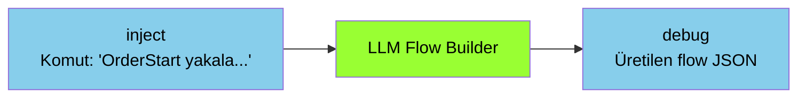

# LLM Flow Builder

<div class="node-header">
  <span class="node-preview green-bright">LLM Flow Builder</span>
  <div class="meta-item"><strong>Inputs:</strong> <span class="io-badge in">1</span></div>
  <div class="meta-item"><strong>Outputs:</strong> <span class="io-badge out">1</span></div>
  <div class="meta-item"><strong>Kategori:</strong> trexMes service</div>
</div>

**Yapay zekâ ile Node-RED akışı üreten** asistan node. Bir LLM (Large Language Model) sağlayıcısına doğal dilde komut göndererek otomatik akış JSON'u üretir; isterseniz akışı otomatik olarak import ve deploy edebilir.

!!! info "Diğer node'lardan farkı"
    Bu node trexMes operasyonu üretmez — Node-RED ortamında **geliştirici asistanı** olarak çalışır. Akış JSON'ı üreterek geliştirici verimliliğini artırır.

## Property Tablosu

### Ana Node (`llm-flow-builder`)

| Alan | Tip | Varsayılan | Açıklama |
|---|---|---|---|
| `name` | string | — | Canvas üzerinde gösterilecek ad |
| `llmConfig` | config node | _(boş)_ | LLM bağlantı yapılandırması |
| `autoImport` | boolean | `false` | Üretilen akışı otomatik import et |
| `autoDeploy` | boolean | `false` | Import sonrası otomatik deploy et |
| `flowTab` | string | _(boş)_ | Akışın import edileceği sekme adı |

### Config Node (`llm-flow-builder-config`)

| Alan | Tip | Açıklama |
|---|---|---|
| `name` | string | Config takma adı |
| `provider` | enum | LLM sağlayıcısı |
| `apiUrl` | string | API endpoint |
| `modelName` | string | Model adı |
| `apiKey` | password (credential) | API anahtarı |

## Desteklenen LLM Sağlayıcıları

Config node, **6 popüler sağlayıcı için preset** sunar:

| Provider | API URL | Varsayılan Model |
|---|---|---|
| **OpenAI** | `https://api.openai.com/v1/chat/completions` | `gpt-4o` |
| **Anthropic** | `https://api.anthropic.com/v1/messages` | `claude-sonnet-4-20250514` |
| **Google Gemini** | `https://generativelanguage.googleapis.com/v1beta/...` | `gemini-2.0-flash` |
| **DeepSeek** | `https://api.deepseek.com/v1/chat/completions` | `deepseek-chat` |
| **Mistral** | `https://api.mistral.ai/v1/chat/completions` | `mistral-large-latest` |
| **Groq** | `https://api.groq.com/openai/v1/chat/completions` | `llama-3.3-70b-versatile` |
| **Custom** | _(manuel)_ | _(manuel)_ |

## Sistem Prompt

Node, sistem promptunu her zaman **paket klasöründeki `systemprompt.txt` dosyasından** otomatik olarak okur. Editörden değiştirilemez; dosyayı doğrudan düzenleyin. Dosya her mesajda yeniden okunduğundan Node-RED yeniden başlatılmadan güncellenebilir.

`systemprompt.txt` LLM'e şunları öğretir:

- Node-RED akış JSON formatını ve zorunlu kuralları
- `node-red-trexmes-service` paketindeki tüm node tiplerini ve property'lerini
- **Business, Communication, Display ve System Events node'larının tüm event adlarını ve Türkçe açıklamalarını**
- Tipik akış desenlerini (observe, form, button handling, conditional handle) örneklerle

### Event Seçimi

LLM, verilen prompta göre açıklamaları okuyarak en uygun event'i otomatik seçer. Örneğin:

| Prompt | Seçilen Event | Node Tipi |
|---|---|---|
| `"Barkod okununca akış başlasın"` | `OnBarcodeScanned` | Communication Events |
| `"Plan yüklendiğinde form aç"` | `OnPlanLoaded` | Business Events |
| `"Uygulama açılışında karşılama göster"` | `OnApplicationStarted` | System Events |
| `"Operatör iş yükle butonuna bastığında..."` | `OnOperatorPlanLoadButtonClicking` | Display Events |
| `"Duruş başladığında bildir"` | `OnStoppageStarted` | Business Events |

!!! tip "Açıklayıcı prompt yazın"
    Senaryo ne kadar açık anlatılırsa LLM event seçimi o kadar isabetli olur. "Üretim onaylandığında" gibi ifadeler `OnProductionConfirmed` ile eşleşir; "sayaç arttığında" ise `OnProductionCounterIncreased` ile.

## Tipik Akış



### Komut Örnekleri

| Komut | Seçilen Event | Üretilen Akış |
|---|---|---|
| `"Plan yüklenince form aç"` | `OnPlanLoaded` (Business) | trex Subscriber + Business Events + Custom Form + Responser |
| `"Barkod okunduğunda sipariş bilgisini göster"` | `OnBarcodeScanned` (Communication) | trex Subscriber + Communication Events + Custom Form + Form Bind Controls + Responser |
| `"Uygulama açılışında karşılama ekranı göster"` | `OnApplicationStarted` (System) | trex Subscriber + System Events + Custom Form + Responser |
| `"Operatör iş yükle butonuna bastığında alternatif akış çalıştır"` | `OnOperatorPlanLoadButtonClicking` (Display) | trex Subscriber + Display Events(ishandled=true) + Handle Setter + Responser |
| `"Duruş başladığında debug'a yaz"` | `OnStoppageStarted` (Business) | trex Subscriber + Business Events + debug + Responser |

## Otomatik Import ve Deploy

Üç olası mod vardır:

| `autoImport` | `autoDeploy` | Davranış |
|---|---|---|
| `false` | _herhangi_ | Sadece üretir, debug çıkışı verir |
| `true` | `false` | Yeni sekmeye ekler ama deploy etmez |
| `true` | `true` | Sekmeye ekler **ve** deploy eder |

!!! warning "Otomatik deploy'a dikkat"
    `autoDeploy: true` ayarı **çalışan Node-RED'i değiştirir**. Üretim ortamında **kapalı tutun**; sadece geliştirme ortamında kullanın.

## Giriş Mesajı

`msg.payload` alanında **doğal dilde komut** beklenir:

```json
{
  "payload": "Bana her PLC bağlantı kopması olayında uyarı veren bir akış oluştur."
}
```

## Çıkış Mesajı

Üretilen akış JSON'u:

```json
{
  "_msgid": "abc123",
  "payload": {
    "flow": [
      {
        "id": "node1",
        "type": "trex Subscriber",
        "name": ""
      },
      {
        "id": "node2",
        "type": "Communication Events",
        "event": "/PLCConnectionLost",
        "ishandled": false
      }
      // ...
    ],
    "imported": true,
    "deployed": false,
    "tabName": "AI_Generated"
  }
}
```

## API İzinleri ve Maliyet

!!! info "API anahtarı"
    Her LLM sağlayıcısı için kendi geliştirici hesabınızdan API anahtarı edinmeniz gerekir. Anahtar `credentials` olarak password tipinde saklanır; flow JSON export'ta görünmez.

!!! warning "Maliyet farkındalığı"
    LLM çağrıları **ücretlidir**. Her flow üretimi ~1000-3000 token tüketebilir. Sürekli test yaparken hızlı maliyet birikebilir.

## Sık Karşılaşılan Hatalar

!!! failure "401 / 403"
    API anahtarı yanlış veya geçersiz. Anahtarın panel/proje yetkisi olduğundan emin olun.

!!! failure "Model adı bulunamadı"
    Seçtiğiniz model sağlayıcının kataloğunda yoksa (örn. eski/yeni isim) hata gelir. Sağlayıcının dokümantasyonundan güncel model adlarını teyit edin.

!!! failure "Geçersiz JSON"
    LLM bazen markdown code-fence (` ``` `) ile cevap döndürebilir. Node iç ayrıştırıcı bunu temizler; yine de hata alıyorsanız `systemPrompt`'unuza **"sadece valid JSON döndür"** ekleyin.

!!! failure "Token limit aşıldı"
    Sistem prompt çok uzunsa (özellikle paket genişledikçe) bazı modellerin limitini aşabilirsiniz. Daha büyük context destekleyen bir modele geçin.

## İpuçları

!!! tip "Önce manuel deneyin"
    Tipik akış desenlerini önce manuel kurun, çalıştığından emin olun. Sonra aynısı için LLM'e komut verirseniz daha tutarlı sonuç alırsınız.

!!! tip "Daha iyi sonuçlar için detay"
    "Sipariş yakala" yerine "Business Events node'u ile `OrderStartEvent` yakala, gelen orderNo ile Custom Form aç, txt** kontrolleri bağla, Responser ile bitir" gibi açık komutlar üretim kalitesini artırır.

!!! tip "Özel sistem prompt"
    Şirketinize/projenize özel kurallar (isimlendirme standartları, kullanılması yasak node tipleri) varsa `systemprompt.txt` dosyasının sonuna ekleyin. Dosya her çağrıda okunduğundan değişiklik anında geçerli olur.

## İlgili

- [Node Referansı](index.md)
- [Mimari Genel Bakış](../baslangic/mimari.md)
- [Custom Form](custom-form.md)
