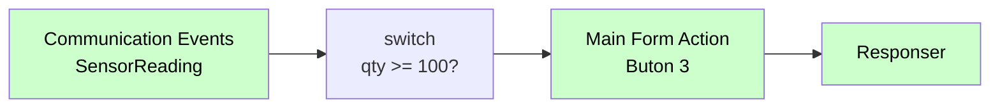

# Main Form Action

<div class="node-header">
  <span class="node-preview green-light">Main Form Action</span>
  <div class="meta-item"><strong>Inputs:</strong> <span class="io-badge in">1</span></div>
  <div class="meta-item"><strong>Outputs:</strong> <span class="io-badge out">1</span></div>
  <div class="meta-item"><strong>Kategori:</strong> trexMes service</div>
</div>

trexMes ana form (Main Form) üzerindeki butonların **tetikleme aksiyonunu** doğrudan programatik olarak çalıştırır. Manuel tıklama yerine akıştan tetikleme yapmanızı sağlar.

## Özet

Bu node, panel kullanıcısının "Manuel olarak butona basmış" gibi davranmasını sağlar. Otomatik iş akışı senaryolarında çok kullanışlıdır:

> "Üretim biten her parçada Main Form'daki 'Sayaç Sıfırla' butonunu otomatik tetikle."

## Buton İndeksleri

Buton ID'leri **1-based** olarak girilir. İndeksleri görsel olarak görmek için:

{ width="800" }

## Property Tablosu

| Alan | Tip | Varsayılan | Açıklama |
|---|---|---|---|
| `name` | string | — | Canvas üzerinde gösterilecek ad |
| `buttonindex` | string | _(boş)_ | Tetiklenecek buton numarası (1-based) |

## Çıkış Mesajı

```json
{
  "operationtype": "TriggerMain",
  "receiveddata": { /* event data */ },
  "name": "3"
}
```

`name` alanı tetiklenecek butonun indeksini taşır.

## Tipik Akış



## Örnek Senaryo

**Otomatik Üretim Sayacı Sıfırlama:**

1. Sensör 100 parça sayacı sinyali gönderir → `Communication Events`
2. Akış, Main Form'daki "Sayaç Sıfırla" butonunun (örn. indeks 7) aksiyonunu tetikler.
3. Panel sanki operatör tıklamış gibi davranır, sayaç sıfırlanır.

## Önemli Notlar

!!! info "Sadece Main Form için"
    Bu node yalnızca **ana form (Main Form / AppForm)** üzerindeki butonları tetikler. Custom dialog veya operasyon formları için kullanılamaz; onlar için [Method Invoker](method-invoker.md) tercih edin.

!!! warning "İndeks doğrulaması"
    Geçersiz bir buton indeksi (`0`, `99`, negatif) gönderirseniz panel sessizce yutar. Hata mesajı dönmez; akış normal akar.

## Sık Karşılaşılan Hatalar

!!! failure "Buton tetiklenmiyor"
    - `buttonindex` 1-based girildi mi? (`0` değil `1`)
    - Buton görünür durumda mı? Görünmeyen butonun tetiklenmesi panel'in default davranışına bağlıdır.
    - O buton **disabled** mı?

## İpuçları

!!! tip "Çok adımlı işlemler"
    Birden fazla butonun sırayla tetiklenmesi gerekiyorsa, akışta peş peşe `Main Form Action` node'ları koyabilirsiniz. Her biri kendi operasyonunu `msg.payload` array'ine ekler ve panel hepsini sırayla işler.

!!! tip "Konfigürasyon ile birlikte"
    Yeni bir Main Form yüklendikten sonra butonları tetiklemeden önce mutlaka `Button Configurator` ile yapılandırın. Görünmeyen/disabled butonların tetiklenmesi anlamsız olur.

## İlgili

- [Button Configurator](button-configurator.md) — Butonları yapılandır
- [Form Events](form-events.md) — Buton tıklama yakalama
- [Method Invoker](method-invoker.md) — Method çağırma alternatifi
