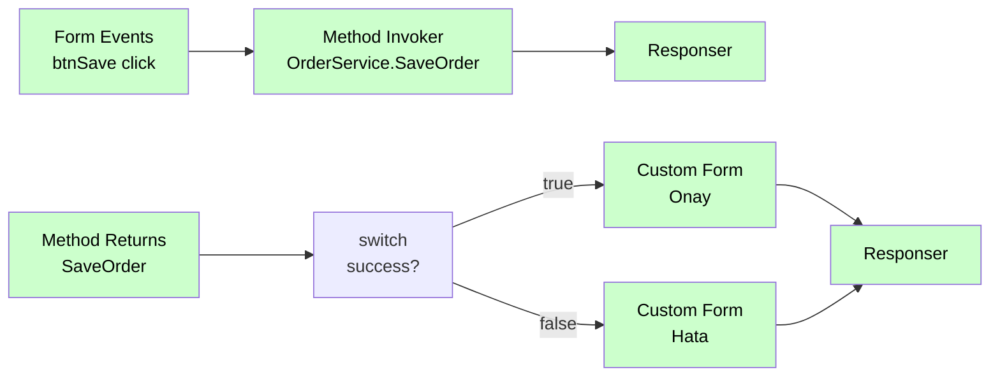
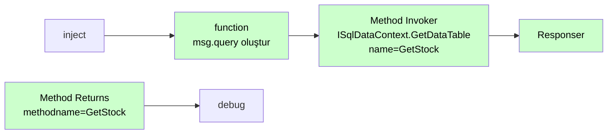

# Method Invoker

<div class="node-header">
  <span class="node-preview green-light">Method Invoker</span>
  <div class="meta-item"><strong>Inputs:</strong> <span class="io-badge in">1</span></div>
  <div class="meta-item"><strong>Outputs:</strong> <span class="io-badge out">1</span></div>
  <div class="meta-item"><strong>Kategori:</strong> trexMes service</div>
</div>

trexMes panel tarafında tanımlı **bir method'u çağırır**. Parametre değerlerini dinamik olarak (msg/flow/global/jsonata) hesaplayıp panele gönderir.

## Property Tablosu

| Alan | Tip | Varsayılan | Açıklama |
|---|---|---|---|
| `name` | string | — | Canvas üzerinde gösterilecek ad |
| `service` | string | _(boş)_ | Servis adı (örn. `OrderService`) |
| `method` | string | _(boş)_ | Method adı (örn. `SaveOrder`) |
| `props` | array | `[]` | Parametre listesi |
| `data` | string | _(boş)_ | _(legacy)_ Veri kaynak yolu |
| `dataType` | string | — | _(legacy)_ Veri kaynak tipi |

## `props` Yapısı

Her satır bir method parametresi:

| Anahtar | Açıklama | Örnek |
|---|---|---|
| `p` | Parametre adı (`ParameterName`) | `orderNo` |
| `v` | _(unused)_ | — |
| `d` | Değer veya path | `payload.orderNo` |
| `dt` | Değer kaynağı (dataType) | `msg`, `flow`, `global`, vs. |

```json
[
  { "p": "orderNo",    "d": "payload.orderNo", "dt": "msg" },
  { "p": "quantity",   "d": "50",              "dt": "num" },
  { "p": "operatorId", "d": "currentUser",     "dt": "flow" }
]
```

## Çıkış Mesajı

```json
{
  "operationtype": "MethodInvokerProcess",
  "receiveddata": { /* event data */ },
  "name": "SaveOrder",
  "message": "OrderService.SaveOrder",
  "value": [
    { "ParameterName": "orderNo",    "Value": "ORD-001" },
    { "ParameterName": "quantity",   "Value": 50 },
    { "ParameterName": "operatorId", "Value": "OP-007" }
  ]
}
```

`message` alanı `service.method` formatında otomatik oluşturulur.

## `dataType` Çeşitleri

| `dataType` | Anlam | Örnek `d` |
|---|---|---|
| `msg` | Mesaj nesnesinden | `payload.orderNo` |
| `flow` | Flow context | `currentOrder` |
| `global` | Global context | `defaultMachine` |
| `num` | Sabit sayı | `42` |
| `json` | Sabit JSON | `{"prio":1}` |
| `bool` | Sabit boolean | `true` |
| `jsonata` | JSONata ifadesi | `payload.items[type='A'].id` |
| _diğer_ | Sabit string | `"ACME"` |

[Detay →](../baslangic/mesaj-yapisi.md#datatype-cozumleme)

## Tipik Akış (Asenkron Method Çağrısı)



!!! info "İki ayrı akış"
    Method çağrısı **asenkron**'dur. İlk akış `Method Invoker` ile çağrıyı yapar ve `Responser` ile kapanır. Method cevabı geldiğinde **ayrı bir akış** `Method Returns` ile tetiklenir.

## Asenkron İşlem Modeli

`Control Properties` ile aynı asenkron pattern'i kullanır:

```javascript
let tasks = node.props.map((item) => {
    return new Promise((resolve, reject) => {
        switch (item.dt) {
            case 'msg':    /* ... */; break;
            case 'flow':   /* ... */; break;
            case 'jsonata':
                // Async JSONata
                RED.util.evaluateJSONataExpression(expr, msg, (err, result) => {
                    err ? reject(err) : resolve({
                        ParameterName: item.p,
                        Value: result
                    });
                });
                return;
            // ...
        }
        resolve({ ParameterName: item.p, Value: computedValue });
    });
});

Promise.all(tasks).then((params) => {
    msg.payload.push({
        operationtype: "MethodInvokerProcess",
        name: node.name,
        message: node.service + "." + node.method,
        value: params
    });
    node.send(msg);
});
```

## SQL Sorgusu Çalıştırma

trexEdge uygulamasının bağlı olduğu MSSQL veritabanında SQL çalıştırmak ve sonuçları almak için `ISqlDataContext` servisi kullanılır.

### Yapılandırma

| Alan | Değer |
|---|---|
| **Name** | Sorguyu tanımlayan benzersiz ad (örn. `GetStock`) |
| **Service** | `ISqlDataContext` |
| **Method** | `GetDataTable` |
| **Parametre Key** | `query` |
| **Parametre Value** | `msg.query` (dataType: `msg`) |

### Akış Yapısı



### Function Node — SQL Sorgusu Oluşturma

Method Invoker'dan önce bir `function` node ekleyerek `msg.query`'yi oluşturun. Template literal (`\`...\``) ile akış değişkenlerini SQL'e geçirebilirsiniz:

```javascript
// Sabit sorgu
msg.query = `SELECT TOP 10 * FROM STOCK`;

// Değişken ile — örneğin event'ten gelen stok kodu
const stockCode = msg.payload.StockCode;
msg.query = `SELECT * FROM STOCK WHERE STOK_KODU = '${stockCode}'`;

// Parametreli — birden fazla koşul
const workStationId = msg.payload.WorkStationId;
const limit = 50;
msg.query = `
    SELECT TOP ${limit} s.STOK_KODU, s.STOK_ADI, s.MIKTAR
    FROM STOCK s
    WHERE s.IS_ISTASYONU_ID = ${workStationId}
    ORDER BY s.STOK_ADI
`;

return msg;
```

!!! warning "SQL Injection"
    Dışarıdan (kullanıcı girişi) gelen değerleri doğrudan template literal ile SQL'e geçirmeyin. Değeri önce doğrulayın veya `parseInt()` / `encodeURIComponent()` ile temizleyin.

### Method Returns ile Sonuç Alma

`Method Returns` node'unu ayrı bir akış olarak ekleyin:

- **methodname**: `GetStock` (Method Invoker'daki `name` ile aynı)

Sonuç `msg.payload` içinde JSON array olarak gelir:

```json
[
  { "STOK_KODU": "MAL-001", "STOK_ADI": "Çelik Mil", "MIKTAR": 120.5 },
  { "STOK_KODU": "MAL-002", "STOK_ADI": "Plastik Kapak", "MIKTAR": 340.0 }
]
```

### Tam Örnek

**Akış 1 — Çağrı:**

| Node | Tip | Ayar |
|---|---|---|
| inject | inject | — |
| SQL hazırla | function | `msg.query = \`SELECT TOP 10 * FROM STOCK\`; return msg;` |
| GetStock | Method Invoker | service=`ISqlDataContext`, method=`GetDataTable`, props: `query` → `msg.query` |
| — | Responser | — |

**Akış 2 — Sonuç:**

| Node | Tip | Ayar |
|---|---|---|
| — | Method Returns | methodname=`GetStock` |
| — | debug | `msg.payload` |

## Önemli Notlar

!!! info "Method ismi formatı"
    `service.method` formatı **panel tarafında tanımlı method ismi ile birebir** eşleşmelidir. Servis adı yoksa boş bırakın; `message` alanı `.method` olarak gider — bu durumun **panel beklentisine** uyduğundan emin olun.

!!! warning "Parametre tip uyumsuzluğu"
    `dataType: num` seçtiyseniz değer `Number()` ile dönüştürülür. `"abc"` gönderirseniz `NaN` olur ve panel hata verir.

## Sık Karşılaşılan Hatalar

!!! failure "Method not found"
    Panel tarafındaki method ismi yazımı doğru mu? Büyük/küçük harf duyarlı olabilir.

!!! failure "Parametre tip hatası"
    Panel'in beklediği parametre tipiyle gönderdiğiniz `dataType` uyuşmuyor olabilir. Örn. panel `int` bekliyor, siz `str` gönderiyorsunuz.

!!! failure "Cevap gelmiyor"
    `Method Returns` node'u ekledi mi? `methodname` alanı `Method Invoker`'daki `method` ile aynı mı?

## İpuçları

!!! tip "Servis adı boşsa"
    `service` alanını boş bırakırsanız `message: ".SaveOrder"` şeklinde olur. Daha güzel görünmesi için tek bir kelime de yazabilirsiniz (`Order`).

!!! tip "Method timeout"
    Uzun süren işlemleri (rapor üretme, toplu güncelleme) method çağrısı ile başlatın. Cevabı `Method Returns`'ten alın. Bu sayede ilk HTTP request **bloklamaz**.

## İlgili

- [Method Returns](method-returns.md) — Method cevabını yakala (Context Getter cevapları da buradan alınır)
- [Context Getter](context-getter.md) — StateContext sorgusu için alternatif node
- [Display Methods](display-methods.md) — Panel'in method çağrısını yakala
- [Execute Process](execute-process.md) — Process tetikleme alternatifi
