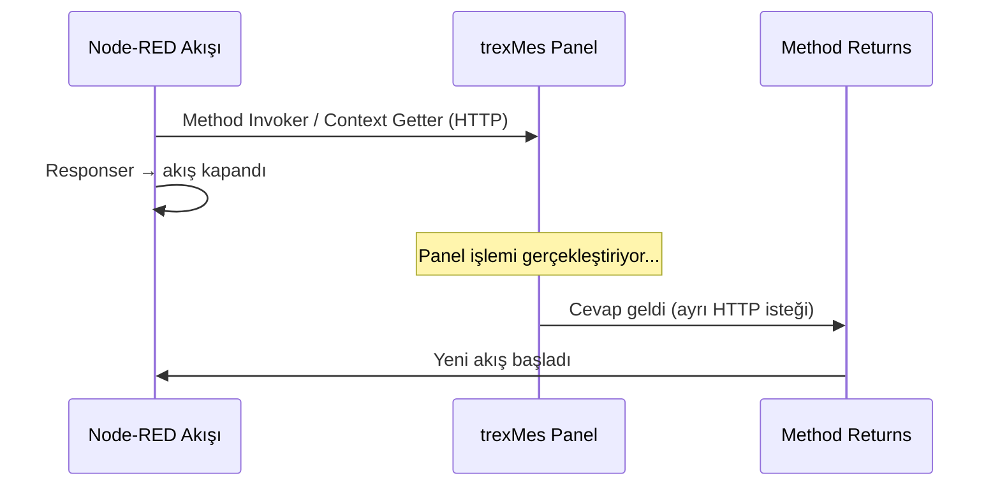
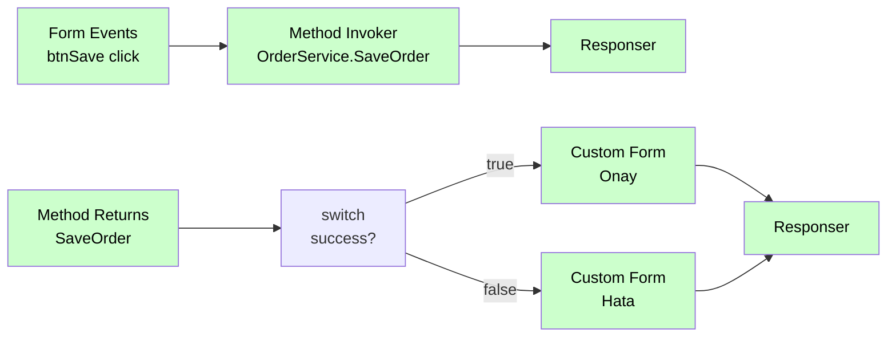
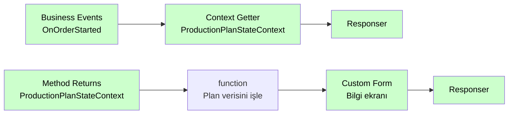

# Method Returns

<div class="node-header">
  <span class="node-preview green-light">Method Returns</span>
  <div class="meta-item"><strong>Inputs:</strong> <span class="io-badge in">0</span></div>
  <div class="meta-item"><strong>Outputs:</strong> <span class="io-badge out">1</span></div>
  <div class="meta-item"><strong>Kategori:</strong> trexMes service</div>
</div>

**Method Invoker** veya **Context Getter** ile başlatılan asenkron bir işlemin **dönüş verisini** yakalar. Panel tarafı işlemi tamamlayıp cevap gönderdiğinde bu node tetiklenir.

## Property Tablosu

| Alan | Tip | Varsayılan | Açıklama |
|---|---|---|---|
| `name` | string | — | Canvas üzerinde gösterilecek ad |
| `methodname` | string | _(boş)_ | Cevabını dinlemek istediğiniz **Method Invoker** veya **Context Getter** node'unun **adı** |

!!! note "methodname = node adı"
    `methodname` alanındaki açılır listede akıştaki tüm **Method Invoker** ve **Context Getter** node'larının adları listelenir. Seçilen ad, kaynak node'un `name` alanıyla **birebir** eşleşmelidir.

## Hangi Node'lardan Cevap Alır?

| Kaynak Node | Cevap Tipi | Açıklama |
|---|---|---|
| **Method Invoker** | Method return değeri | Panel servisindeki method'un döndürdüğü veri |
| **Context Getter** | StateContext snapshot | Sorgulanan istasyona ait context property değerleri |

## Asenkron Çalışma Modeli

Method Invoker veya Context Getter çağrısı **iki ayrı akış** oluşturur:



!!! info "Neden iki akış?"
    İlk akış çağrıyı yapar ve `Responser` ile kapanır. Panel asenkron olarak işlemi tamamladıktan sonra Node-RED'e geri döner; bu noktada `Method Returns` **yeni bir akış** başlatır. Uzun süren işlemler bu sayede HTTP timeout'a düşmeden çalışır.

## Tipik Kullanım — Method Invoker ile



## Tipik Kullanım — Context Getter ile



!!! warning "Node adı eşleşmesi"
    `Method Returns` node'undaki **methodname** seçimi, kaynak node'un `name` alanı ile birebir eşleşmelidir.

    - Method Invoker adı `"SaveOrder"` ise → `methodname = SaveOrder`
    - Context Getter adı `"ProductionPlanStateContext"` ise → `methodname = ProductionPlanStateContext`

## Çıkış Mesajı

Method Returns her zaman dönüş verisini **`msg.payload.Result.Result`** yolunda taşır.

```javascript
const result = msg.payload.Result.Result;
```

İçerik kaynağa göre değişir:

=== "Method Invoker Cevabı"

    ```json
    {
      "payload": {
        "Result": {
          "Result": {
            "success": true,
            "orderId": 4521
          }
        }
      }
    }
    ```

    ```javascript
    const result = msg.payload.Result.Result;
    // result.success, result.orderId vb.
    ```

=== "SQL Sorgu Cevabı (ISqlDataContext)"

    `ISqlDataContext.GetDataTable` sonucu `msg.payload.Result.Result` **JSON array** olarak gelir:

    ```json
    {
      "payload": {
        "Result": {
          "Result": [
            { "STOK_KODU": "MAL-001", "STOK_ADI": "Çelik Mil",     "MIKTAR": 120.5 },
            { "STOK_KODU": "MAL-002", "STOK_ADI": "Plastik Kapak", "MIKTAR": 340.0 }
          ]
        }
      }
    }
    ```

    ```javascript
    const rows = msg.payload.Result.Result;
    rows.forEach(row => {
        node.log(`${row.STOK_KODU} — ${row.STOK_ADI}: ${row.MIKTAR}`);
    });
    return msg;
    ```

=== "Context Getter Cevabı"

    ```json
    {
      "payload": {
        "Result": {
          "Result": {
            "PlanId": 1042,
            "PlanQuantity": 500.0,
            "PlanTotalProductionQuantity": 312.0,
            "LeftAmountForPlanCompletion": 188.0,
            "PlanWorkStartDate": "2026-05-19T08:00:00Z",
            "PlanNote": "Öncelikli sipariş"
          }
        }
      }
    }
    ```

    ```javascript
    const ctx = msg.payload.Result.Result;
    // ctx.PlanId, ctx.PlanQuantity vb.
    ```

## Örnek Senaryo — Context Getter ile Üretim Verisi Okuma

1. `Business Events` — `OnShiftStarted` tetiklenir.
2. `Context Getter` — `AnalysisStateContext` sorgusu yapılır, `WorkStationId = 5`.
3. `Responser` — ilk akış kapanır.
4. Panel context verisini hazırlar ve Node-RED'e gönderir.
5. `Method Returns` (adı: `AnalysisStateContext`) tetiklenir.
6. `function` node — `msg.payload.Result.Result.ShiftOeePercent` okunur.
7. `Custom Form` — OEE değeri ekranda gösterilir.

## Sık Karşılaşılan Hatalar

!!! failure "Method Returns hiç tetiklenmiyor"
    - Kaynak node adı ile `methodname` eşleşiyor mu?
    - `Method Invoker` / `Context Getter` node'u akışta deploy edildi mi?
    - Panel tarafında ilgili servis/context aktif mi?

!!! failure "Yanlış veri geliyor"
    Akışta birden fazla `Method Invoker` veya `Context Getter` varsa her birinin `name` alanının **benzersiz** olduğundan emin olun.

## İlgili

- [Method Invoker](method-invoker.md) — Servis method'u çağıran node
- [Context Getter](context-getter.md) — StateContext sorgulayan node
- [Display Methods](display-methods.md) — Panel'in method tetiklemelerini yakala
