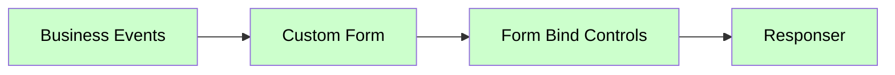

# Responser

<div class="node-header">
  <span class="node-preview green-light">Responser</span>
  <div class="meta-item"><strong>Inputs:</strong> <span class="io-badge in">1</span></div>
  <div class="meta-item"><strong>Outputs:</strong> <span class="io-badge out">0</span></div>
  <div class="meta-item"><strong>Kategori:</strong> trexMes service</div>
</div>

Olay tabanlı akışların **kapatıcısıdır**. trexMes panele HTTP cevabını döndürür. Her event akışının sonunda **mutlaka** bulunmalıdır (bazı node'lar bunu otomatik yönetir).

## Özet

!!! info "Akış sonlandırıcı"
    `Business Events`, `System Events` gibi olay node'larıyla başlayan akışlar mutlaka bir `Responser` ile sonlanmalıdır. Aksi takdirde panel cevap bekler, akış asılı kalır ve **timeout** hatası alırsınız.

## Ne Zaman Kullanılır?

- Her olay (event) tabanlı akışın sonunda
- Custom form / control / method invocation operasyonlarından sonra cevap döndürmek için

## Hangi Akışlarda Gerekli DEĞİLDİR?

- **`trex Subscriber`** kendi cevabını yönetir — sonuna `Responser` koymayın.
- **`Method Returns`** asenkron bir akış başlatır — gerekli olmayabilir.

## Property Tablosu

| Alan | Tip | Varsayılan | Açıklama |
|---|---|---|---|
| `name` | string | — | Node-RED canvas üzerinde gösterilecek ad |
| `statusCode` | string | _(boş)_ | HTTP cevap kodunu zorla ayarlamak için (örn. `200`, `400`) |
| `headers` | object | `{}` | HTTP cevap header'ları |

## Davranış

`Responser` aldığı `msg`'i analiz eder ve panele şu şekilde cevap döner:

```javascript
// Statü kodu belirleme (öncelik sırası)
statusCode = node.statusCode || msg.statusCode || 200;

// Payload tip kontrolü
if (typeof msg.payload === "object" && !Buffer.isBuffer(msg.payload)) {
    msg.res._res.status(statusCode).jsonp(msg.payload);
} else {
    msg.res._res.status(statusCode).send(msg.payload);
}
```

### Cookie ve Header Yönetimi

`msg.headers` ve `msg.cookies` set edilmişse otomatik olarak HTTP cevabına eklenir:

```javascript
// Akış içinde
msg.headers = { "x-custom": "value" };
msg.cookies = { sessionId: "abc123" };
```

## Tipik Akış



## Çıkış Yok

`Responser` `outputs: 0` olduğu için sonrasına başka node bağlayamazsınız. Akış burada sona erer.

## Sık Karşılaşılan Hatalar

!!! failure "Panel cevap beklemede asılı kalıyor"
    Akışta `Responser` eksik. Olay node'undan başlayan akışın sonuna bir `Responser` eklenmelidir. Birden fazla dal tek bir `Responser`'a bağlanabilir.

!!! failure "Cevap iki kere dönüyor uyarısı"
    Aynı `msg.res` üzerinden iki kere cevap döndürülmeye çalışıldığında ortaya çıkar. Birden fazla `Responser` aynı dalda peş peşe gelmemelidir.

!!! failure "Hata: msg.res is undefined"
    Bu node'a `msg.res` taşımayan bir akıştan geliyorsanız (örn. `inject` ile manuel başlatılan flow) cevap dönecek bir HTTP isteği yoktur. Sadece gerçek olay akışlarında çalışır.

## İpuçları

!!! tip "Hata cevabı dönmek istiyorum"
    Akışın bir noktasında hata oluştu ve panele `400` veya `500` döndürmek istiyorsanız:

    ```javascript
    // Function node içinde
    msg.statusCode = 400;
    msg.payload = { error: "Invalid order number" };
    return msg;
    ```

    Sonra `Responser` bunu otomatik kullanır.

!!! tip "JSON yerine düz metin"
    `msg.payload` bir **string** ise düz metin gönderilir. `object` ise JSON olarak gönderilir.

## İlgili Nodlar

- [trex Subscriber](trex-subscriber.md) — Kendi cevabını yönetir
- [Olay Nodları](event-subscribers.md) — Tüm olay node'ları `Responser` ile sonlandırılır
