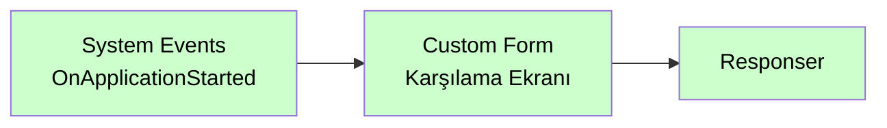

# System Events

<div class="node-header">
  <span class="node-preview green-light">System Events</span>
  <div class="meta-item"><strong>Inputs:</strong> <span class="io-badge in">0</span></div>
  <div class="meta-item"><strong>Outputs:</strong> <span class="io-badge out">1</span></div>
  <div class="meta-item"><strong>Kategori:</strong> trexMes service</div>
</div>

trexMes panelindeki **sistem seviyesi olaylarına** abone olur. Panel açılması, kapanması ve periyodik işlemler gibi sistem tetiklemelerini yakalar.

## Property Tablosu

| Alan | Tip | Varsayılan | Açıklama |
|---|---|---|---|
| `name` | string | — | Canvas üzerinde gösterilecek ad |
| `event` | string | _(boş)_ | Abone olunacak sistem olayı |
| `ishandled` | boolean | `false` | Node-RED bu olayı handle ediyor mu? |

## Olay Listesi

| Olay | Açıklama |
|---|---|
| `OnApplicationClosing` | Uygulama kapanma aşamasında ana form kapatılmadan hemen önce tetiklenir. |
| `OnApplicationStarted` | Uygulama ayağa kalktığında ana ekran gösteriminden hemen önce tetiklenir. |
| `OnGlobalTimerTicked` | Arka planda gerçekleşen periyodik işlemler için kullanılan Timer Tick olayında tetiklenir. Benzer periyodik işlemler için kullanılabilir. |

## `msg.payload` Yapısı

System Events, payload'u **4 item** içeren bir nesne olarak gönderir:

| Alan | Model | Açıklama |
|---|---|---|
| `Item1` | `WorkStationStatusEntryModel` | İstasyonun anlık üretim durumu |
| `Item2` | `ProductionPlanDetailModel` | Aktif üretim planı detayı (stok, iş emri, operasyon) |
| `Item3` | `EmployeeInfo[]` | Aktif operatör listesi |
| `Item4` | `StoppageStateContext` | Duruş yönetim durumu ve aktif duruş bilgisi |

```json
{
  "Item1": {
    "WorkStationId": 0,
    "IsPlanLoaded": false,
    "IsStopped": false,
    "ProductionQuantity": 0.0,
    "ShiftId": 0,
    "ClientVersion": "",
    "...": "..."
  },
  "Item2": {
    "PlanId": 0,
    "Stock": { "StockId": 0, "StockNo": "", "StockName": "" },
    "Operation": { "OperationId": 0, "OperationName": "" },
    "PlannedQuantity": 0.0,
    "...": "..."
  },
  "Item3": [
    { "EmployeeId": 0, "EmployeeNo": "", "EmployeeName": "" }
  ],
  "Item4": {
    "CurrentStoppage": { "StoppageCauseId": 0, "StoppageCauseName": "" },
    "CurrentStoppageDuration": 0,
    "IsPlannedStoppage": false,
    "...": "..."
  }
}
```

!!! info "Editörde önizleme"
    Event seçildiğinde editör içinde tam `msg.payload` yapısı **collapse edilebilir JSON ağacı** olarak görüntülenir.

## Argüman Referansı

System Events'e özgü EventArgs modelleri yalnızca `WorkStationId` içerir; asıl veri `Item1–Item4` aracılığıyla taşınır.

| Event | EventArgs modeli | Not |
|---|---|---|
| `OnApplicationClosing` | `ApplicationClosingEventArgs` | EventArgs alanı yoktur — veri Item1–Item4 ile gelir |
| `OnApplicationStarted` | `ApplicationStartedEventArgs` | EventArgs alanı yoktur — veri Item1–Item4 ile gelir |
| `OnGlobalTimerTicked` | `GlobalTimerEventArgs` | `IsHandled` alanı bulunur |

## Örnek Kullanım



## İpuçları

!!! tip "Başlangıç konfigürasyonu"
    `OnApplicationStarted` ile panel ayağa kalktığında varsayılan form yükleyebilir, bağlantıları kontrol edebilir veya ilk verileri çekebilirsiniz.

!!! tip "Periyodik görevler"
    `OnGlobalTimerTicked` saniye bazında tetiklenir. Bu event ile InfluxDB'ye OEE verisi yazmak, Modbus poll yapmak gibi periyodik işlemler gerçekleştirebilirsiniz. `IsHandled` özelliği yoktur, akışı kesmez.

!!! tip "Kapanma öncesi işlemler"
    `OnApplicationClosing` ile panel kapanmadan önce açık bağlantıları kapatabilir, son durumu kaydedebilirsiniz.

## İlgili

- [Olay Nodları Genel Bakış](event-subscribers.md)
- [Custom Form](custom-form.md)
- [Handle Setter](handle-setter.md)
