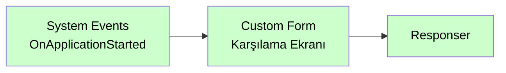

# System Events

<div class="node-header">
  <span class="node-preview green-light">System Events</span>
  <div class="meta-item"><strong>Inputs:</strong> <span class="io-badge in">0</span></div>
  <div class="meta-item"><strong>Outputs:</strong> <span class="io-badge out">1</span></div>
  <div class="meta-item"><strong>Kategori:</strong> trexMes service</div>
</div>

trexMes panelindeki **sistem seviyesi olaylarına** abone olur. Panel açılması, kapanması, kilitleme, kullanıcı girişi gibi sistemsel tetiklemeleri yakalar.

## Property Tablosu

| Alan | Tip | Varsayılan | Açıklama |
|---|---|---|---|
| `name` | string | — | Canvas üzerinde gösterilecek ad |
| `method` | string | `get` | HTTP method (otomatik) |
| `event` | string | _(boş)_ | Panel'in tetikleyeceği HTTP path |
| `ishandled` | boolean | `false` | Node-RED handle ediyor mu? |

## Olay Listesi

`Event` alanı combobox ile seçilir. Mevcut seçenekler:

| Olay | Açıklama |
|---|---|
| `OnApplicationClosing` | Uygulama kapanma aşamasında ana form kapatılmadan hemen önce tetiklenir. |
| `OnApplicationStarted` | Uygulama ayağa kalktığında ana ekran gösteriminden hemen önce tetiklenir. |
| `OnGlobalTimerTicked` | Arka planda gerçekleşen periyodik işlemler için kullanılan Timer Tick olayında tetiklenir. Benzer periyodik işlemler için kullanılabilir. |

## Örnek Kullanım



## Giriş Mesajı

```json
{
  "_msgid": "abc123",
  "payload": {
    "userId": "USR-007",
    "userName": "Ahmet Yılmaz",
    "loginTime": "2026-05-11T08:30:00Z",
    "panelId": "PNL-A-15"
  }
}
```

## İpuçları

!!! tip "Audit logging"
    `UserLoginEvent` ve `UserLogoutEvent` olaylarını yakalayıp veritabanına yazarak panel başına denetim (audit) kayıtları tutabilirsiniz.

!!! tip "Otomatik form yükleme"
    `SystemBootEvent` ile panel açılır açılmaz varsayılan bir form yüklenmesini sağlayabilirsiniz.

## İlgili

- [Olay Nodları Genel Bakış](event-subscribers.md)
- [Custom Form](custom-form.md)
