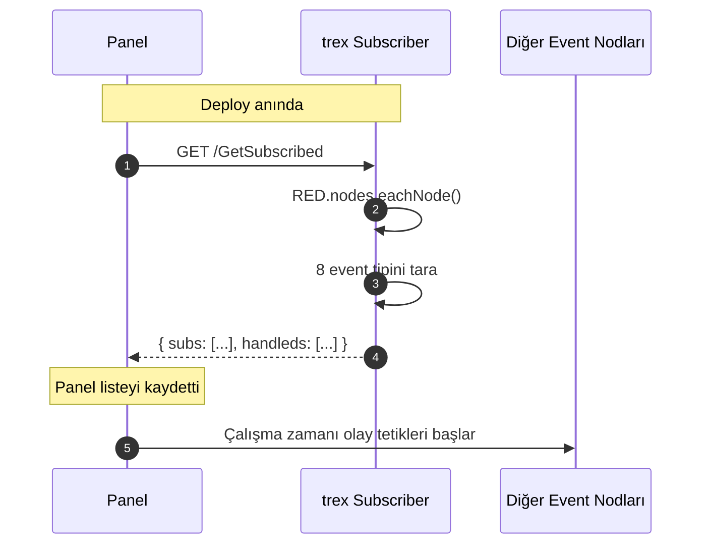
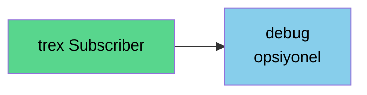
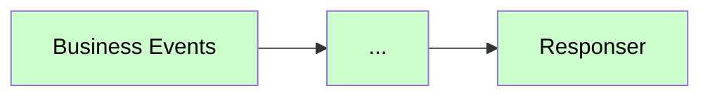

# trex Subscriber

<div class="node-header">
  <span class="node-preview green-dark">trex Subscriber</span>
  <div class="meta-item"><strong>Inputs:</strong> <span class="io-badge in">0</span></div>
  <div class="meta-item"><strong>Outputs:</strong> <span class="io-badge out">1</span></div>
  <div class="meta-item"><strong>Kategori:</strong> trexMes service</div>
</div>

Projedeki tüm event node'larının isimlerini **trexMes paneline kaydeder**. Bu node sayesinde panel hangi olayları Node-RED'e göndereceğini bilir.

## Özet

!!! warning "Her projede 1 ADET zorunlu"
    Bu node, paketin **omurgasıdır**. trexMes Edge ile ilk haberleşmeyi kuran node'tur. Bir projede birden fazla `trex Subscriber` bulunamaz.

## Ne Zaman Kullanılır?

- Yeni bir trexMes akışı oluştururken **ilk** eklenmesi gereken node.
- Deploy anında otomatik tetiklenir; tarayıcı/manuel input gerekmez.

## Property Tablosu

| Alan | Tip | Varsayılan | Açıklama |
|---|---|---|---|
| `name` | string | — | Node-RED canvas üzerinde gösterilecek ad (opsiyonel) |
| `method` | string | `get` | HTTP method (otomatik, değiştirilmez) |
| `event` | string | `/GetSubscribed` | Panel'in event listesi sormak için çağıracağı HTTP path |

## Çıkış Mesajı

Bu node'un çıkışı yalnızca **tanı (diagnostic) amaçlıdır**; diğer node'ları tetiklemek için kullanılmaz.

Çıkışa bir `debug` node'u bağlandığında, her `GET /GetSubscribed` isteğinde şu bilgiler görüntülenir:

```json
{
  "_msgid": "abc123",
  "payload": {
    "client": "192.168.1.42",
    "subs": [
      "OrderStartEvent",
      "OrderEndEvent",
      "MachineStatusEvent"
    ],
    "handleds": [
      "OrderStartEvent|handled"
    ]
  }
}
```

### Alanlar

| Alan | Açıklama |
|---|---|
| `client` | İsteği yapan trexEdge endüstriyel PC'nin IP adresi |
| `subs` | Panele bildirilen event listesi (bu projedeki tüm Event node isimleri) |
| `handleds` | `ishandled=true` olan event'ler (sonuna `\|handled` eklenir) |

!!! info "Ne işe yarar?"
    `debug` çıktısı sayesinde hangi trexEdge PC'lerin Node-RED servisine bağlandığını ve her bağlantıda panele hangi event listesinin iletildiğini anlık olarak izleyebilirsiniz. Bu bilgi üretim hattı izleme ve bağlantı sorun giderme için kullanılır.

## Davranış



### Hangi Event Tipleri Listeleniyor?

`trex Subscriber` aşağıdaki node tiplerini otomatik tarar:

- `Business Events`
- `System Events`
- `Communication Events`
- `Display Events`
- `Form Events`
- `Display Methods`
- `Method Returns`


## Otomatik Cevap

Bu node **kendi `Responser`'ını içerir**. Akışınıza ayrı bir `Responser` eklemeniz gerekmez. Çıkış mesajı bilgi amaçlıdır (debug için kullanabilirsiniz).

```javascript
// JS tarafından otomatik yapılır
node.send({ payload: { client, subs, handleds } });
// Aynı zamanda HTTP cevabı panele döner
res.status(200).jsonp([...subs, ...handleds]);
```

## Durum (Status) Göstergesi

Node tetiklendiğinde altında 500 ms boyunca:

```
[yellow dot] Triggered
```

görünür ve kaybolur.

## Tipik Akış

`trex Subscriber` her zaman **tek başına** durur; diğer node'lara bağlanmaz ve onları tetiklemez. Tanı amacıyla çıkışına `debug` bağlanabilir.





Olay akışları **Event node'larından** başlar; `trex Subscriber`'dan değil.

## Sık Karşılaşılan Hatalar

!!! failure "Triggered çıkmıyor"
    - trexMes Edge'de Node-RED Connector eklentisi etkin mi?
    - Panel'in Node-RED IP/port ayarı doğru mu?
    - `httpNodeRoot` ayarı `false` mı? (Olmamalı; varsayılanı bırakın.)

!!! failure "Subs listesi boş"
    Henüz hiç event node'u eklemediğiniz anlamına gelir. Bir `Business Events` ekleyip yeniden deploy edin.

!!! failure "Birden fazla trex Subscriber uyarısı"
    Aynı flow'da iki adet `trex Subscriber` varsa ikinci ekleme **HTTP path çakışmasına** yol açar. Tek bir tane bırakın.

## İleri Konular

### Custom `event` Path

Varsayılan `/GetSubscribed` yerine farklı bir path kullanmak isterseniz, trexMes panel tarafının da bu path'i bilmesi gerekir. Genellikle değiştirmemeniz önerilir.

### `httpNodeMiddleware` ve CORS

Node-RED `settings.js` içinde tanımlı `httpNodeMiddleware` ve `httpNodeCors` ayarları bu node tarafından otomatik uygulanır. Özel middleware kullanıyorsanız etkilenir.

## İlgili Nodlar

- [Business Events](business-events.md) — Listelenen iş olaylarını işler
- [Responser](responser.md) — Diğer event akışlarının kapatıcısı
- [Olay Nodları Genel Bakış](event-subscribers.md)
