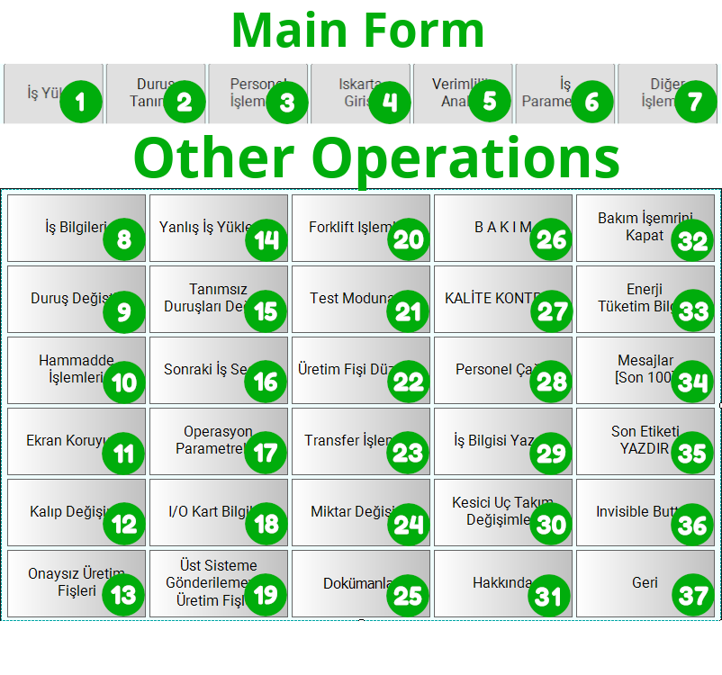
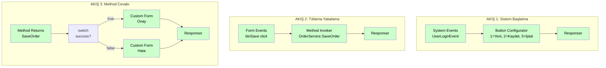

# Örnek: Buton Konfigürasyonu

Bu örnekte trexMes Main Form üzerindeki **standart butonları yapılandıracak**, tıklamalarını yakalayıp Method Invoker ile panel method'unu çağıracağız.

## Hedef

1. Sistem açıldığında Main Form'da 3 buton görünür olsun: "Yeni", "Kaydet", "İptal".
2. Operatör "Kaydet" butonuna bastığında `Form Events` ile yakalayalım.
3. Form verisini panel'in `OrderService.SaveOrder` method'una geçelim.
4. Cevap geldiğinde onay ekranı gösterelim.

## Önkoşullar

- Çalışan trexMes Edge bağlantısı
- Panel tarafında `OrderService.SaveOrder` method'u tanımlı
- Main Form üzerinde 1-10 arası buton indeksleri kullanılabilir

## Buton İndeksleri

Aşağıdaki görselde Main Form'daki butonların indeks numaraları görünmektedir:

{ width="800" }

## Akış Şeması



## Adım Adım Yapılandırma

### Akış 1: Sistem Başlatma

#### 1.1. `System Events`

| Alan | Değer |
|---|---|
| Name | `UserLogin` |
| Event | `/UserLoginEvent` |
| Is Handled | `false` |

#### 1.2. `Button Configurator`

| Alan | Değer |
|---|---|
| Name | `MainFormButtons` |
| Form In Main Form | `true` |
| Form Name | _(otomatik AppForm)_ |

`props` listesi:

| `p` (Index) | `v` (Caption) | `d` (Visible) | `e` (Override) | `f` (Name) |
|---|---|---|---|---|
| `1` | `"Yeni Sipariş"` | `true` | `false` | `btnNewOrder` |
| `2` | `"Kaydet"` | `true` | `true` | `btnSave` |
| `5` | `"İptal"` | `true` | `false` | `btnCancel` |

!!! info
    `e=true` (override) demek: "Bu butonun panel-default davranışı yerine **bizim** akışımız çalışsın." Sadece Kaydet butonunu özelleştirdiğimiz için sadece onu override ediyoruz.

#### 1.3. `Responser`

Tüm varsayılan değerlerle.

### Akış 2: Tıklama Yakalama

#### 2.1. `Form Events`

| Alan | Değer |
|---|---|
| Name | `SaveClick` |
| Event | `/AppForm_btnSave_Click` |
| Form Name | `AppForm` |

#### 2.2. `Method Invoker`

| Alan | Değer |
|---|---|
| Name | `SaveOrder` |
| Service | `OrderService` |
| Method | `SaveOrder` |

`props` listesi:

| `p` (Param) | `d` (Data) | `dt` (Type) |
|---|---|---|
| `orderNo` | `payload.formData.orderNo` | `msg` |
| `customer` | `payload.formData.customer` | `msg` |
| `qty` | `payload.formData.qty` | `msg` |
| `operatorId` | `currentUser.id` | `flow` |

#### 2.3. `Responser`

Tüm varsayılan değerlerle.

### Akış 3: Method Cevabı

#### 3.1. `Method Returns`

| Alan | Değer |
|---|---|
| Name | `SaveOrderReturn` |
| Method Name | `SaveOrder` |

#### 3.2. `switch` Node (Standart Node-RED)

`payload.returnValue.success` değerine bakarak iki dala ayrılır:

- Dal 1: `== true` → Onay formu
- Dal 2: `!= true` → Hata formu

#### 3.3. Onay `Custom Form`

Basit bir bilgi formu: "Sipariş #X başarıyla kaydedildi."

#### 3.4. Hata `Custom Form`

Basit bir uyarı formu: "Kayıt sırasında hata oluştu."

#### 3.5. `Responser`

İki dalı tek bir `Responser`'a bağlayın.

## Method Invoker Çıkışı

```json
{
  "operationtype": "MethodInvokerProcess",
  "receiveddata": { /* form click data */ },
  "name": "SaveOrder",
  "message": "OrderService.SaveOrder",
  "value": [
    { "ParameterName": "orderNo",    "Value": "ORD-001" },
    { "ParameterName": "customer",   "Value": "ACME" },
    { "ParameterName": "qty",        "Value": 50 },
    { "ParameterName": "operatorId", "Value": "OP-007" }
  ]
}
```

## Method Returns Girişi

Panel method'u başarılı tamamladığında:

```json
{
  "payload": {
    "methodName": "SaveOrder",
    "returnValue": {
      "success": true,
      "orderId": 4521,
      "createdAt": "2026-05-11T14:30:00Z"
    },
    "executionTime": 245
  }
}
```

Hata durumunda:

```json
{
  "payload": {
    "methodName": "SaveOrder",
    "returnValue": {
      "success": false,
      "errorCode": "DB_TIMEOUT",
      "errorMessage": "Veritabanı zaman aşımı"
    }
  }
}
```

## Beklenen Davranış

### Operatör Giriş Anı

1. `UserLoginEvent` tetiklenir.
2. Main Form'da 1, 2 ve 5 numaralı butonlar görünür hale gelir:
    - **Buton 1**: "Yeni Sipariş" (panel default davranışı)
    - **Buton 2**: "Kaydet" (bizim akışımız tetiklenecek)
    - **Buton 5**: "İptal" (panel default davranışı)
3. Diğer butonlar gizli kalır.

### Operatör Kaydet'e Bastığında

1. `Form Events` tetiklenir, form verileri `msg.payload.formData`'da gelir.
2. `Method Invoker` parametreleri toplar, `OrderService.SaveOrder` çağrılır.
3. İlk akış kapanır (`Responser`).
4. Panel veritabanı işlemini yapar (~300 ms).
5. Cevap gelir → `Method Returns` tetiklenir.
6. `switch` başarı durumuna göre dallara ayırır.
7. Uygun form (`Onay` veya `Hata`) panelde gösterilir.

## Yaygın Sorunlar

!!! failure "Butonlar görünmedi"
    - `formainform: true` olduğundan emin olun.
    - Buton indeksleri 1-10 aralığında mı?
    - Akışta `Responser` var mı?

!!! failure "Kaydet butonu hâlâ panel default'unu çalıştırıyor"
    `Button Configurator`'da o butonun `e` (IsToOverrideDefaultHandler) **true** olmalı.

!!! failure "Form Events tetiklenmiyor"
    - Buton `ComponentName` (`f` alanı) `Form Events` event ismiyle uyumlu mu?
    - Event isminde `/AppForm_btnSave_Click` gibi formname prefix var mı?

!!! failure "Method cevabı gelmiyor"
    - `Method Returns`'teki `methodname`, `Method Invoker`'daki `method` ile aynı mı?
    - Panel tarafında method gerçekten cevap dönüyor mu? (panel log'una bakın)

## İleri Konular

### Çoklu Method Cevabı Dinleme

Birden fazla `Method Returns` node'u kullanabilirsiniz; her biri farklı method ismi dinler. Bu sayede aynı flow'da paralel olarak SaveOrder, DeleteOrder, UpdateStock cevaplarını dinleyebilirsiniz.

### Hata Recover

`Method Returns` mesajında `success: false` geldiğinde `Method Invoker`'ı **tekrar tetikleyerek** retry mantığı kurabilirsiniz. Bu durumda retry sayısını `flow` context'te tutmaya dikkat edin.

## Tamamlandı!

Üç temel örneği tamamladınız. Artık trexMes paneliniz ile karmaşık iş akışları kurabilirsiniz.

Sonraki adımlar için [Node Referansı](../nodlar/index.md) bölümündeki tüm node'ları inceleyin ve [SSS](../sss.md) sayfasındaki sorun gidermeyle tanışın.
