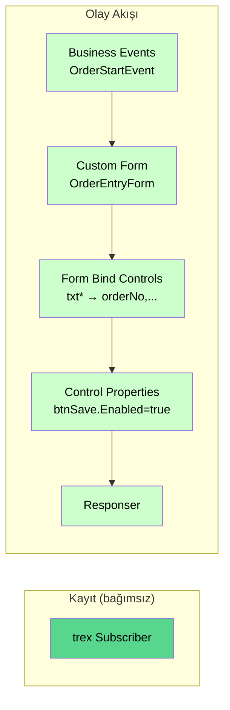

# Örnek: Custom Form Akışı

Bu örnekte panel'den gelen sipariş verisini bir **Custom Form** üzerinde gösterecek, alanlarına bağlayacak ve kontrol özelliklerini ayarlayacağız.

## Hedef

`OrderStartEvent` tetiklendiğinde:

1. Panel ekranında `OrderEntryForm` adlı bir form açılsın.
2. Gelen sipariş bilgisi form alanlarına otomatik bağlansın.
3. Buton görünürlüğü duruma göre ayarlansın.
4. Akış sonunda panele cevap dönsün.

## Önkoşullar

- [Temel Akış](temel-akis.md) örneğinin çalışıyor olması
- Form için XML tasarım hazır (aşağıda örnek var)
- `customFormDesigner.exe` (opsiyonel, Designer kullanılacaksa)

## Akış Şeması



## Form XML Tasarımı

`Custom Form` node'unun `customformxml` alanına yapıştıracağımız XML, `trexForm.Designer` tarafından üretilen WinForms formatındadır:

```xml
<Object name="CustomForm" type="trexForm.Designer.CustomForm, trexForm.Designer, Version=1.0.0.0, Culture=neutral, PublicKeyToken=null" version="1">
    <AutoValidate>EnablePreventFocusChange</AutoValidate>
    <BackColor>Control</BackColor>
    <ClientSize>600, 400</ClientSize>
    <Font>Microsoft Sans Serif, 8.25pt</Font>
    <Name>CustomForm</Name>

    <Object type="System.Windows.Forms.Label, System.Windows.Forms, Version=4.0.0.0, Culture=neutral, PublicKeyToken=b77a5c561934e089" name="lblOrderNo">
        <Text>Sipariş No:</Text>
        <Location>20, 20</Location>
        <Size>100, 20</Size>
        <TabIndex>0</TabIndex>
    </Object>
    <Object type="System.Windows.Forms.TextBox, System.Windows.Forms, Version=4.0.0.0, Culture=neutral, PublicKeyToken=b77a5c561934e089" name="txtOrderNo">
        <Location>140, 20</Location>
        <Size>200, 20</Size>
        <TabIndex>1</TabIndex>
    </Object>

    <Object type="System.Windows.Forms.Label, System.Windows.Forms, Version=4.0.0.0, Culture=neutral, PublicKeyToken=b77a5c561934e089" name="lblCustomer">
        <Text>Müşteri:</Text>
        <Location>20, 60</Location>
        <Size>100, 20</Size>
        <TabIndex>2</TabIndex>
    </Object>
    <Object type="System.Windows.Forms.TextBox, System.Windows.Forms, Version=4.0.0.0, Culture=neutral, PublicKeyToken=b77a5c561934e089" name="txtCustomer">
        <Location>140, 60</Location>
        <Size>200, 20</Size>
        <TabIndex>3</TabIndex>
    </Object>

    <Object type="System.Windows.Forms.Label, System.Windows.Forms, Version=4.0.0.0, Culture=neutral, PublicKeyToken=b77a5c561934e089" name="lblQty">
        <Text>Miktar:</Text>
        <Location>20, 100</Location>
        <Size>100, 20</Size>
        <TabIndex>4</TabIndex>
    </Object>
    <Object type="System.Windows.Forms.NumericUpDown, System.Windows.Forms, Version=4.0.0.0, Culture=neutral, PublicKeyToken=b77a5c561934e089" name="txtQty">
        <Minimum>1</Minimum>
        <Maximum>9999</Maximum>
        <Location>140, 100</Location>
        <Size>100, 20</Size>
        <TabIndex>5</TabIndex>
    </Object>

    <Object type="System.Windows.Forms.Label, System.Windows.Forms, Version=4.0.0.0, Culture=neutral, PublicKeyToken=b77a5c561934e089" name="lblWarning">
        <Text></Text>
        <ForeColor>Red</ForeColor>
        <Location>20, 140</Location>
        <Size>320, 20</Size>
        <TabIndex>6</TabIndex>
    </Object>

    <Object type="System.Windows.Forms.Button, System.Windows.Forms, Version=4.0.0.0, Culture=neutral, PublicKeyToken=b77a5c561934e089" name="btnSave">
        <Text>Kaydet</Text>
        <Location>20, 200</Location>
        <Size>120, 40</Size>
        <TabIndex>7</TabIndex>
    </Object>
    <Object type="System.Windows.Forms.Button, System.Windows.Forms, Version=4.0.0.0, Culture=neutral, PublicKeyToken=b77a5c561934e089" name="btnCancel">
        <Text>İptal</Text>
        <Location>160, 200</Location>
        <Size>120, 40</Size>
        <TabIndex>8</TabIndex>
    </Object>
</Object>
```

!!! tip "XML'i elle yazmayın"
    Yukarıdaki XML `trexForm.Designer` aracı ile görsel olarak tasarlanıp dışa aktarılabilir. Kontrol adları (`txtOrderNo`, `btnSave` vb.) `Form Bind Controls` ve `Control Properties` nodlarında kullanılacağından büyük/küçük harfe dikkat edin.

## Adım Adım Yapılandırma

### 1. `trex Subscriber` (Bağımsız)

[Temel Akış](temel-akis.md#1-trex-subscriber-ekleyin) örneğindeki gibi varsayılan ayarlarla ekleyin.

### 2. `Business Events`

| Alan | Değer |
|---|---|
| Name | `OrderStart` |
| Method | `get` |
| Event | `/OrderStartEvent` |
| Is Handled | `false` |

### 3. `Custom Form`

| Alan | Değer |
|---|---|
| Name | `OrderForm` |
| Form Name | `OrderEntryForm` |
| Custom Form XML | _(yukarıdaki XML)_ |
| Is Styled | `true` |
| Form In Main Form | `false` _(modal dialog)_ |
| Design Form Name | _(boş)_ |

### 4. `Form Bind Controls`

| Alan | Değer |
|---|---|
| Name | `BindOrder` |
| Form Name | `OrderEntryForm` |
| Form In Main Form | `false` |
| Data Type | `msg` |
| Data | `payload` |
| Props | _(aşağıdaki tablo)_ |

`props` listesi:

| `p` (Property) | `v` (Value Field) |
|---|---|
| `txtOrderNo` | `orderNo` |
| `txtCustomer` | `customer` |
| `txtQty` | `qty` |

### 5. `Control Properties`

| Alan | Değer |
|---|---|
| Name | `SetProperties` |
| Form Name | `OrderEntryForm` |
| Form In Main Form | `false` |
| Props | _(aşağıdaki tablo)_ |

`props` listesi:

| `p` (Control) | `v` (Property) | `d` (Value) | `dt` (Type) |
|---|---|---|---|
| `btnSave` | `Enabled` | `true` | `bool` |
| `lblWarning` | `Visible` | `false` | `bool` |

### 6. `Responser`

Tüm varsayılan değerlerle ekleyin.

## Flow JSON

```json
[
  {
    "id": "f2",
    "type": "tab",
    "label": "CustomFormOrnegi"
  },
  {
    "id": "sub1",
    "type": "trex Subscriber",
    "z": "f2",
    "name": "",
    "method": "get",
    "event": "/GetSubscribed",
    "x": 200,
    "y": 80,
    "wires": [[]]
  },
  {
    "id": "ev1",
    "type": "Business Events",
    "z": "f2",
    "name": "OrderStart",
    "event": "/OrderStartEvent",
    "ishandled": false,
    "x": 180,
    "y": 180,
    "wires": [["form1"]]
  },
  {
    "id": "form1",
    "type": "Custom Form",
    "z": "f2",
    "name": "OrderForm",
    "formname": "OrderEntryForm",
    "customformxml": "<form name='OrderEntryForm'>...</form>",
    "isstyled": true,
    "formainform": false,
    "designformname": "",
    "x": 360,
    "y": 180,
    "wires": [["bind1"]]
  },
  {
    "id": "bind1",
    "type": "Form Bind Controls",
    "z": "f2",
    "name": "BindOrder",
    "formname": "OrderEntryForm",
    "formainform": false,
    "props": [
      { "p": "txtOrderNo",  "v": "orderNo" },
      { "p": "txtCustomer", "v": "customer" },
      { "p": "txtQty",      "v": "qty" }
    ],
    "data": "payload",
    "dataType": "msg",
    "x": 560,
    "y": 180,
    "wires": [["props1"]]
  },
  {
    "id": "props1",
    "type": "Control Properties",
    "z": "f2",
    "name": "SetProperties",
    "formname": "OrderEntryForm",
    "formainform": false,
    "props": [
      { "p": "btnSave",    "v": "Enabled", "d": "true",  "dt": "bool" },
      { "p": "lblWarning", "v": "Visible", "d": "false", "dt": "bool" }
    ],
    "x": 760,
    "y": 180,
    "wires": [["resp1"]]
  },
  {
    "id": "resp1",
    "type": "Responser",
    "z": "f2",
    "name": "",
    "statusCode": "",
    "headers": {},
    "x": 950,
    "y": 180,
    "wires": []
  }
]
```

## Beklenen Davranış

Panel'de `OrderStartEvent` tetiklendiğinde:

1. **`OrderEntryForm`** adlı modal pencere panel üzerinde açılır.
2. Form içindeki textbox'lar gelen sipariş verisiyle doldurulur:
    - `txtOrderNo`: `ORD-2026-0042`
    - `txtCustomer`: `ACME Ltd.`
    - `txtQty`: `50`
3. `btnSave` butonu **aktiftir**, `lblWarning` etiketi gizlidir.
4. Operatör formu görür ve onaylayabilir.

## msg.payload İncelemesi

`Responser`'a ulaştığında `msg.payload` array'i şuna benzer:

```json
[
  {
    "operationtype": "CustomDialog",
    "receiveddata": { "orderNo": "ORD-001", "customer": "ACME", "qty": 50 },
    "name": "OrderEntryForm",
    "continueevent": "Continue",
    "customformxml": "<form ...>...</form>",
    "isstyled": true
  },
  {
    "operationtype": "BindControl",
    "receiveddata": { ... },
    "name": "OrderEntryForm",
    "bindcontrols": [
      { "Name": "txtOrderNo",  "FieldName": "orderNo" },
      { "Name": "txtCustomer", "FieldName": "customer" },
      { "Name": "txtQty",      "FieldName": "qty" }
    ],
    "value": { "orderNo": "ORD-001", "customer": "ACME", "qty": 50 }
  },
  {
    "operationtype": "ControlProperties",
    "receiveddata": { ... },
    "name": "OrderEntryForm",
    "value": [
      { "ControlName": "btnSave",    "PropertyName": "Enabled", "Value": true  },
      { "ControlName": "lblWarning", "PropertyName": "Visible", "Value": false }
    ]
  }
]
```

`Responser` bu array'i tek HTTP cevabında panele gönderir, panel **sırayla** her operasyonu uygular.

## Yaygın Sorunlar

!!! failure "Form açılıyor ama alanlar boş"
    - `Form Bind Controls`'taki `data` ve `dataType` doğru mu?
    - `props` listesindeki `p` değerleri XML'deki kontrol isimleriyle birebir mi eşleşiyor? (büyük/küçük harf!)

!!! failure "Form hiç açılmıyor"
    - `customformxml` geçerli XML mı? (Açıkta kalmış tag, eksik attribute)
    - `formname` doğru?

!!! failure "btnSave hala disabled"
    `Control Properties`'te `dt` "bool", `d` ise düz `"true"` string olmalı.

## Sonraki Adım

[Buton Konfigürasyonu](buton-konfigurasyonu.md) örneğinde butonları yapılandırıp tıklamaları yakalayacağız.
