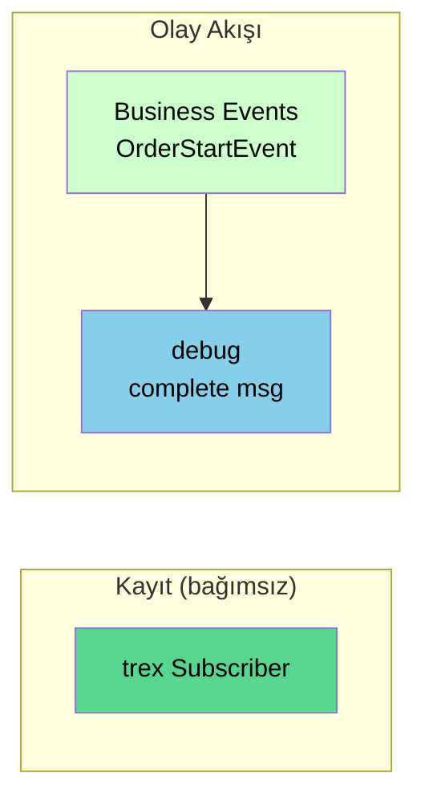

# Örnek: Temel Akış

Bu örnekte trexMes paneliniz ile Node-RED arasındaki bağlantıyı doğrulayan **minimum çalışan akışı** kuracağız.

## Hedef

Panel tarafında `OrderStartEvent` adında bir Business Event tetiklendiğinde, gelen veriyi Node-RED debug panelinde görüntülemek.

## Önkoşullar

- `node-red-trexmes-service` paketi kurulu
- trexMes Edge'de Node-RED Connector eklentisi etkin
- Panelden Node-RED'e bağlantı kuruluyor

## Akış Şeması

`trex Subscriber` bağımsız bir kayıt node'udur; olay akışıyla bağlantısı yoktur.



## Adım Adım Yapılandırma

### 1. `trex Subscriber` Ekleyin

Paletten `trex Subscriber` node'unu canvas'a sürükleyin. Yapılandırma gerektirmez; tüm değerleri varsayılan bırakın.

| Alan | Değer |
|---|---|
| Name | _(boş)_ |
| Method | `get` |
| Event | `/GetSubscribed` |

### 2. `Business Events` Ekleyin

Paletten `Business Events` node'unu canvas'a sürükleyin ve yapılandırın:

| Alan | Değer |
|---|---|
| Name | `OrderStart` _(opsiyonel etiket)_ |
| Method | `get` |
| Event | `/OrderStartEvent` |
| Is Handled | `false` |
| Suffix | _(boş)_ |

### 3. `debug` Node'u Ekleyin

Standart Node-RED `debug` node'unu canvas'a sürükleyin:

| Alan | Değer |
|---|---|
| Output | `complete msg object` |
| To | `debug window` |

### 4. Bağlantıları Kurun

`Business Events` çıkışını `debug` girişine bağlayın.

`trex Subscriber` olay akışına **bağlanmaz**; canvas'ta bağımsız durur. İsterseniz çıkışına `debug` node'u ekleyerek hangi trexEdge PC'lerin bağlandığını ve event listesini izleyebilirsiniz.

### 5. Deploy

Sağ üstteki kırmızı **Deploy** butonuna tıklayın.

## Flow JSON

Aşağıdaki JSON'u Node-RED'e import ederek bu akışı doğrudan kurabilirsiniz:

```json
[
    {
        "id": "f1",
        "type": "tab",
        "label": "TemelAkis",
        "disabled": false
    },
    {
        "id": "sub1",
        "type": "trex Subscriber",
        "z": "f1",
        "name": "",
        "method": "get",
        "event": "/GetSubscribed",
        "x": 200,
        "y": 100,
        "wires": [[]]
    },
    {
        "id": "ev1",
        "type": "Business Events",
        "z": "f1",
        "name": "OrderStart",
        "method": "get",
        "event": "/OrderStartEvent",
        "ishandled": false,
        "suffix": "",
        "x": 200,
        "y": 200,
        "wires": [["dbg1"]]
    },
    {
        "id": "dbg1",
        "type": "debug",
        "z": "f1",
        "name": "OrderStart Debug",
        "active": true,
        "complete": "true",
        "x": 480,
        "y": 200,
        "wires": []
    }
]
```

## Beklenen Çıktı

### Deploy Anında

`trex Subscriber` node'unun altında kısaca:

```
[sarı nokta] Triggered
```

görünür ve panel kayıt listesini almıştır.

### Panel Tarafında Olay Tetiklendiğinde

Sağ paneldeki **debug** çıktısında şuna benzer mesaj görünür:

```json
{
  "_msgid": "8a3f5b1c.de4a7",
  "payload": {
    "orderNo": "ORD-2026-0042",
    "operatorId": "OP-007",
    "machineId": "M-12",
    "productCode": "PRD-X100",
    "qty": 50,
    "startTime": "2026-05-11T08:30:15Z"
  },
  "req": { /* ... */ },
  "res": { /* ... */ }
}
```

## Test Etmek

Panel tarafına erişiminiz yoksa Postman gibi bir HTTP istemcisi ile test edebilirsiniz. Event node'ları `POST` metodunu kullanır; veri request body'den iletilir, adres satırına parametre geçilemez.

- Method: `POST`
- URL: `http://<node-red-host>:1880/OrderStartEvent`
- Body: `raw / JSON`

```json
{
  "orderNo": "TEST-001",
  "qty": 10
}
```

Gönderim sonrası `debug` panelinde mesajı görmelisiniz.

## Yaygın Sorunlar

!!! failure "trex Subscriber Triggered çıkmıyor"
    - trexMes Edge'de Node-RED Connector eklentisi etkin mi?
    - Panel'in Node-RED IP/port ayarı doğru mu?

!!! failure "Business Events tetiklenmiyor"
    - Event ismi (`/OrderStartEvent`) panel tarafında tanımlı olanla **birebir** mi eşleşiyor?
    - Büyük/küçük harf duyarlılığı kontrol edildi mi?

!!! failure "Cevap timeout"
    Bu akışta `debug` sonrası `Responser` yok; panel cevap beklemeyebilir veya zaman aşımı verebilir. Production için **`Responser` ekleyin**:

    ```
    Business Events → debug → Responser
    ```

## Sonraki Adım

[Custom Form Akışı](custom-form-akisi.md) örneğinde olay verisini görsel forma yansıtacağız.
